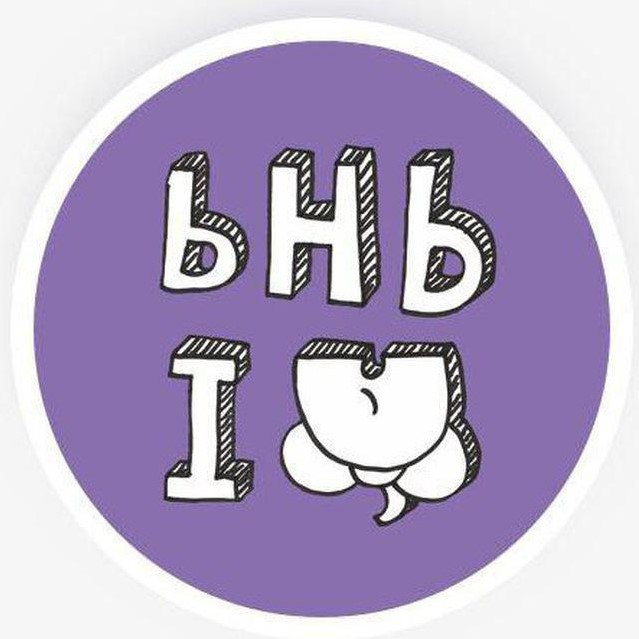

# Памятка PHP/GoLang разработчику для подготовки к собеседованиям

Всем привет, меня зовут Артур Пантелеев и вы читаете мою "книгу" о собеседованиях.

Это методичка(краткий справочник) по темам/вопросам, знание которых может понадобиться при собеседовании и  на должность бэкенд

 разработчика (с уклоном в php/Golang) и на работе.

Книга не является исчерпывающим руководством, а служит лишь тезисным помощником в повторении нужного материала для подготовки к собеседованию и структурированию собственных знаний. Также тут есть много полезных ссылок на дополнительные материалы по каждой теме.

Вопросы можно задать в  чате https://t.me/phpgeeks или в личку https://t.me/arturpanteleev

Пулреквесты с улучшениями/дополнениями шлите сюда https://github.com/arturpanteleev/phpInterview

*P.S. Первый кирпич в создание данного пособия, заложил, увековечив здесь своё имя, Сергей Пронин.*

