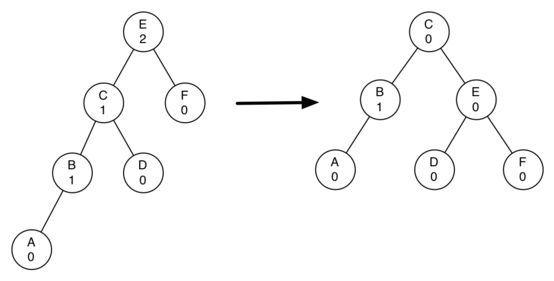
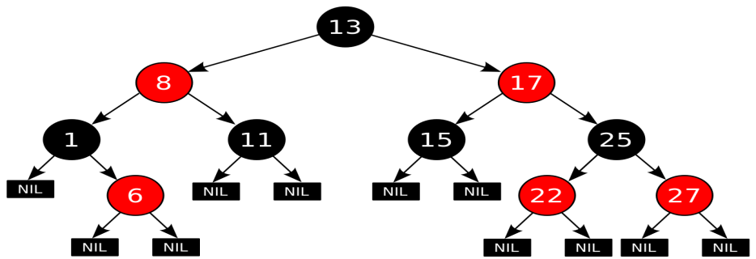
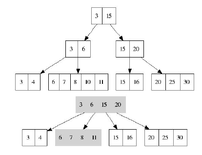
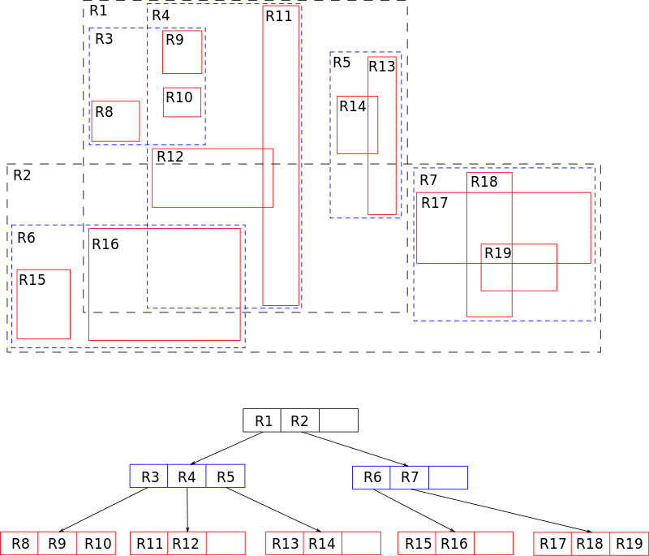

# Дерево

Иерархическая структура элементов, называемыми узлами (вершинами). На самом верхнем уровне имеется только один узел — корень дерева. Каждый узел, кроме корня, связан только с одним узлом на более высоком уровне. Каждый элемент может быть связан ребром с одним или несколькими элементами на следующем, более низком, уровне. Элементы, не имеющий потомков называются листьями. От корня до любой вершины существует один путь. Любой узел дерева с потомками на всех уровнях так же образует дерево, называемое поддеревом.

**Термины:**

- **Корневой узел** — самый верхний узел дерева.
- **Корень** — одна из вершин, по желанию наблюдателя.
- **Лист**, **листовой или терминальный узел** — узел, не имеющий дочерних элементов.
- **Внутренний узел** — любой узел дерева, имеющий потомков, и таким образом, не являющийся листовым узлом.
- Дерево считается **ориентированным**, если в корень не заходит ни одно ребро.
- **Полный сцепленный ключ** — идентификатор записи, который образуется путём конкатенации всех ключей экземпляров родительских записей (групп).
- **M-арное дерево** - число поддеревьев данного узла образует степень узла, максимальное значение m степени всех узлов дерева является степенью дерева. Дерево степени 2 называется бинарным деревом. Если в дереве на каждом уровне задан порядок следования вершин, то такое дерево называется упорядоченным

## Бинарное дерево поиска

`Поиск -  O(log n); Вставка -  O(log n); Удаление -  O(log n);`

Это двоичное дерево, для которого выполняются следующие условия:

- У каждого узла не более двух детей(так как бинарное).

- У всех узлов левого поддерева произвольного узла X значения ключей данных меньше, нежели значение ключа данных самого узла X.

- У всех узлов правого поддерева произвольного узла X значения ключей данных больше либо равно, нежели значение ключа данных самого узла X.

  

### АВЛ-Дерево

**Сбалансированное по высоте** двоичное дерево поиска: для каждой его вершины высота её двух поддеревьев различается не более чем на 1. 

### 

## Красно-чёрное дерево

Красно-черные деревья - один из способов балансировки деревьев. Название происходит от стандартной раскраски узлов таких деревьев в красный и черный цвета. Цвета узлов используются при балансировке дерева. Во время операций вставки и удаления поддеревья может понадобиться повернуть, чтобы достигнуть сбалансированности дерева. Оценкой как среднего время, так и наихудшего является **O**(log *n*).

Красно-чёрное дерево - это двоичное дерево поиска, в котором каждый узел имеет атрибут цвет, принимающий значения красный или чёрный. 

Как бинарное дерево, красно-черное обладает свойствами:

- Оба поддерева являются бинарными деревьями поиска.
- Для каждого узла с ключом k выполняется критерий упорядочения: ключи всех левых потомков <= k < ключи всех правых потомков(в других определениях дубликаты должны располагаться с правой стороны либо вообще отсутствовать). Это неравенство должно быть истинным для всех потомков узла, а не только его дочерних узлов.

В дополнение к обычным требованиям, налагаемым на двоичные деревья поиска, к красно-чёрным деревьям применяются следующие требования:

- Узел либо красный, либо чёрный.
- Корень — чёрный. (В других определениях это правило иногда опускается. Это правило слабо влияет на анализ, так как корень всегда может быть изменен с красного на чёрный, но не обязательно наоборот).
- Все листья(NIL) — чёрные.
- Оба потомка каждого красного узла — чёрные.
- Всякий простой путь от данного узла до любого листового узла, являющегося его потомком, содержит одинаковое число чёрных узлов.

  

Количество черных узлов на ветви от корня до листа называется черной высотой дерева. Перечисленные свойства гарантируют, что самая длинная ветвь от корня к листу не более чем вдвое длиннее любой другой ветви от корня к листу. Чтобы понять, почему это так, рассмотрим дерево с черной высотой 2. Кратчайшее возможное расстояние от корня до листа равно двум - когда оба узла черные. Длиннейшее расстояние от корня до листа равно четырем - узлы при этом покрашены (от корня к листу) так: красный, черный, красный, черный. Сюда нельзя добавить черные узлы, поскольку при этом нарушится свойство 4, из которого вытекает корректность понятия черной высоты. Поскольку согласно свойству 3 у красных узлов непременно черные наследники, в подобной последовательности недопустимы и два красных узла подряд. Таким образом, длиннейший путь, который мы можем сконструировать, состоит из чередования красных и черных узлов, что и приводит нас к удвоенной длине пути, проходящего только через черные узлы. Все операции над деревом должны уметь работать с перечисленными свойствами. В частности, при вставке и удалении эти свойства должны сохраниться.

## Куча

Специализированное дерево, которая удовлетворяет *свойству кучи:*если *B* является узлом-потомком узла *A*, то ключ(*A*) ≥ ключ(*B*). Из этого следует, что элемент с наибольшим ключом всегда является корневым узлом кучи, поэтому иногда такие кучи называют *max-кучами* (в качестве альтернативы, если сравнение перевернуть, то наименьший элемент будет всегда корневым узлом, такие кучи называют *min-кучами*). Не существует никаких ограничений относительно того, сколько узлов-потомков имеет каждый узел кучи, хотя на практике их число обычно не более двух. Куча является максимально эффективной реализации  очереди с приоритетом. Кучи имеют решающее значение в некоторых эффективных алгоритмах нв графах, таких, как [алгоритм Дейкстры на d-кучах](https://ru.wikipedia.org/w/index.php?title=%D0%90%D0%BB%D0%B3%D0%BE%D1%80%D0%B8%D1%82%D0%BC_%D0%94%D0%B5%D0%B9%D0%BA%D1%81%D1%82%D1%80%D1%8B_%D0%BD%D0%B0_d-%D0%BA%D1%83%D1%87%D0%B0%D1%85&action=edit&redlink=1) и сортировка [методом пирамиды](https://ru.wikipedia.org/wiki/%D0%9F%D0%B8%D1%80%D0%B0%D0%BC%D0%B8%D0%B4%D0%B0%D0%BB%D1%8C%D0%BD%D0%B0%D1%8F_%D1%81%D0%BE%D1%80%D1%82%D0%B8%D1%80%D0%BE%D0%B2%D0%BA%D0%B0).

Двои́чная ку́ча, пирами́да, или сортиру́ющее де́рево — такое двоичное дерево, для которого выполнены три условия:

- Значение в любой вершине не меньше, чем значения её потомков.

- Глубина всех листьев (расстояние до корня) отличается не более чем на 1 слой.

- Последний слой заполняется слева направо без «дырок».

  

## B-дерево

**B-дерево** – это структура хранения данных, являющаяся разновидностью дерева поиска. Особенностями В-деревьев является: 

- сбалансированность,
- ветвистость, 
- отсортированность 
- логарифмическое **O(log n)** время работы всех стандартных операций (поиск, вставка, удаление).

Сбалансированность означает, что все листы находятся на одинаковом расстоянии от корня. В отличие от бинарных деревьев В-деревья допускают большое число потомков для любого из узлов. Это свойство называется ветвистостью. Благодаря ветвистости, В-деревья очень удобны для хранения крупных последовательных блоков данных, поэтому такая структура часто находит применение в базах данных и файловых системах.

С точки зрения физической организации B-дерево представляется как мультисписочная структура страниц памяти, то есть каждому узлу дерева соответствует блок памяти (страница). Внутренние и листовые страницы обычно имеют разную структуру.

Порядок(m) В-дерева – это максимальное число потомков для любого узла. Кроме узлов в дереве присутствует ещё одна сущность – ключи. Именно в них и содержится вся полезная информация. Каждый узел дерева можно представить в виде упорядоченной последовательности *”потомок1; ключ1; потомок2; ключ2; … потомок(N-1); ключ(N-1); потомокN”*. Важно заметить, что ключи располагаются между ссылками на потомков и, таким образом, ключей всегда на 1 меньше. В организации В-дерева можно выделить несколько ключевых правил:

- Каждый узел содержит строго меньше m (порядок дерева) потомков.
- Каждый узел содержит **не менее m/2** потомков.
- Корень может содержать **меньше m/2** потомков.
- У корневого узла есть хотя бы 2 потомка, если он не является листом.
- Все листья находятся на одном уровне и содержат только данные (ключи). Но это **не значит** что ключи находятся только в листьях.

Ключи в внутреннем узле окружены указателями или смещениями записей, отсылающими к ключам, которые либо все больше, либо все меньше окруженного ключа. Например, все ключи, меньшие 22, адресуются левой ссылкой, все большие - правой. Для простоты здесь не показаны адреса записей, связанные с каждым ключом.

### **B+‍‍ дерево** 

**B+‍‍ дерево** — структура данных на основе B-дерева, сбалансированное n-арное дерево поиска с переменным, но зачастую большим количеством потомков в узле. B+‍‍ дерево состоит из корня, внутренних узлов и листьев, корень может быть либо листом, либо узлом с двумя и более потомками.

Изначально структура предназначалась для хранения данных в целях эффективного поиска в блочно-ориентированной среде хранения — в частности, для файловых систем; применение связано с тем, что в отличие от бинарных деревьев поиска, **B+‍‍** деревья имеют очень высокий коэффициент ветвления (число указателей из родительского узла на дочерние, обычно порядка 100 или более), что снижает количество операций ввода-вывода, требующих поиска элемента в дереве.

Построение B+‍‍-дерева может требовать перестройки промежуточной структуры, это связано с тем, что количество ключей в каждом узле (кроме корня) должно быть от  **t** до  **2t**, где  **t** — степень (или порядок) дерева. При попытке вставить в узел  **2t+1**-й ключ возникает необходимость разделить этот узел, в качестве ключа-разделителя сформированных ветвей выступает **t+1**-й ключ, который помещается на соседний ярус дерева. Особым же случаем является разделение корня, так как в этом случае увеличивается число ярусов дерева. Особенностью разделения листа B+‍‍-дерева является то, что он делится на неравные части. При разделении внутреннего узла или корня возникают узлы с равным числом ключей **k**. Разделение листа может вызвать «цепную реакцию» деления узлов, заканчивающуюся в корне.

## **Свойства структуры:**

- Легко реализуется независимость программы от структуры информационной записи.
- Поиск обязательно заканчивается в листе.
- Удаление ключа имеет преимущество — удаление всегда происходит из листа.
- Другие операции выполняются аналогично B-деревьям.
- **B+‍‍** деревья требуют больше памяти для представления, чем классические B-деревья.
- **B+‍‍** деревья имеют возможность последовательного доступа к ключам.

## B* дерево

**B\*** дерево — разновидность **B** дерева, в которой каждый узел дерева заполнен не менее чем на ⅔ (в отличие от B-дерева, где этот показатель составляет 1/2). **B+** дерево, удовлетворяющее таким требованиям называется **B+*** деревом.

**B\*** дерево  относительно компактнее, так как каждый узел используется полнее. В остальном же этот вид деревьев не отличается от простого **B** дерева.

Для выполнения требования «заполненность узла не менее 2/3», приходится отказываться от простой процедуры разделения переполненного узла. Вместо этого происходит «переливание» в соседний узел. Если же и соседний узел заполнен, то ключи приблизительно поровну разделяются на 3 новых узла.

## LSM Дерево

**LSM**-дерево (**Log-structured merge-tree** — журнально-структурированное дерево со слиянием) — используемая во многих СУБД структура данных, предоставляющая быстрый доступ по индексу в условиях частых запросов на вставку (например, при хранении журналов транзакций). LSM-деревья, как и другие деревья, хранят пары «ключ — значение». LSM-дерево поддерживает две или более различные структуры, каждая из которых оптимизирована под устройство, в котором она будет храниться. Синхронизация между этими структурами происходит блоками.

### Принцип работы

Простая версия LSM-дерева — двухуровневое дерево — состоит из двух древоподобных структур C0 и C1. C0 меньше по размеру и хранится целиком в оперативной памяти, а C1 находится в энергонезависимой памяти. Новые записи вставляются в C0. Если после вставки размер C0 превышает некоторое заданное пороговое значение, непрерывный сегмент удаляется из C0 и сливается с C1 на устройстве постоянного хранения. Хорошая производительность достигается за счёт того, что деревья оптимизированы под своё хранилище, а слияние осуществляется эффективно и группами по нескольку записей, используя алгоритм, напоминающий [сортировку слиянием](https://ru.wikipedia.org/wiki/Сортировка_слиянием).

Большинство LSM-деревьев, используемых на практике, реализует несколько уровней. Уровень 0 (назовём его MemTable) хранится в оперативной памяти и может быть представлен обычным деревом. Данные на устройствах постоянного хранения хранятся в виде отсортированных по ключу таблиц ([SSTable](https://ru.wikipedia.org/w/index.php?title=SSTable&action=edit&redlink=1)). Таблица может храниться в виде отдельного файла или набора файлов с непересекающимися значениями ключей. Для поиска конкретного ключа нужно проверить его наличие в MemTable, а затем — пройти по всем SSTable на устройстве постоянного хранения.

### Схема работы с LSM-деревом:

- индексы SSTable всегда загружены в оперативную память;
- запись производится в MemTable;
- при чтении сначала проверяется MemTable, а затем, если надо, — SSTable на устройстве постоянного хранения;
- периодически MemTable сбрасывается в энергонезависимую память для постоянного хранения в виде SSTable;
- периодически SSTable на устройствах постоянного хранения сливаются.

Искомый ключ может появиться сразу в нескольких таблицах на устройствах постоянного хранения, и итоговый ответ зависит от программы. Большинству приложений нужно лишь последнее значение, относящееся к данному ключу. Другие, например Apache Cassandra, в которой каждое значение представляет собой строку базы данных (а строка может иметь разное количество столбцов в разных таблицах с устройств постоянного хранения), вынуждены как-либо обрабатывать все имеющиеся значения, чтобы получить корректный результат. Чтобы сократить время выполнения запросов, на практике стараются избегать ситуации со слишком большим количеством таблиц на устройствах постоянного хранения.

Были разработаны расширения к «уровневому» методу для поддержания [B+‍-структур](https://ru.wikipedia.org/wiki/B%2B-дерево), например, bLSM[[2\]](https://ru.wikipedia.org/wiki/LSM-дерево#cite_note-2) и Diff-Index.[[3\]](https://ru.wikipedia.org/wiki/LSM-дерево#cite_note-3)

### Время работы

Архитектура LSM-дерева позволяет удовлетворить запрос на чтение либо из оперативной памяти, либо за одно обращение к устройствам постоянного хранения. Запись тоже всегда быстра независимо от размеров хранилища.

SSTable на устройствах постоянного хранения неизменяема. Поэтому изменения хранятся в MemTable, а удаления должны добавлять в MemTable специальное значение. Поскольку новые считывания происходят последовательно по индексу, обновлённое значение или запись об удалении значения встретятся раньше, чем старые значения. Периодически запускаемое слияние старых SSTable на устройстве постоянного хранения будет производить эти изменения и действительно удалять и обновлять значения, избавляясь от ненужных данных.

## R-дерево

**R-дерево** (R-trees) — древовидная структура данных (дерево). Она подобна B-дереву, но используется для организации доступа к пространственным данным, то есть для индексации многомерной информации, такой, например, как географические данные с двумерными координатами (широтой и долготой). Типичным запросом с использованием R-деревьев мог бы быть такой: «Найти все музеи в пределах 2 километров от моего текущего местоположения».

Эта структура данных разбивает многомерное пространство на множество иерархически вложенных и, возможно, пересекающихся, прямоугольников (для двумерного пространства). В случае трехмерного или многомерного пространства это будут прямоугольные параллелепипеды (кубоиды) или параллелотопы.

Алгоритмы вставки и удаления используют эти ограничивающие прямоугольники для обеспечения того, чтобы «близкорасположенные» объекты были помещены в одну листовую вершину. В частности, новый объект попадёт в ту листовую вершину, для которой потребуется наименьшее расширение её ограничивающего прямоугольника. Каждый элемент листовой вершины хранит два поля данных: способ идентификации данных, описывающих объект, (либо сами эти данные) и ограничивающий прямоугольник этого объекта.

Аналогично, алгоритмы поиска (например, пересечение, включение, окрестности) используют ограничивающие прямоугольники для принятия решения о необходимости поиска в дочерней вершине. Таким образом, большинство вершин никогда не затрагиваются в ходе поиска. Как и в случае с B-деревьями, это свойство R-деревьев обусловливает их применимость для баз данных, где вершины могут выгружаться на диск по мере необходимости.

Для расщепления переполненных вершин могут применяться различные алгоритмы, что порождает деление R-деревьев на подтипы: квадратичные и линейные.

### Структура R-дерева

Каждая вершина R-дерева имеет переменное количество элементов (не более некоторого заранее заданного максимума). Каждый элемент нелистовой вершины хранит два поля данных: способ идентификации дочерней вершины и ограничивающий прямоугольник (кубоид), охватывающий все элементы этой дочерней вершины. Все хранимые кортежи хранятся на одном уровне глубины, таким образом, дерево идеально сбалансировано. При проектировании R-дерева нужно задать некоторые константы:

- MaxEntries — максимальное число детей у вершины
- MinEntries — минимальное число детей у вершины, за исключением корня.

Для корректной работы алгоритмов необходимо выполнение условия MinEntries <= MaxEntries / 2. В корневой вершине может быть от 2 до MaxEntries потомков. Часто выбирают MinEntries = 2, тогда для корня выполняются те же условия, что и для остальных вершин. Также иногда разумно выделять отдельные константы для количества точек в листовых вершинах, так как их часто можно делать больше.