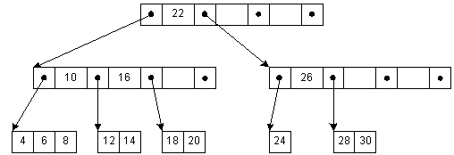

# Деревья

Иерархическая структура элементов, называемыми узлами (вершинами). На самом верхнем уровне имеется только один узел — корень дерева. Каждый узел, кроме корня, связан только с одним узлом на более высоком уровне. Каждый элемент может быть связан ребром с одним или несколькими элементами на следующем, более низком, уровне. Элементы, не имеющий потомков называются листьями. От корня до любой вершины существует один путь.

Любой узел дерева с потомками на всех уровнях так же образует дерево, называемое поддеревом.

### M-арное дерево

Число поддеревьев данного узла образует степень узла, максимальное значение m степени всех узлов дерева является степенью дерева. **Дерево степени 2 называется бинарным деревом.**

Если в дереве на каждом уровне задан порядок следования вершин, то такое дерево называется упорядоченным

### Бинарное дерево поиска

Это двоичное дерево, для которого выполняются следующие условия:

У всех узлов левого поддерева произвольного узла X значения ключей данных меньше, нежели значение ключа данных самого узла X.

У всех узлов правого поддерева произвольного узла X значения ключей данных больше либо равно, нежели значение ключа данных самого узла X.

### АВЛ-Дерево

Сбалансированное по высоте двоичное дерево поиска: для каждой его вершины высота её двух поддеревьев различается не более чем на 1.

АВЛ — аббревиатура, образованная первыми буквами создателей Адельсон-Вельского Георгия Максимовича и Ландиса Евгения Михайловича.

### 

### Красно-чёрное дерево

Это двоичное дерево поиска, в котором каждый узел имеет атрибут цвет, принимающий значения красный или чёрный. В дополнение к обычным требованиям, налагаемым на двоичные деревья поиска, к красно-чёрным деревьям применяются следующие требования:

- Узел либо красный, либо чёрный.
- Корень — чёрный. (В других определениях это правило иногда опускается. Это правило слабо влияет на анализ, так как корень всегда может быть изменен с красного на чёрный, но не обязательно наоборот).
- Все листья(NIL) — чёрные.
- Оба потомка каждого красного узла — чёрные.
- Всякий простой путь от данного узла до любого листового узла, являющегося его потомком, содержит одинаковое число чёрных узлов.

### B-дерево

**B-дерево** – это структура хранения данных, являющаяся разновидностью дерева поиска. Особенностями В-деревьев является: сбалансированность, ветвистость, отсортированность и логарифмическое время работы всех стандартных операций (поиск, вставка, удаление). Сбалансированность означает, что все листы находятся на одинаковом расстоянии от корня. В отличие от бинарных деревьев В-деревья допускают большое число потомков для любого из узлов. Это свойство называется ветвистостью. Благодаря ветвистости, В-деревья очень удобны для хранения крупных последовательных блоков данных, поэтому такая структура часто находит применение в базах данных и файловых системах.

m – порядок В-дерева – это максимальное число потомков для любого узла. Кроме узлов в дереве присутствует ещё одна сущность – ключи. Именно в них и содержится вся полезная информация. Каждый узел дерева можно представить в виде упорядоченной последовательности ”потомок1; ключ1; потомок2; ключ2; … потомок(N-1); ключ(N-1); потомокN”. Важно заметить, что ключи располагаются между ссылками на потомков и, таким образом, ключей всегда на 1 меньше. В организации В-дерева можно выделить несколько ключевых правил:

- Каждый узел содержит строго меньше m (порядок дерева) потомков.
- Каждый узел содержит не менее m/2 потомков.
- Корень может содержать меньше m/2 потомков.
- У корневого узла есть хотя бы 2 потомка, если он не является листом.
- Все листья находятся на одном уровне и содержат только данные (ключи).

### **B+‍‍-дерево** 

**B+‍‍-дерево** — [структура данных](https://ru.wikipedia.org/wiki/%D0%A1%D1%82%D1%80%D1%83%D0%BA%D1%82%D1%83%D1%80%D0%B0_%D0%B4%D0%B0%D0%BD%D0%BD%D1%8B%D1%85) на основе [B-дерева](https://ru.wikipedia.org/wiki/B-%D0%B4%D0%B5%D1%80%D0%B5%D0%B2%D0%BE), сбалансированное n-арное дерево поиска с переменным, но зачастую большим количеством потомков в узле. B+‍‍-дерево состоит из корня, внутренних узлов и листьев, корень может быть либо листом, либо узлом с двумя и более потомками.

Изначально структура предназначалась для хранения данных в целях эффективного поиска в блочно-ориентированной среде хранения — в частности, для файловых систем; применение связано с тем, что в отличие от бинарных деревьев поиска, B**+‍‍**-деревья имеют очень высокий коэффициент ветвления (число указателей из родительского узла на дочерние, обычно порядка 100 или более), что снижает количество операций ввода-вывода, требующих поиска элемента в дереве.

Свойства структуры:

- В B**+‍‍**-дереве легко реализуется независимость программы от структуры информационной записи.
- Поиск обязательно заканчивается в листе.
- Удаление ключа имеет преимущество — удаление всегда происходит из листа.
- Другие операции выполняются аналогично B-деревьям.
- B**+‍‍**-деревья требуют больше памяти для представления, чем классические B-деревья.
- B**+‍‍**-деревья имеют возможность последовательного доступа к ключам.