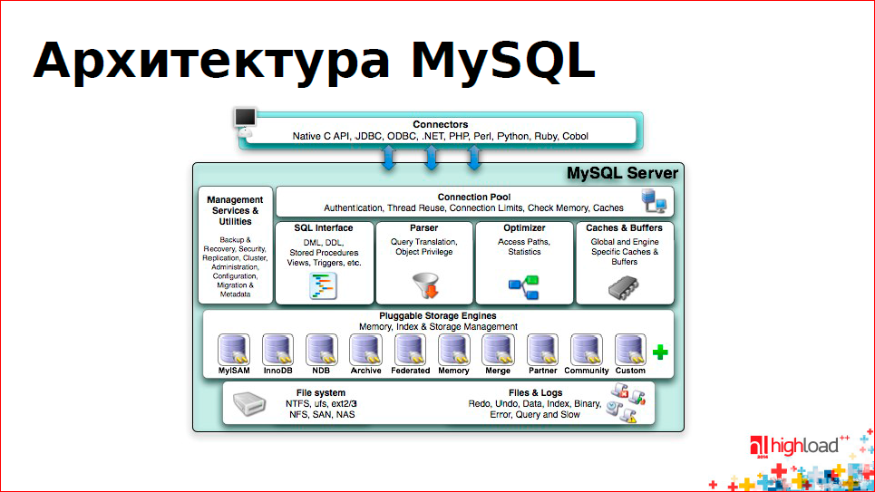

## Логическая архитектура Mysql

На самом верхнем уровне содержатся службы, которые не являются уникальными для MySQL. Эти службы необходимы большинству сетевых клиент-серверных инструментов и серверов: они обеспечивают
поддержку соединений, идентификацию, безопасность и т. п.

Второй уровень представляет гораздо больший интерес. Здесь сосредоточена значительная часть интеллекта MySQL: синтаксический анализ запросов, оптимизация, кэширование и все встроенные функции (например, функции работы с датами и временем, математические функции, шифрование). На этом уровне реализуется любая независимая от подсистемы хранения данных функциональность, например хранимые
процедуры, триггеры и представления.

Третий уровень содержит подсис темы хранения данных. Они отвечают за сохранение и извлечение всех данных, хранимых в MySQL. Подобно различным файловым сис темам GNU/Linux, каждая подсис тема
хранения данных имеет свои сильные и слабые стороны. Сервер взаимодействует с ними с помощью API подсистемы хранения данных. Этот интерфейс скрывает различия между подсис темами хранения данных и делает их почти прозрачными на уровне запросов. Кроме того, данный интерфейс содержит пару десятков низкоуровневых функций, выполняющих операции типа «начать транзакцию» или «извлечь строку с таким первичным ключом». Подсис темы хранения не производят синтаксический анализ кода SQL  и не взаимодействуют друг с другом, они просто отвечают наисходящие от сервера запросы.

## Управление соединениями и безопасность

Для каждого клиентского соединения выделяется отдельный поток внутри процесса сервера. Запросы по данному соединению исполняются в пределах этого потока, который, в свою очередь, выполняется одним ядром или процессором. Сервер кэширует потоки, так что их не нужно создавать или уничтожать для каждого нового соединения. Когда клиенты (приложения) подключаются к серверу MySQL, сервер должен их идентифицировать. Идентификация основывается на имени пользователя, адресе хоста, с которого происходит соединение, и паро-
ле. Также можно использовать сертификаты X.509 при соединении по протоколу Secure Sockets Layer (SSL). После того как клиент подключился, для каждого запроса сервер проверяет наличие необходимых привилегий (например, разрешено ли клиенту использовать команду SELECT применительно к таб лице Country базы данных world). 
