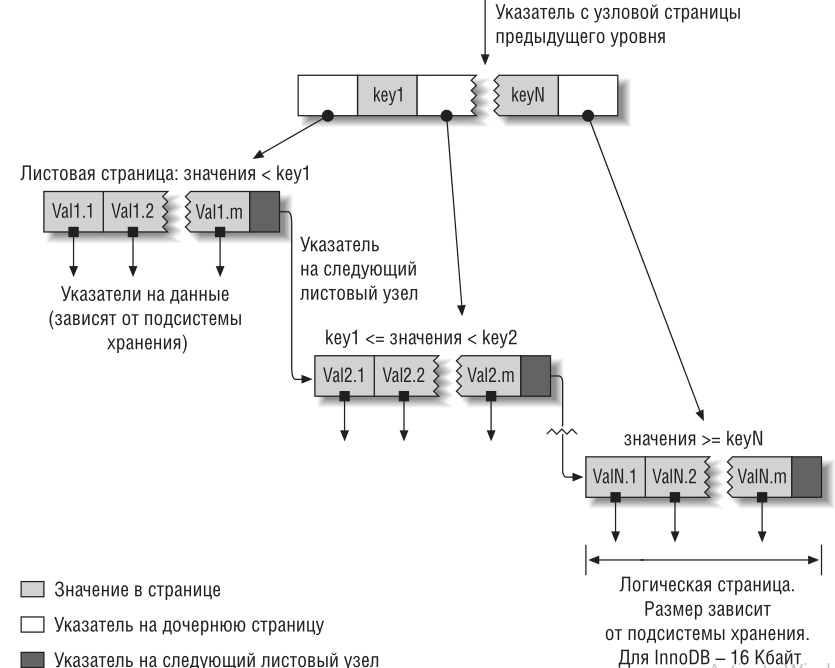
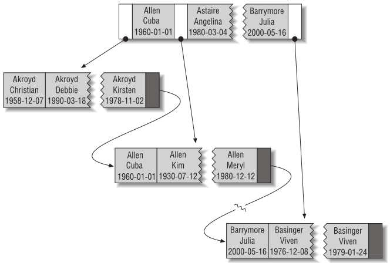

# Индексы

Индексы представляют собой структуры, которые помогают MySQL эффективно извлекать данные. Они критичны для достижения хорошей производительности, но многие часто забывают о них или плохо понимают их смысл, поэтому индексирование является главной причиной проблем с производительностью в реальных условиях. 

Важность индексов (именуемых в MySQL также ключами) увеличивается по мере роста объема данных. Небольшие, слабо загруженные базы зачастую могут удовлетворительно работать даже без правильно построенных индексов, но по мере роста объемов хранимой в базе информации производительность может упасть очень быстро.

Самый простой способ понять, как работает индекс в MySQL, – представить себе алфавитный указатель в книге. Чтобы выяснить, в какой части издания обсуждается конкретный вопрос, вы смотрите в алфавитный указатель и находите номер страницы, где упоминается термин.MySQL использует индексы сходным образом. Она ищет значение в структурах данных индекса. Обнаружив соответствие, она может перейти к самой строке. 

## Типы индексов

### B-Tree  
Когда говорят об индексе без упоминания типа, обычно имеют в виду B-Tree индексы, в которых для хранения данных используется структура, называемая B-Tree. Мы используем термин «B-tree» для этих индексов потому, что именно так MySQL называет их в CREATE TABLE и других командах. Однако на внутреннем уровне подсис темы хранения могут использовать совершенно другие структуры данных.
Общая идея B-дерева заключается в том, что значения хранятся по порядку, и все листовые страницы находятся на одинаковом расстоянии от корня. На рисунке  показано абстрактное представление B-Tree индекса, которое приблизительно соответствует тому, как работают индексы InnoDB (InnoDB использует структуру данных B+Tree).




Предположим, у нас есть следующая таб лица:

``` 
CREATE TABLE People (
    last_name varchar(50) not null,
    first_name varchar(50) not null,
    dob date not null,
    gender enum(‘m’, ‘f’) not null,
    key(last_name, first_name, dob)
);
```

Примерно так это будет храниться в индексе:



Рассмотрим когда B-Tree будет реально полезен, на примере этой таблицы:

- **Поиск по полному значению** При поиске с полным значением ключа задаются критерии для всех
  столбцов, по которым построен индекс. Например, индекс позволит найти человека по имени Cuba Allen, родившегося 1 января 1960.
- **Поиск по самому левому префиксу** Индекс позволит найти всех людей с фамилией Allen. В этом случае используется только первый столбец индекса.
- **Поиск по префиксу столбца** Вы можете искать соответствие по началу значения столбца. Рассматриваемый индекс позволит найти всех людей, чьи фамилии начинаются с буквы J. В этом случае используется только первый столбец индекса.
- **Поиск по диапазону значений** Индекс позволит найти всех людей с фамилиями, начиная с Allen и кончая Barrymore. В этом случае также используется только первый столбец индекса.
- **Поиск по полному совпадению одной части и диапазону в другой части** Индекс позволит найти всех людей с фамилией Allen, чьи имена начинаются с буквы K (Kim, Karl и т. п.). Полное совпадение со столбцом last_name и поиск по диапазону значений столбца first_name.
  ​

### Hash index 

Хеш­индекс строится на основе хеш-таб лицы и полезен только для точного поиска с указанием всех столбцов индекса. Для каждой строки подсистема хранения вычисляет хеш­код индексированных столбцов –
сравнительно короткое значение, которое, скорее всего, будет различно для строк с разными значениями ключей. В индексе хранятся хеш-коды и указатели на соответствующие строки.

В MySQL только подсистема хранения Memory поддерживает явные хеш-индексы. Этот тип индекса принимается по умолчанию для таблиц типа Memory, хотя над ними можно строить также и B-Tree-индексы. Подсис тема Memory поддерживает неуникальные хеш-индексы, чтов мире баз данных является необычным. Если для нескольких строк хеш-код одинаков, то в индексе будет храниться связанный список указателей на эти строки.

Подсис тема хранения InnoDB поддерживает так называемые адап­тивные хеш­индексы. Когда InnoDB замечает, что доступ к некоторым значениям индекса происходит очень часто, она строит для них хешиндекс в памяти, помимо уже имеющихся B-Tree-индексов. Тем самым к B-Tree-индексам добавляются некоторые свойства хеш-индексов, например очень быстрый поиск. Этот процесс полностью автоматический, и вы не можете ни контролировать, ни настраивать его.

Также можно симулировать хеш-индекс в ручную - добавить колонку, хранящую вычисляемый хеш для другой колонки и строить индекс для колонки хранящей хеш.

### R-Tree 

MyISAM поддерживает пространственные индексы, которые можно строить по стобцам пространственного типа, например GEOMETRY. Однако для того чтобы R-Tree индексы работали, необходимо использовать
геоинформационные функции MySQL, например MBRCONTAINS(). В целом пространственные индексы в  MySql гавно, лучше юзать Postgres для этого.

### Полнотекстовые индексы

Полнотекстовый (FULLTEXT) индекс позволяет искать в тексте ключевые слова, а не сравнивать искомое значение со значениями в столбце. Полнотекстовый поиск не имеет ничего общего с другими типами по-
иска. С ним связано много тонкостей, например стоп-слова, стемминг, учет множественного числа, а также булевский поиск. Он гораздо больше напоминает поисковые системы, нежели обычное сравнение с кри-
терием во фразе WHERE.

Наличие полнотекстового индекса по столбцу не делает B-Tree-индекс по этому же столбцу менее ценным. Полнотекстовые индексы предназначены для операций MATCH AGAINST, а не обычных операций с фразой WHERE. 

@todo

кардинальность, селективность, кластерные, покрывающие