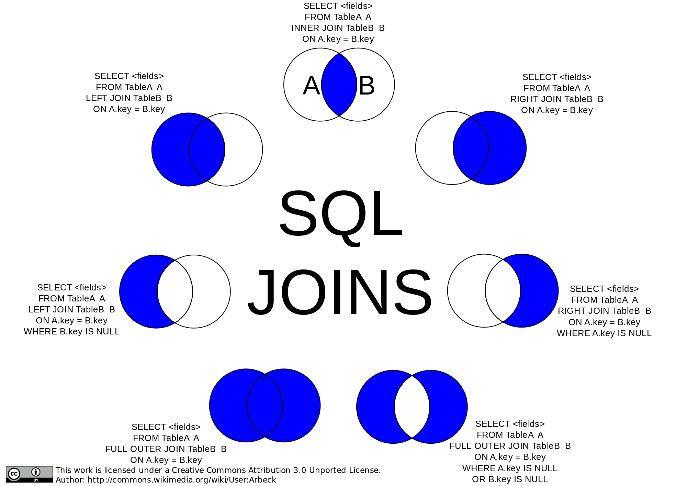

# Основы языка SQL

SQL (structured query language — «язык структурированных запросов») — декларативный язык программирования, применяемый для создания, модификации и управления данными в реляционной базе данных, управляемой соответствующей системой управления базами данных.

Поскольку к началу 1980-х годов существовало несколько вариантов СУБД от разных производителей, причём каждый из них обладал собственной реализацией языка запросов, было принято решение разработать стандарт языка, который будет гарантировать переносимость ПО с одной СУБД на другую (при условии, что они будут поддерживать этот стандарт). В итоге у нас сейчас дохера стандартов:

| Год                                        | Название                                           | Иное название                                                | Изменения                                                    |
| ------------------------------------------ | -------------------------------------------------- | ------------------------------------------------------------ | ------------------------------------------------------------ |
| 1986                                       | SQL-86                                             | SQL-87                                                       | Первый вариант стандарта, принятый институтом ANSI и одобренный ISO в 1987 году. |
| 1989                                       | SQL-89                                             | [FIPS](https://ru.wikipedia.org/wiki/%D0%A4%D0%B5%D0%B4%D0%B5%D1%80%D0%B0%D0%BB%D1%8C%D0%BD%D1%8B%D0%B5_%D1%81%D1%82%D0%B0%D0%BD%D0%B4%D0%B0%D1%80%D1%82%D1%8B_%D0%BE%D0%B1%D1%80%D0%B0%D0%B1%D0%BE%D1%82%D0%BA%D0%B8_%D0%B8%D0%BD%D1%84%D0%BE%D1%80%D0%BC%D0%B0%D1%86%D0%B8%D0%B8) 127-1 | Немного доработанный вариант предыдущего стандарта.          |
| [1992](https://ru.wikipedia.org/wiki/1992) | [SQL-92](https://ru.wikipedia.org/wiki/SQL-92)     | SQL2, FIPS 127-2                                             | Значительные изменения (ISO 9075); уровень *Entry Level* стандарта SQL-92 был принят как стандарт FIPS 127-2. |
| [1999](https://ru.wikipedia.org/wiki/1999) | [SQL:1999](https://ru.wikipedia.org/wiki/SQL:1999) | SQL3                                                         | Добавлена поддержка [регулярных выражений](https://ru.wikipedia.org/wiki/%D0%A0%D0%B5%D0%B3%D1%83%D0%BB%D1%8F%D1%80%D0%BD%D1%8B%D0%B5_%D0%B2%D1%8B%D1%80%D0%B0%D0%B6%D0%B5%D0%BD%D0%B8%D1%8F), [рекурсивных](https://ru.wikipedia.org/wiki/%D0%A0%D0%B5%D0%BA%D1%83%D1%80%D1%81%D0%B8%D1%8F) запросов, поддержка [триггеров](https://ru.wikipedia.org/wiki/%D0%A2%D1%80%D0%B8%D0%B3%D0%B3%D0%B5%D1%80_(%D0%B1%D0%B0%D0%B7%D1%8B_%D0%B4%D0%B0%D0%BD%D0%BD%D1%8B%D1%85)), базовые процедурные расширения, нескалярные типы данных и некоторые [объектно-ориентированные](https://ru.wikipedia.org/wiki/%D0%9E%D0%B1%D1%8A%D0%B5%D0%BA%D1%82%D0%BD%D0%BE-%D0%BE%D1%80%D0%B8%D0%B5%D0%BD%D1%82%D0%B8%D1%80%D0%BE%D0%B2%D0%B0%D0%BD%D0%BD%D0%BE%D0%B5_%D0%BF%D1%80%D0%BE%D0%B3%D1%80%D0%B0%D0%BC%D0%BC%D0%B8%D1%80%D0%BE%D0%B2%D0%B0%D0%BD%D0%B8%D0%B5) возможности. |
| [2003](https://ru.wikipedia.org/wiki/2003) | [SQL:2003](https://ru.wikipedia.org/wiki/SQL:2003) |                                                              | Введены расширения для работы с [XML](https://ru.wikipedia.org/wiki/XML)-данными, оконные функции (применяемые для работы с [OLAP](https://ru.wikipedia.org/wiki/OLAP)-базами данных), генераторы последовательностей и основанные на них типы данных. |
| [2006](https://ru.wikipedia.org/wiki/2006) | [SQL:2006](https://ru.wikipedia.org/wiki/SQL:2006) |                                                              | Функциональность работы с XML-данными значительно расширена. Появилась возможность совместно использовать в запросах SQL и [XQuery](https://ru.wikipedia.org/wiki/XQuery). |
| [2008](https://ru.wikipedia.org/wiki/2008) | [SQL:2008](https://ru.wikipedia.org/wiki/SQL:2008) |                                                              | Улучшены возможности оконных функций, устранены некоторые неоднозначности стандарта SQL:2003[[6\]](https://ru.wikipedia.org/wiki/SQL#cite_note-6) |

## Операторы

Согласно общепринятому [стилю программирования](https://ru.wikipedia.org/wiki/%D0%A1%D1%82%D0%B8%D0%BB%D1%8C_%D0%BF%D1%80%D0%BE%D0%B3%D1%80%D0%B0%D0%BC%D0%BC%D0%B8%D1%80%D0%BE%D0%B2%D0%B0%D0%BD%D0%B8%D1%8F), операторы (и другие зарезервированные слова) в SQL обычно рекомендуется писать [прописными буквами](https://ru.wikipedia.org/wiki/%D0%97%D0%B0%D0%B3%D0%BB%D0%B0%D0%B2%D0%BD%D1%8B%D0%B5_%D0%B1%D1%83%D0%BA%D0%B2%D1%8B).[[7\]](https://ru.wikipedia.org/wiki/SQL#cite_note-7)

Операторы SQL делятся на:

- операторы определения данных (Definition Language, DDL):

  - [CREATE](https://ru.wikipedia.org/wiki/Create_(SQL)) создаёт объект БД (саму базу, таблицу, [представление](https://ru.wikipedia.org/wiki/%D0%9F%D1%80%D0%B5%D0%B4%D1%81%D1%82%D0%B0%D0%B2%D0%BB%D0%B5%D0%BD%D0%B8%D0%B5_(%D0%B1%D0%B0%D0%B7%D1%8B_%D0%B4%D0%B0%D0%BD%D0%BD%D1%8B%D1%85)), пользователя и т. д.),
  - [ALTER](https://ru.wikipedia.org/w/index.php?title=Alter_(SQL)&action=edit&redlink=1) изменяет объект,
  - [DROP](https://ru.wikipedia.org/w/index.php?title=Drop_(SQL)&action=edit&redlink=1) удаляет объект;

- операторы манипуляции данными (Data Manipulation Language, DML):

  - [SELECT](https://ru.wikipedia.org/wiki/Select_(SQL)) выбирает данные, удовлетворяющие заданным условиям,
  - [INSERT](https://ru.wikipedia.org/wiki/Insert_(SQL)) добавляет новые данные,
  - [UPDATE](https://ru.wikipedia.org/wiki/Update_(SQL)) изменяет существующие данные,
  - [DELETE](https://ru.wikipedia.org/wiki/Delete_(SQL)) удаляет данные;

- операторы определения доступа к данным (Data Control Language, DCL):

  - [GRANT](https://ru.wikipedia.org/w/index.php?title=Grant_(SQL)&action=edit&redlink=1) предоставляет пользователю (группе) разрешения на определённые операции с объектом,
  - [REVOKE](https://ru.wikipedia.org/w/index.php?title=Revoke_(SQL)&action=edit&redlink=1) отзывает ранее выданные разрешения,
  - [DENY](https://ru.wikipedia.org/w/index.php?title=Deny_(SQL)&action=edit&redlink=1) задаёт запрет, имеющий приоритет над разрешением;

- операторы управления транзакциями (Transaction Control Language, TCL):

  - [COMMIT](https://ru.wikipedia.org/wiki/Commit_(SQL)) применяет транзакцию,
  - [ROLLBACK](https://ru.wikipedia.org/wiki/Rollback_(SQL)) откатывает все изменения, сделанные в контексте текущей транзакции,
  - [SAVEPOINT](https://ru.wikipedia.org/wiki/Savepoint_(SQL)) делит транзакцию на более мелкие участки.

## Joins

