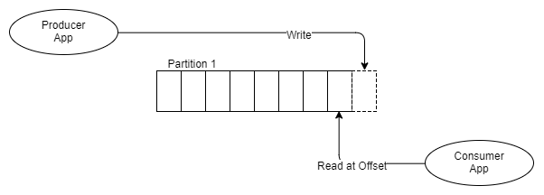

# noSql

## Memcached

[Memcached](http://code.google.com/p/memcached/) представляет собой сервер, хранящий в оперативной памяти некоторые данные с заданным временем жизни. Доступ к данным осуществляется по ключу (имени). Вы можете думать о Memcached, как о [хэш-таблице](https://eax.me/hash-tables/), хранящейся на сервере. Применяется он в основном для кэширования кода веб-страниц, результатов запросов к базе данных и тп.

Также ничто не мешает использовать Memcached в качестве «не очень надежного» key-value хранилища. Например, в нем можно хранить сессии пользователей, коды капч или счетчик посетителей, находящихся в данный момент на сайте.

Коротко о главном:

- Умеет только key => value in memrory

- Вытеснение. Когда Memcache доходит до ограничения в памяти, он начинает удалять объекты по принципу [LRU](https://ruhighload.com/%d0%9a%d1%8d%d1%88%d0%b8%d1%80%d0%be%d0%b2%d0%b0%d0%bd%d0%b8%d0%b5+%d0%b4%d0%b0%d0%bd%d0%bd%d1%8b%d1%85#lru)(Least Recently Used). Memcache постарается удалить прежде всего те данные, которые запрашивались очень давно (т.е. менее популярные удалит, а более популярные оставит).

- Шардинг из коробки(достаточно просто добавлять сервера, вся работа будет инкапсулирвоана в него)

- Максимальная длина ключа по умолчанию составляет 250 байт, а длина значения — 1 Мб;

- [Будьте осторожнее со спец-символами](https://eax.me/memcached/#comment-432394490);

- Ключи можно «расширить», воспользовавшись каким-нибудь MD5 или SHA512 (в этом случае нехэшированный ключ будет разумно продублировать в значении);

- Если хочется хранить очень длинные значения, можно сжимать их и/илиразбивать на части;

- Весь ввод-вывод осуществляется с помощью [libevent](https://eax.me/libevent/);

- Для ускорения работы память выделяется при запуске демона и не освобождается до его остановки;

- Для борьбы с фрагментацией памяти используется [slab allocator](http://ru.wikipedia.org/wiki/Slab);

- Все операции являются атомарными, есть поддержка [compare-and-swap](http://ru.wikipedia.org/wiki/%D0%A1%D1%80%D0%B0%D0%B2%D0%BD%D0%B5%D0%BD%D0%B8%D0%B5_%D1%81_%D0%BE%D0%B1%D0%BC%D0%B5%D0%BD%D0%BE%D0%BC);

- С Memcached можно работать по UDP;

- Помимо текстового протокола [также существует бинарный](http://code.google.com/p/memcached/wiki/BinaryProtocolRevamped);

## Redis

[Redis](http://redis.io/) (REmote DIctionary Server) — это *не*реляционная высокопроизводительная СУБД. Redis хранит все данные в памяти, доступ к данным осуществляется по ключу. Опционально копия данных может храниться на диске. Этот подход обеспечивает производительность, в десятки раз превосходящую производительность реляционных СУБД, а также упрощает секционирование (шардинг) данных.

### Коротко о главном

В первом приближении может показаться, что Redis мало чем отличается от [Memcached](https://eax.me/memcached/). И действительно, как Redis, так и Memcached хранят данные в памяти и осуществляют доступ к ним по ключу. Оба написаны на Си и распространяются под лицензией BSD. Но в действительности, между Redis и Memcahced больше различий, чем сходства.

В первую очередь, Redis умеет **сохранять данные на диск**. Можно настроить Redis так, чтобы данные вообще не сохранялись, сохранялись периодически по принципу copy-on-write, или сохранялись периодически *и* писались в журнал (binlog). Таким образом, всегда можно добиться требуемого баланса между производительностью и надежностью.

Redis, в отличие от Memcached, **позволяет хранить не только строки**, но и массивы (которые могут использоваться в качестве очередей или стеков), словари, множества без повторов, большие массивы бит (bitmaps), а также множества, отсортированные по некой величине. Разумеется, можно работать с отдельными элементами списков, словарей и множеств. Как и Memcached, Redis позволяет указать время жизни данных (двумя способами — «удалить тогда-то» и «удалить через …»). По умолчанию все данные хранятся вечно.

Интересная особенность Redis заключается в том, что это — **однопоточный сервер**. Такое решение сильно упрощает поддержку кода, обеспечивает атомарность операций и позволяет запустить по одному процессу Redis на каждое ядро процессора. Разумеется, каждый процесс будет прослушивать свой порт. Решение нетипичное, но вполне оправданное, так как на выполнение одной операции Redis тратит очень небольшое количество времени (порядка [*одной стотысячной* секунды](http://pyha.ru/wiki/index.php?title=Redis:benchmark)).

В Redis есть **репликация**. Репликация с несколькими главными серверами не поддерживается. Каждый подчиненный сервер может выступать в роли главного для других. Репликация в Redis не приводит к блокировкам ни на главном сервере, ни на подчиненных. На репликах разрешена операция записи. Когда главный и подчиненный сервер восстанавливают соединение после разрыва, происходит полная синхронизация (resync).

Также Redis поддерживает **транзакции** (будут последовательно выполнены либо все операции, либо ни одной) и **пакетную обработку команд** (выполняем пачку команд, затем получаем пачку результатов). Притом ничто не мешает использовать их совместно.

Еще одна особенность Redis — поддержка механизма **publish/subscribe**. Но лучше не надо.

Преимущества Redis: 

- очень очень быстрая скорость доступа к данным. Это же мемчик.
- смешанные типы данных, хеши. По одному ключу (ивент), мы можем сторить кучу инфы (юзер айди, тип ивента, время, токен, сессию). Это могут быть байты, килобайты, мегабайты данных.
- дженерик TTL. Нам не нужно удалять то, что мы положили в Redis. Внутренний механизм сам удалит ключ, TTL которого пришел. Это невероятно удобно.
- унарные операции, инкременты, декременты — все это отрабатывает не моментально, а просто невероятно моментально. Соответственно, в Redis удобно и легко реализовывать комплексные прогресс бары, ивенты, класть кастомные данные, которые изменяются с разных мест системы.
- персистентность и бин-лог. Есть возможность периодически флашить все данные на диск, обеспечивая высокую доступность данных, и почти нивелируя их потерю.

- На данный момент длина ключа в Redis может составлять до 231 байт, длина строки — до 512 Мб, списки и множества могут содержать до 232элементов, один экземпляр Redis может хранить до 232 ключей;
- На одном сервере можно держать [несколько пронумерованных баз данных](http://rediscookbook.org/multiple_databases.html), по умолчанию их число равно 16-и.
- Приложения, использующие Redis, удобно профилировать (команда slowlog) и отлаживать (команда monitor);
- Redis написан таким образом, что резервную копию его базы данных можно сделать простым копированием файла дампа, даже во время работы сервера;
- Redis Cluster

Так для каких же целей можно использовать Redis?

### Области применения

Самое серьезное ограничение Redis заключается в том, что объем данных, который может хранится на одном физическом сервере, ограничен объемом оперативной памяти на этом сервере. Была предпринята попытка обойти это ограничение за счет использования виртуальной памяти, но эта идея [была признана неудачной](http://redis.io/topics/virtual-memory). Таким образом, хранить в Redis *много* данных стоит недешево.

Позволю себе привести цитату из The Little Redis Book:

> Это тот тип систем, которые вы используете для решения специфических задач. В этом смысле Redis близок к индексирующему движку. Вы не будете писать ваше приложение полностью на Lucene, но если вам нужна хорошая система поиска, она подарит вам полезный опыт.

На ум приходят следующие варианты использования Redis:

- Хранилище сессий и профилей пользователей;
- [Сервер очередей](https://metacpan.org/module/Redis::Queue), плюс держим в уме механизм publish/subscribe;
- Полноценная замена Memcached, притом в случае с Redis мы получим репликацию, более длинные ключи и значения, возможность восстановления кэша с диска и тп;
- Место для хранения [количества пользователей онлайн](http://blog.getspool.com/2011/11/29/fast-easy-realtime-metrics-using-redis-bitmaps/), кодов капч, различных флагов, саджестов поисковых запросов;
- СУБД для небольших приложений — сокращалок ссылок, имиджбордов, возможно даже блогов;
- Роль «словаря» в шардинге, то есть сервер, который знает, какие шарды на каких серверах искать;
- Хранилище промежуточных результатов вычислений при обработке больших объемов данных;

### Redis Cluster

Там же есть Redis Cluster! Скажете Вы, но я бы попросил не спешить. На самом деле, у Redis есть 2 типа кластеризации:

1. Redis Sentinel — для старых версий
2. Redis Cluster — для новых версий

Redis Sentinel — это очень примитивная штука, которая выстраивает древовидную структуру из Ваших стенделон редисок, и называет это кластером. Никакого шардинга, балансировки, ничего. И тем более, это работает для старых версий Redis, если не ошибаюсь, ниже 3.0.

Redis Cluster — это штука повеселее, тут уже есть шардинг, репликация, отказоустойчивость, мастера-слейвы, разные там штуки прикольные и все такое. Это уже однозначно похоже на нормальный кластер, но все равно юзать это таким, как оно есть — не получится. 

## Tarantool

Tarantool представляет собой решение, совмещающее неблокирующий сервер приложений на Lua с NoSQL базой данных. Высокой производительности позволяет достичь стек технологий, который использует тарантул:

- libev, libcoro и libeio для реализации event-loop'а, кооперативной многозадачности (coroutines/fibers) и асинхронной работы с сетью и другими задачами.
- LuaJIT — Трассирующий JIT-компилятор для Lua (на стероидах).

### Особенности хранилища

Базовым элементом хранения является кортеж. Кортеж имеет любую размерность, это просто произвольно длинный список полей, ассоциированный с уникальным ключом. Каждый кортеж принадлежит какому-то пространству (space). По полям кортежа можно определять индексы. Если проводить аналогии с реляционными СУБД, то "пространство" соответствует таблице, а "поля" соответствуют столбцам.

1. Несколько движков хранения данных:
   - Memtx — движок хранения данных полностью в памяти, с поддержкой нескольких видов индексов:
     - TREE (B+*-Дерево) — для быстрого поиска значений и возможности интегрирования.
     - HASH (Хеш-таблица) — для еще более быстрого поска значений.
     - BITSET (Битовая маска) — возможность поиска по битовым маскам.
     - RTREE (многомерное R*-Дерево) — для быстрого поиска близжайших соседей (KNN) и точек в заданных многомерных параллелепипедах с заданными функциями расстояния между двумя точками.
   - Sophia — двухуровневый движок хранения информации на диске, который был разработан в ответ на "недостатки" в LSM-деревьях, B-Деревьях и других. Он прекрасно подходит для нагрузки типа "много записи данных среднего размера и немного чтений", но расчёт идёт также на то, что чтение не будет занимать много времени.
2. Возможность поддерживать "персистентность" с помощью xlog (также известный как Transaction Log), snap (который, в свою очередь, является полным снимком БД) и eventual-consistency (консистетность в конечном счёте) master-master репликации.
3. Поддержка вторичных ключей и составных ключей.
4. Аутентификация и привелегии для пользователей и ролей.
5. MessagePack в качестве протокола для связи клиента с сервером и хранения информации внутри самой базы. MessagePack обеспечивает упаковку некоторых данных, что позволяет снизить траффик, передаваемый по сети, и размер занимаемой памяти в самом хранилище.
6. Поддержка транзакций и мультиверсионности индексов.

### Характеристика сервера приложений

Язык Lua прекрасно подходит для написания бизнес-логики вашего приложения и прост в освоении, а благодаря трассирующей JIT компиляции можно добиться существенной производительности. Также есть возможность писать модули приложения на языке C/C++.

Из встроенных библиотек есть возможность работы с YAML, JSON и CSV; имеется возможность для работы с неблокирующим дисковым/сетевым вводом-выводом, работой с UUID, алгоритмами хешированиями, упаковкой-распаковкой данных с заданной схемой и другое.

Имеется возможность связывать Tarantool'ы в кластера с помощью модуля 'net.box'. В качестве примера можно использовать модуль '[sharding](https://github.com/tarantool/shard)', который реализует шардинг на стороне сервера и '[connection-pool](https://github.com/tarantool/connection-pool)'.

## RabbitMQ

**RabbitMQ** — это распределенная система управления очередью сообщений. Распределенная, поскольку обычно работает как кластер узлов, где очереди распределяются по узлам и, опционально, реплицируются в целях устойчивости к ошибкам и высокой доступности. Штатно, она реализует AMQP 0.9.1 и предлагает другие протоколы, такие как STOMP, MQTT и HTTP через дополнительные модули.

RabbitMQ использует как классический, так и новаторский подходы к обмену сообщениями. Классический в том смысле, что она ориентирована на очередь сообщений, а новаторский — в возможности гибкой маршрутизации. Именно эта возможность маршрутизации является ее уникальным преимуществом. Создание быстрой, масштабируемой и надежной распределенной системы сообщений само по себе является достижением, но функциональность маршрутизации сообщений делает ее действительно выдающейся среди множества технологий обмена сообщениями.

### Exchange'и и очереди

Супер-упрощенный обзор:

- Паблишеры (publishers) отправляют сообщения на exchange’и
- Exchange’и отправляют сообщения в очереди и в другие exchange’и
- RabbitMQ отправляет подтверждения паблишерам при получении сообщения
- Получатели (consumers) поддерживают постоянные TCP-соединения с RabbitMQ и объявляют, какую очередь(-и) они получают
- RabbitMQ проталкивает (push) сообщения получателям
- Получатели отправляют подтверждения успеха/ошибки
- После успешного получения, сообщения удаляются из очередей

## Apache Kafka

Kafka — это распределенный реплицированный журнал фиксации изменений (commit log). У Kafka’и нет концепции очередей, что сначала может показаться странным, учитывая, что его используют в качестве системы обмена сообщениями. Очереди долгое время были синонимом систем обмена сообщениями. Давайте для начала разберемся, что значит «распределенный, реплицированный журнал фиксации изменений»:

- Распределенный, поскольку Kafka развертывается как кластер узлов, как для устойчивости к ошибкам, так и для масштабирования
- Реплицированный, поскольку сообщения обычно реплицируются на нескольких узлах (серверах).
- Журнал фиксации изменений, потому что сообщения хранятся в сегментированных, append-only журналах, которые называются топиками. Эта концепция журналирования является основным уникальным преимуществом Kafka’и.

 Понимание журнала (и топика) и партиций являются ключом к пониманию Kafka’и. Итак, чем партиционированный журнал отличается от набора очередей? Давайте представим, как это выглядит.

Вместо того, чтобы помещать сообщения в очередь FIFO и отслеживать статус этого сообщения в очереди, как это делает RabbitMQ, Kafka просто добавляет его в журнал, и на этом все.

Сообщение остается, вне зависимости от того, будет ли оно получено один или несколько раз. Удаляется оно в соответствии с политикой удерживания данных (retention policy, также называемый window time period). Каким же образом информация забирается из топика?

Каждый получатель отслеживает, где она находится в журнале: имеется указатель на последнее полученное сообщение и этот указатель называется адресом смещения. Получатели поддерживают этот адрес через клиентские библиотеки, и в зависимости от версии Kafka адрес сохраняется либо в ZooKeeper, либо в самой Kafka’е.

Отличительная особенность модели журналирования в том, что она мгновенно устраняет множество сложностей, касающихся состояния доставки сообщений и, что более важно для получателей, позволяет им перематывать назад, возвращаться и получать сообщения по предыдущему относительному адресу. Например, представьте, что вы разворачиваете сервис, который выставляет счета, учитывающие заказы, размещаемые клиентами. У службы случилась ошибка, и она неправильно рассчитывает все счета за 24 часа. С RabbitMQ в лучшем случае вам нужно будет как-то переопубликовать эти заказы только на сервисе счетов. Но с Kafka вы просто перемещаете относительный адрес для этого получателя на 24 часа назад.

Каждая партиция представляет собой отдельный файл, в котором гарантируется очередность сообщений. Это важно помнить: порядок сообщений гарантируется только в одной партиции. В дальнейшем это может привести к некоторому противоречию между потребностями в очередности сообщений и потребностями в производительности, поскольку производительность в Kafka также масштабируется партициями. Партиция не может поддерживать конкурирующих получателей, блок параллельности Kafka — это сама партиция. Поэтому, если нам нужны три получателя счетов, нам нужно как минимум три партиции(1 воркер на 1 партицию).

## MongoDb

**MongoDB** — документоориентированная система управления базами данных (СУБД) с открытым исходным кодом, не требующая описания схемы таблиц. Классифицирована как NoSQL, использует JSON-подобные документы и схему базы данных. Написана на языке C++.

### Формат данных в MongoDB

Одним из популярных стандартов обмена данными и их хранения является JSON (JavaScript Object Notation). JSON эффективно описывает сложные по структуре данные. Способ хранения данных в MongoDB в этом плане похож на JSON, хотя формально JSON не используется. Для хранения в MongoDB применяется формат, который называется **BSON** (БиСон) или сокращение от binary JSON.

BSON позволяет работать с данными быстрее: быстрее выполняется поиск и обработка. Хотя надо отметить, что BSON в отличие от хранения данных в формате JSON имеет небольшой недостаток: в целом данные в JSON-формате занимают меньше места, чем в формате BSON, с другой стороны, данный недостаток с лихвой окупается скоростью.

### Документы вместо строк

Если реляционные базы данных хранят строки, то MongoDB хранит документы. В отличие от строк документы могут хранить сложную по структуре информацию. Документ можно представить как хранилище ключей и значений.

Ключ представляет простую метку, с которым ассоциировано определенный кусок данных.

Однако при всех различиях есть одна особенность, которая сближает MongoDB и реляционные базы данных. В реляционных СУБД встречается такое понятие как первичный ключ. Это понятие описывает некий столбец, который имеет уникальные значения. В MongoDB для каждого документа имеется уникальный идентификатор, который называется `_id`. И если явным образом не указать его значение, то MongoDB автоматически сгенерирует для него значение.

Каждому ключу сопоставляется определенное значение. Но здесь также надо учитывать одну особенность: если в реляционных базах есть четко очерченная структура, где есть поля, и если какое-то поле не имеет значение, ему (в зависимости от настроек конкретной бд) можно присвоить значение `NULL`. В MongoDB все иначе. Если какому-то ключу не сопоставлено значение, то этот ключ просто опускается в документе и не употребляется.

### Коллекции

Если в традиционном мире SQL есть таблицы, то в мире MongoDB есть коллекции. И если в реляционных БД таблицы хранят однотипные жестко структурированные объекты, то в коллекции могут содержать самые разные объекты, имеющие различную структуру и различный набор свойств.

### Репликация

Система хранения данных в MongoDB представляет набор реплик. В этом наборе есть основной узел, а также может быть набор вторичных узлов. Все вторичные узлы сохраняют целостность и автоматически обновляются вместе с обновлением главного узла. И если основной узел по каким-то причинам выходит из строя, то один из вторичных узлов становится главным.

### Простота в использовании

Отсутствие жесткой схемы базы данных и в связи с этим потребности при малейшем изменении концепции хранения данных пересоздавать эту схему значительно облегчают работу с базами данных MongoDB и дальнейшим их масштабированием. Кроме того, экономится время разработчиков. Им больше не надо думать о пересоздании базы данных и тратить время на построение сложных запросов.

### GridFS

Одной из проблем при работе с любыми системами баз данных является сохранение данных большого размера. Можно сохранять данные в файлах, используя различные языки программирования. Некоторые СУБД предлагают специальные типы данных для хранения бинарных данных в БД (например, BLOB в MySQL).

В отличие от реляционных СУБД MongoDB позволяет сохранять различные документы с различным набором данных, однако при этом размер документа ограничивается 16 мб. Но MongoDB предлагает решение - специальную технологию **GridFS**, которая позволяет хранить данные по размеру больше, чем 16 мб.

Система GridFS состоит из двух коллекций. В первой коллекции, которая называется `files`, хранятся имена файлов, а также их метаданные, например, размер. А в другой коллекции, которая называется `chunks`, в виде небольших сегментов хранятся данные файлов, обычно сегментами по 256 кб.

Для тестирования GridFS можно использовать специальную утилиту **mongofiles**, которая идет в пакете mongodb.

*Дополнительно*:

[Использование memcached и Redis в высоконагруженных проектах](https://habr.com/company/oleg-bunin/blog/316652/)

[Как мы Redis Cluster готовили](https://habr.com/post/320902/)

[RabbitMQ против Kafka](https://habr.com/company/itsumma/blog/416629/)

[Apache Kafka – мой конспект](https://habr.com/post/354486/)

https://stackoverflow.com/questions/10558465/memcached-vs-redis

[Сравниваем Tarantool с Redis и Memcached](https://habr.com/company/mailru/blog/352760/)

[Введение в MongoDB](https://metanit.com/nosql/mongodb/1.1.php)