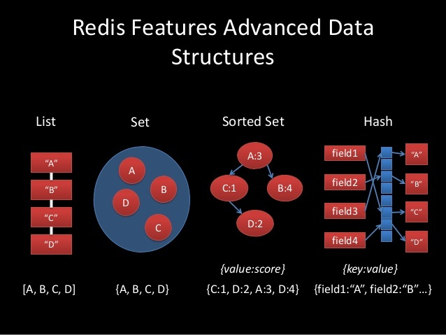

# Redis

[Redis](http://redis.io/) (REmote DIctionary Server) — это *не*реляционная высокопроизводительная СУБД. Быстрое хранилище данных в памяти с открытым исходным кодом для использования в качестве базы данных, кэша, брокера сообщений или очереди. Redis хранит все данные в памяти, доступ к данным осуществляется только по ключу. Опционально копия данных может храниться на диске. Этот подход обеспечивает производительность, в десятки раз превосходящую производительность реляционных СУБД, а также упрощает шардинг данных.

## Типы данных

### Строки

**Строки** (strings). Базовый тип данных Redis. Строки в Redis бинарно-безопасны, *могут использоваться так же как числа,* ограничены размером 512 Мб.  Строки — это основная структура. Это одна их четырех базовых структур, а так же основа всех сложных структур, потому что Список — это список строк, Множество — это множество строк, и так далее.

Строки хороши во всех очевидных сценариях использования, когда вы хотите хранить HTML страницу, но так же они хороши если вы хотите избежать конвертирования уже закодированных данных. Например, если у вас есть JSON или MessagePack, вы можете просто хранить объекты как строки. В Redis 2.6 вы даже можете управлять этим видом структур на стороне сервера, используя скрипты на Lua.

Другое интересное использование строк — это битовые массивы, и вообще, случайный доступ к массивам байтов, так как Redis предоставляет команды доступа к произвольным диапазонам байтов, или даже к отдельным битам. 

### Списки

**Списки** (lists). Классические списки строк, упорядоченные в порядке вставки, которая возможна как со стороны головы, так и со стороны хвоста списка. Максимальное количество элементов — 2^32 — 1. Списки хороши когда в основном вы работаете с крайними элементами: около хвоста, или около головы. Списки не лучший выбор для деления чего-либо на страницы, из-за медленного случайного доступа, O(N). Хорошим использованием списков будут простые очереди и стеки, или циклическая обработка элементов командой RPOPLPUSH, параметрами которой будет один и тот же список.

Списки так же хороши, когда нам нужна ограниченная коллекция из N элементов, доступ в которой *обычно* осуществляется только к верхнему или нижнему элементам, или когда N небольшое.

### Множества

**Множества** (sets). Множества строк в математическом понимании: не упорядочены, поддерживают операции вставки, проверки вхождения элемента, пересечения и разницы множеств. Максимальное количество элементов — 2^32 — 1. Множество — это не упорядоченный набор данных, оно эффективно когда у вас есть коллекция элементов, и важно очень быстро проверить присутствие элемента в коллекции, или получить ее размер. Еще одна «фишка» множеств — это возможность получить случайный элемент.

Множества поддерживают сложные операции, такие как пересечение, объединение и так далее, это хороший способ использовать Redis в «вычислительной» манере, когда у вас есть данные, и вы хотите получить некоторый результат, выполняя преобразования над этими данными. Небольшие множества кодируются очень эффективным способом.

Множества используются для хранения уникальных значений и предоставляют набор операций — таких, как объединение. Множества не упорядочены, но предоставляют эффективные операции со значениями. Список друзей является классическим примером использования множеств:
```
sadd friends:leto ghanima paul chani jessica
sadd friends:duncan paul jessica alia
```
Независимо от того, сколько друзей имеет пользователь, мы можем эффективно (O(1)) определить, являются ли пользователи userX и userY друзьями, или нет.
```
sismember friends:leto jessica
sismember friends:leto vladimir
```
Более того, мы можем узнать, имеют ли два пользователя общих друзей:
```
sinter friends:leto friends:duncan
```
и даже сохранить результат этой операции под новым ключом:
```
sinterstore friends:leto_duncan friends:leto friends:duncan
```
Множества отлично подходят для теггинга (tagging, присвоение семантических ярлыков-меток — прим. перев.) и отслеживания любых других свойств, для которых повторы не имеют смысла (или там, где мы хотим использовать операции над множествами, такие как пересечение и объединение).

### Упорядоченные множества

**Упорядоченные множества** (sorted sets). Упорядоченное множество отличается от обычного тем, что его элементы упорядочены по особому параметру «score». Упорядоченное Множество — это *единственная структура данных, кроме списка, поддерживающая работу с упорядоченными элементами*. С упорядоченными множествами можно делать много крутых вещей. Например, вы можете реализовать все виды **Топа Чего-либо** в вашем веб-приложении. Топ пользователей по рейтингу, топ постов по числу просмотров, топ чего угодно, и один экземпляр Redis будет обслуживать тонны вставок и запросов в секунду.

Упорядоченные множества, как и обычные множества, могут быть использованы для описания отношений, но они так же позволят делить элементы на страницы, и сохранять порядок. К примеру, если я храню друзей пользователя X как упорядоченное множество, я могу легко хранить их в порядке добавления в друзья.

Упорядоченные множества хороши для очередей с приоритетами.

Упорядоченные множества — это что-то вроде более мощных списков, в которых вставка, удаление или получение элементов из середины списка так же быстро. Но они используют больше памяти, и являются O(log(N)) структурами.

Упорядоченные множества — симбиоз обычных множеств и списков. Дело в том, что они содержат только уникальные значения, но каждому значению соответствуют число (score). В результате для это типа данных вводится порядок:

A > B, если A.score > B.score
если A.score = B.score, то A и B упорядочиваются в соответствии с лексикографическим порядком значений. Так как они уникальны, равенство двух различных элементов в упорядоченном множестве невозможно.

### Хеш-таблицы

**Хеш-таблицы** (hashes). Классические хеш-таблицы или ассоциативные массивы. Максимальное количество пар «ключ-значение» — 2^32 — 1.   Хэши отличная структура для представления объектов, составленных из полей и значений. Поля хэшей могут быть атомарно инкрементированы командой HINCRBY. Если у вас есть объекты, такие как пользователи, записи в блоге, или другие виды *элементов*, хэши — это то, что вам нужно, если вы не хотите использовать свой собственный формат, такой как JSON или любой другой.

Хеши — хороший пример того, почему называть Redis хранилищем пар ключ-значение не совсем корректно. Хеши во многом похожи на строки. Важным отличием является то, что они предоставляют дополнительный уровень адресации данных — поля (fields). Эквивалентами команд set и get для хешей являются:

```
hset users:goku powerlevel 9000
hget users:goku powerlevel
```

Мы также можем устанавливать значения сразу нескольких полей, получать все поля со значениями, выводить список всех полей и удалять отдельные поля:

```
hmset users:goku race saiyan age 737
hmget users:goku race powerlevel
hgetall users:goku
hkeys users:goku
hdel users:goku age
```

Как вы видите, хеши дают чуть больше контроля, чем строки. Вместо того, чтобы хранить данные о пользователе в виде одного сериализованного значения, мы можем использовать хеш для более точного представления. Преимуществом будет возможность извлечения, изменения и удаления отдельных частей данных без необходимости читать и записывать все значение целиком. Однако, имейте в виду, что небольшие хэши в Redis кодируются очень эффективно, и вы можете использовать атомарные операции GET, SET или атомарно инкрементировать отдельное поле с большой скоростью.



## Хранение

Redis хранит данные в оперативной памяти, но периодически сохраняет их на диск, чтобы восстановить при перезапуске. Стандартные настройки сделаны для скорости, а не надежности, поэтому при перезапуске часть данных может потеряться.

Этого можно избежать, включив режим AOF. Тогда каждая команда от клиента сперва будет записываться в лог на диске, что позволит потом восстановить все данные. Цена за это — резкая деградация производительности: иногда скорость может упасть в 10 раз.Обычно Redis не использует AOF, а вместо этого в фоне сохраняет данные на диск. Есть возможность настроить то, как часто будут сохранятся данные по времени и количеству изменений.

В любом случае, Redis — не высоконадежное хранилище данных, а быстрая легкая база для данных, которые не страшно потерять.

## TTL

Redis позволяет назначать ключам срок существования. Вы можете использовать абсолютные значения времени в формате Unix (Unix timestamp, количество секунд, прошедших с 1 января 1970 года) или оставшееся время существования в секундах. Эта команда оперирует ключами, поэтому неважно, какая структура данных при этом
используется.

```
expire pages:about 30
expireat pages:about 1356933600
```

Первая команда удалит ключ (и ассоциированное с ним значение) по истечении 30 секунд.
Вторая сделает то же самое в 12:00, 31 декабря 2012 года

По умолчанию все данные хранятся вечно.

## Транзакции

Как и все остальное, реализованы просто и обеспечивают атомарное выполнение набора команд. Изоляции нет, но в Redis она и не нужна, так как Redis — однопоточное приложение, и транзакции не выполняются параллельно.

## Репликация

Реализована как master-slave: на мастер можно писать и читать, слейвы — только чтение. Настраивается легко, работает безотказно. Репликация с несколькими главными серверами не поддерживается. Каждый подчиненный сервер может выступать в роли главного для других. Репликация в Redis не приводит к блокировкам ни на главном сервере, ни на подчиненных. На репликах разрешена операция записи. Когда главный и подчиненный сервер восстанавливают соединение после разрыва, происходит полная синхронизация (resync). 

К сожалению, система репликации Redis еще не поддерживает автоматическую отказоустойчивость. Если master-узел выходит из строя, необходимо вручную выбрать новый из slave-узлов. Необходимо использовать традиционные утилиты, использующие мониторинг и специальные скрипты для переключения master-узлов, если вам необходима устойчивая к сбоям система.

## PubSub

Позволяет клиентам подписываться на обновления ключей. На основе этого можно построить систему обмена сообщениями, например.

## Коротко о главном

Интересная особенность Redis заключается в том, что это — **однопоточный сервер**. Такое решение сильно упрощает поддержку кода, обеспечивает атомарность операций и позволяет запустить по одному процессу Redis на каждое ядро процессора. Разумеется, каждый процесс будет прослушивать свой порт. Решение нетипичное, но вполне оправданное, так как на выполнение одной операции Redis тратит очень небольшое количество времени (порядка [*одной стотысячной* секунды](http://pyha.ru/wiki/index.php?title=Redis:benchmark)).

В Redis есть **репликация**. Репликация с несколькими главными серверами не поддерживается. Каждый подчиненный сервер может выступать в роли главного для других. Репликация в Redis не приводит к блокировкам ни на главном сервере, ни на подчиненных. На репликах разрешена операция записи. Когда главный и подчиненный сервер восстанавливают соединение после разрыва, происходит полная синхронизация (resync).

Также Redis поддерживает **транзакции** (будут последовательно выполнены либо все операции, либо ни одной) и **пакетную обработку команд** (выполняем пачку команд, затем получаем пачку результатов). Притом ничто не мешает использовать их совместно.

Преимущества Redis: 
- очень очень быстрая скорость доступа к данным. 
- смешанные типы данных, хеши. По одному ключу (ивент), мы можем сторить кучу инфы (юзер айди, тип ивента, время, токен, сессию). Это могут быть байты, килобайты, мегабайты данных.
- дженерик TTL. Нам не нужно удалять то, что мы положили в Redis. Внутренний механизм сам удалит ключ, TTL которого пришел. Это невероятно удобно.
- унарные операции, инкременты, декременты — все это отрабатывает не моментально, а просто невероятно моментально. Соответственно, в Redis удобно и легко реализовывать комплексные прогресс бары, ивенты, класть кастомные данные, которые изменяются с разных мест системы.
- персистентность и бин-лог. Есть возможность периодически флашить все данные на диск, обеспечивая высокую доступность данных, и почти нивелируя их потерю.
- На данный момент длина ключа в Redis может составлять до 231 байт, длина строки — до 512 Мб, списки и множества могут содержать до 232элементов, один экземпляр Redis может хранить до 232 ключей;
- На одном сервере можно держать [несколько пронумерованных баз данных](http://rediscookbook.org/multiple_databases.html), по умолчанию их число равно 16-и.
- Приложения, использующие Redis, удобно профилировать (команда slowlog) и отлаживать (команда monitor);
- Redis написан таким образом, что резервную копию его базы данных можно сделать простым копированием файла дампа, даже во время работы сервера;
- Redis Cluster

## Области применения

Самое серьезное ограничение Redis заключается в том, что объем данных, который может хранится на одном физическом сервере, ограничен объемом оперативной памяти на этом сервере. Была предпринята попытка обойти это ограничение за счет использования виртуальной памяти, но эта идея [была признана неудачной](http://redis.io/topics/virtual-memory). Таким образом, хранить в Redis *много* данных стоит недешево.

Позволю себе привести цитату из The Little Redis Book:

> Это тот тип систем, которые вы используете для решения специфических задач. В этом смысле Redis близок к индексирующему движку. Вы не будете писать ваше приложение полностью на Lucene, но если вам нужна хорошая система поиска, она подарит вам полезный опыт.

На ум приходят следующие варианты использования Redis:

- Хранилище сессий и профилей пользователей;
- [Сервер очередей](https://metacpan.org/module/Redis::Queue), плюс держим в уме механизм publish/subscribe;
- Полноценная замена Memcached, притом в случае с Redis мы получим репликацию, более длинные ключи и значения, возможность восстановления кэша с диска и тп;
- Место для хранения [количества пользователей онлайн](http://blog.getspool.com/2011/11/29/fast-easy-realtime-metrics-using-redis-bitmaps/), кодов капч, различных флагов, саджестов поисковых запросов;
- СУБД для небольших приложений — сокращалок ссылок, имиджбордов, возможно даже блогов;
- Роль «словаря» в шардинге, то есть сервер, который знает, какие шарды на каких серверах искать;
- Хранилище промежуточных результатов вычислений при обработке больших объемов данных;

## Redis Sentinel

Redis Sentinel — это система, разработанная для помощи в управлении узлами Redis, выполняющая следующие задачи:

- Мониторинг: постоянно проверяется, что ведущий и ведомые узлы работают так, как ожидается;

- Уведомление: сообщает системному администратору или другой программе о том, что с отслеживаемыми узлами что-то не так;
- Автоматическое переключение: если ведущий узел не работает так, как ожидается, Sentinel может начать процесс восстановления работоспособности, в котором один из ведомых узлов объявляется как ведущий, другие ведомые узлы меняют конфигурацию на использование нового ведущего и приложение информируется об использовании нового адреса ведущего узла;
- Поставщик конфигурации: сообщение клиентам и другим Redis-узлам адрес текущего ведущего узла, в случае отказа Sentinel сообщает новый адрес.
- Redis Sentinel входит в состав Redis начиная с версии 2.6 (Sentinel 1 — устарел). Начиная с версии Redis 2.8 поставляется текущая версия — Sentinel 2.

Sentinel не рекомендуется использовать в единственном экземпляре, кластер Sentinel-узлов поддерживает кворум, благодаря чему сохраняет работоспособность даже при переменном составе и временном отсутствии некоторых из них.

## Redis Cluster

Redis Cluster — тут уже есть шардинг, репликация, отказоустойчивость, мастера-слейвы, разные там штуки прикольные и все такое. Это уже однозначно похоже на нормальный кластер, но все равно юзать это таким, как оно есть — не получится. 

Окей, у нас есть кластер. Теперь немного теории: внутри кластера есть такие штуки, как **hash slots**. По сути, слот — это число, которое подразумевает набор данных, за которые ответственна конкретная нода кластера. Всего существует 16384 слота, которые равномерно делятся между всеми мастерами.

Кстати, о мастерах. По умолчанию Redis Cluster может состоять **не менее чем из трех нод**, и все это будут мастера. Соответственно, они поделят слоты между собой.

Второй нюанс использования кластера — это невероятная хрупкость. Например, у нас из кластера с 3 нодами отвалилась одна нода. Логичным решением было бы продолжить работать — у нас же есть 66,6% данных, но все совсем не радужно. В дефолтной конфигурации будет ответ 'CLUSTER IS DOWN' по запросу любого, даже живого ключа. 

Если рассматривать кластер побольше, например из 6 нод (3 мастера и 3 слейва) — ситуация повторяется. Пока происходит автоматический промоутинг слейва в мастера после падения, ответ аналогичен — 'CLUSTER IS DOWN'. А это — секунды, хотя эта задержка зависит от количества данных в кластере. 

Третья проблема — это клиенты. Точнее, коннекторы в апликейшнах. Если взять предыдущий кейс, когда у нас идет промоутинг кластера — все клиенты отвалятся с socket error, или connection timeout, или с чем-то похожим, потому что держат коннект ко всем мастерам в кластере. Это тоже нужно доделывать. 

Четвертый, и один из самых неприятных, нюанс — это изменение набора команд. Стандартные команды, которые работают по вайлдкардам — не работают, и это не удивительно. Это нужно переделывать по всему проекту, учить апликейшн работать как со стенделоном так и с кластером. По факту — это самая длинная и затратная часть имплементации Redis Cluster.

*Дополнительно*:

- [Использование memcached и Redis в высоконагруженных проектах](https://habr.com/company/oleg-bunin/blog/316652/)
- [Как мы Redis Cluster готовили](https://habr.com/post/320902/)
- [Memcached vs Redis](https://stackoverflow.com/questions/10558465/memcached-vs-redis)
- [Сравниваем Tarantool с Redis и Memcached](https://habr.com/company/mailru/blog/352760/)
