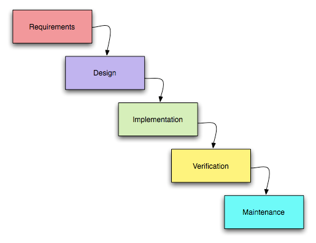
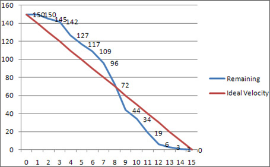

# Методологии разработки ПО

## Водопад или Каскадная модель

**Каскадная модель** ( waterfall model) - [*модель процесса разработки*](http://ru.wikipedia.org/wiki/%D0%9A%D0%B0%D1%81%D0%BA%D0%B0%D0%B4%D0%BD%D0%B0%D1%8F_%D0%BC%D0%BE%D0%B4%D0%B5%D0%BB%D1%8C) программного обеспечения, в которой процесс разработки выглядит как поток, последовательно проходящий фазы анализа требований, проектирования, реализации, тестирования, интеграции и поддержки.

Каскадная модель подходит для больших проектов с большими сроками, большими штатами, большим функционалом: сложные системы в банковской сфере, большие интернет-магазины, проекты с большим числом пользователей и так далее. ТЗ для таких проектов может занимать тысячи страниц, но для разработчиков такой процесс фактически идеален: все описано, всё завизировано и утверждено, сделано максимально всё, чтобы понять как должна работать система.

Водопад даёт качественный результат в силу чёткого следования порядку работы, отсутствию смены требований.

Минус системы: при необходимости изменений возникает большой объём "бюрократических" работ: согласование и утверждение со всеми заинтересованными лицами.

## Итеративный процесс

**Итеративная разработка** - это выполнение работ параллельно с непрерывным анализом полученных результатов и корректировкой предыдущих этапов работы. Проект при этом [*подходе*](http://ru.wikipedia.org/wiki/%D0%98%D1%82%D0%B5%D1%80%D0%B0%D1%82%D0%B8%D0%B2%D0%BD%D0%B0%D1%8F_%D1%80%D0%B0%D0%B7%D1%80%D0%B0%D0%B1%D0%BE%D1%82%D0%BA%D0%B0) в каждой фазе развития проходит повторяющийся цикл: Планирование — Реализация — Проверка — Оценка ( plan-do-check-act cycle).

Предпочтителен в случаях когда система сложная и непонятно как она должна работать в конечном виде. Основной принцип: пошаговое приближение к конечной цели. То есть сделать от начала и до конца часть системы, внедрить, собрать фидбек, обсудить, скорректировать процесс и перейти к следующему шагу. Итерация может быть большой (2-3 месяца) или нет (2-3 недели).

Метод очень эффективен в плане взаимодействия с клиентом. Особенно с тем, кто толком не представляет чего он хочет. Улучшается обратная связь с Заказчиком – он принимает каждый этап (итерацию). Выпуск проекта в стартовой, урезанной конфигурации позволяет Заказчику самому понять куда идти дальше. И он идёт дальше **вместе с вами**.

Метод позволяет брать в работу приоритетные задачи и риски. Распределяется нагрузка равномерно по всему сроку, то есть проектировщики не сидят без дела, после выполнения проектирования, как было бы в методе "водопад", а после выполнения первого этапа, когда программисты только начали работу, переходят ко второму. В это время дизайнеры могут заниматься уже третьим этапом.

Затраты на проект распределяются равномерно, а не в конце проекта. Это важно для Заказчика.

Сложности метода:

- Нужно внедрять, обучать людей;
- Много ролей, требующих узкой специализации;
- Требуется постоянный контроль, поддержание процесса.

Итеративный процесс имеет несколько видов: Agile, XP, Kanban, RUP и другие.

### Agile/Scrum

[***Agile***](http://www.agilemanifesto.org/iso/ru/) - серия подходов к разработке программного обеспечения, ориентированных на использование итеративной разработки, динамическое формирование требований и обеспечение их реализации в результате постоянного взаимодействия внутри самоорганизующихся рабочих групп, состоящих из специалистов различного профиля.

**Scrum** - методология гибкой разработки программного обеспечения. Scrum чётко делает акцент на неотвратимости срока демонстрации готового функционала клиенту.

Работа организуется по следующему принципу:

1. Менеджер проекта (Product owner) собирает все потребности, "хотелки" по продукту, сценарии использования в списке задач (Product backlog).
2. На основе Product backlog на собрании перед циклом разработки (Sprint planning meeting) составляется круг задач (Sprint backlog) решаемых в этой итерации (Sprint'e)
3. Производится цикл с разработкой, тестированием, демонстрацией результата заказчику.
4. По результатам Sprint'а проводится публичный анализ (Sprint Retrospective) результатов работы.
5. Цикл повторяется нужное число раз до выхода готового продукта.

**Менеджер проектов - Product owner**

Ключевой человек в технологии Scrum. Он закрывает команду от Клиента. Если Клиент - корпоративный, то с его стороны участвует несколько (до нескольких десятков) сотрудников. Доступ этих сотрудников к разработке напрямую должен быть исключён. Это делает Product owner.

Product owner выстраивает взаимодействие с Клиентом. Если Product owner "прогнётся" под наплывом требований со стороны Заказчика, Scrum становится бесполезен. Задача очень трудная, для человека с крепкой психикой.

Product owner говорит со всеми менеджерами, директорами, аналитиками и так далее и вырабатывает понимание того как должна работать создаваемая система. И он отвечает за продукт. Он знает ответы на все вопросы по продукту, что позволяет разработчикам чувствовать стабильность при работе, что завтра не поменяются требования и не придётся всё переделывать.

Для команды Product owner формирует ранжированный список "хотелок" (Product backlog) из которого и формируется список задач на конкретный цикл (Sprint backlog).

**Список задач - Product backlog**

Список потребностей, сценариев использования описываются в таблице Product backlog. Список линейный, приоритезированный, предварительно оценённый на трудозатраты по простейшей схеме: простой, средний, сложный.

Product backlog позволяет легко проверять работу менеджеров: скорость работы, возможные проблемы. В том числе и в плане работы с клиентами: если Клиент не может высказать внятно свои потребности (составить backlog), то, возможно, есть смысл сменить методику работы с ним.

**Планирование цикла - Sprint planing meeting**

Срок собрания - не более одного дня. Команда с подачи Product owner'а отбирает задачи из Product backlog, оценивает их во временных единицах (как правило, это человеко-часы) на выполнение. Оценка проводится в "игровой форме" (Planning poKer), при большом разногласии в оценке может проводиться в несколько туров с периодами обсуждения.

**Задачи конкретного цикла - Sprint backlog**

Отобранный из Product backlog список задач на данную итерацию (Sprint). Задачи отбираются с учётом выделенного времени на Sprint и выставленных каждой задаче временных оценок.

**Цикл разработчки - Sprint**

Небольшой по срокам (1-4 недели) цикл разработки. Разработка ведётся на основе Sprint backlog. Учёт работы можно вести по аналогии с доской Kanban:

Учёт "сожжённого" времени, представленный в графической форме, позволяет судить о процессе производства. Если процесс идёт нормально, то часы "сжигаются" равномерно. Если скорость "сжигания" замедлилась или встала совсем, то на лицо проблемы, которые требуют 

вмешательства руководства.

**Примечание**: Учёт скорости нужно вести систематически, от Sprint'а к Sprint'у. Это позволяет прогнозировать сроки релизов и оптимизировать процесс разработки.

**Команда - Team**

В Scrum'е нет личности. Работа - коллективная, ответственность коллективная. Это порождает как преимущества, так и проблемы. Есть сотрудники - таланты, которые просто не могут работать в команде, но они нужны. Есть просто недобросовестные товарищи. И со всеми нужно работать.

Кроссфункциональность не подразумевает универсальность каждого участника команды. В команде всегда кто-от что-то лучше делает, чем другой. Под кроссфункциональностью подразумевается тесное сотрудничество между её участниками.

Размер команды для каждого проекта нужно подбирать. Оптимально - 5-7, при большем количестве возникают проблемы контроля.

Считается, что если Sprint провален, то провалила вся команда. Но в реальности провалы бывают из-за конкретного человека. Как быть в такой ситуации?

Но если команда - настоящая, слаженная команда, то этот принцип работает просто великолепно.

**Управляющий процессом - Scrum master**

Авторитетный и уважаемый всеми участниками разработки человек. Его задача - следить за тем, что бы поддерживался процесс Scrum'а. Специальность этого сотрудника в рамках проекта - не важна. Это может быть верстальщик, программист. Он следит за тем, чтобы люди не расслаблялись, не тусовались, а работали. При этом он не командует, а все вопросы решаются только за счёт авторитета.

Другая функция - устранять препятствия, возникающие перед группой разработчиков. Не боясь при этом поругаться и "повоевать" за нужное оборудование, условия работы и прочее.

**Ежедневное планирование - Daily standup meeting**

Ежедневное, короткое (не более 15 минут) собрание участников для оценки сделанного накануне, задач на день, возникших проблем. Идея в том, что бы каждый в команде знал кто чем занимается, к кому с какими вопросами обращаться, кому, если нужно, помочь.

**Условие готовности задачи - Definition of Done**

Очень важно правильно определиться с этими условиями. Они должны быть чётко оговорены: проверено тестировщиками, проверено безопасниками, проверено сисадминами, проверено Product owner'ом и так далее.

**Демонстрация результатов - Sprint review**

Демонстрация клиенту результатов цикла. Контролирующее, организующие и вдохновляющее на дальнейший труд мероприятие. Клиент видит, что работа идёт, есть за что платить. Команда видит оценку своей работы.

**Внутрикомандная оценка этапа - Sprint retrospective**

Оценка результатов цикла самой командой, оценка механизма разработки. В целом оценивается результат и ищутся способы как сделать лучше.

**Плюсы и минусы технологии**

**Плюсы:**

- Просто внедрить
- Разработчикам обычно нравится
- Прозрачность проекта
- Ориентация на результат

**Минусы:**

- Не все люди сработаются, сложности "человеческого фактора".
- Издержки на «болтовню» 10-30%
- Качество веб-системы может сильно пострадать, если неверно организован процесс и неверно заданы Definition of Done.

### Канбан

**Kanban** - модель разработки, в условиях ограничения числа выполняемых задач каждым разработчиком.

Модель подходит для веб-студий, работающих с большим количеством несложных заказов. Работа по этой модели - это работа без конечных сроков. Клиент платит за то, что студия потратила время. При доверии со стороны клиента, что программист работает эффективно и поставленную задачу реально можно было решить именно за то время, которое на неё потрачено.

Канбан позволяет сократить время прохода задачи до состояния «готовности». Количество незавершённой работы разработчика должно быть ограничено. Новая задача может ставиться только тогда, когда какая-то из существующих передаётся следующему элементу производственного цикла. Kanban (или сигнальная карточка) подразумевает, что производится некое визуальное оповещение о том, что можно задавать новую работу, так как текущий объём работ не равен принятым лимитам.

**Смысл системы с точки зрения разработчика**: максимально упростить бюрократию и дать человеку просто работать над небольшим числом задач.

**Смысл системы с точки зрения веб-студии**: снижение времени прохождения задачи через группу специалистов до её релиза. Система позволяет создать работнику такие комфортные условия работы, что бы задача проходила через все эти этапы быстро. При этом происходит визуализация задач, облегчающая контроль.

Нет планирования времени. На доске размещаются столбцы специалистов. В столбцах специалистов указывается лимит на число задач, которые "висят" на специалисте. Больше этого числа задач им нельзя ставить. Не должно быть такого, что прибегает кто-то и: "Срочно нужно сделать!", все делается только в порядке установленном на доске.

Менеджер может визуально отслеживать состояние дел: где происходит "затык" в работе, кто отстаёт и начать разбираться почему это происходит и принимать меры по устранению проблем.

На одной доске можно вести учёт всех проектов, если, например, определить для каждого проекта свой цвет задач. На карточках можно указывать время начала работы и время её завершения.

## Continuous Integration

**Continuous Integration** - это практика разработки программного обеспечения, которая заключается в выполнении частых автоматизированных сборок проекта для скорейшего выявления и решения интеграционных проблем. Частый и постоянный выпуск релизов позволяет модулям системы постоянно взаимодействовали между собой целостно, что снижает риск срыва сроков. Как элемент используется в Экстремальном программировании.

Эта практика рекомендуется для больших проектов, имеющих большой временной период для исполнения. То над чем вам предстоит работать и что поддерживать, а не просто сделать и сдать. В маленьких проектах в этой технологии просто нет необходимости, лучше использовать Kanban или SCRUM.

Требования к производству по практике **Continuous Integration**

- Использование системы контроля версий.
  - Создаются ветки, система аудита и политики коммита.
  - Используются обработчики событий – hooks.
  - Частые коммиты, лучше – раз в день.

- Модульные тесты
  - Тесты можно делать не сложные.
  - Можно не использовать PHPUnit, Simple Test
