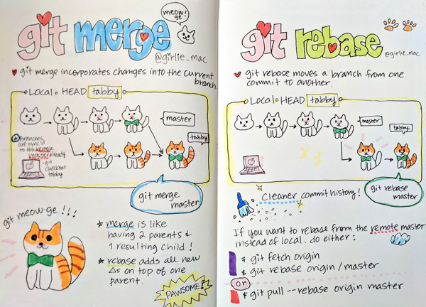

# Git

Git — это набор консольных утилит, которые отслеживают и фиксируют изменения в файлах (чаще всего речь идет об исходном коде программ, но вы можете использовать его для любых файлов на ваш вкус). С его помощью вы можете откатиться на более старую версию вашего проекта, сравнивать, анализировать, сливать изменения и многое другое. Этот процесс называется контролем версий. Существуют различные системы для контроля версий. Вы, возможно, о них слышали: SVN, Mercurial, Perforce, CVS, Bitkeeper и другие.

Git является распределенным, то есть не зависит от одного центрального сервера, на котором хранятся файлы. Вместо этого он работает полностью локально, сохраняя данные в папках на жестком диске, которые называются репозиторием. Тем не менее обычно хранят копию репозитория онлайн, доставляя свои и получая изменения других участников через неё.

## Терминология Git

- **Рабочее дерево (Working tree)** — Любая директория в вашей файловой системе, связанная с *репозиторием* (что можно видеть по наличию в ней поддиректории «.git»). Включает в себя все файлы и поддиректории.
- **Коммит (Commit)**. В роли существительного: «моментальный снимок» *рабочего дерева* в какой-то момент времени. В роли глагола: коммитить (закоммитить) — добавлять *коммит* в *репозиторий*.
- **Репозиторий (Repository)** — это набор *коммитов*, т.е. просто архив прошлых состояний *рабочего дерева* проекта на вашей или чьей-то машине.
- **Ветка (Branch)** — просто имя для *коммита*, также называемое *ссылкой* (reference). Определяет происхождение — «родословную» *коммита*, и таким образом, является типичным представлением «ветки разработки»
- **Checkout** — операция переключения между *ветками* или восстановления файлов *рабочего дерева*
- **Метка (Tag)** — также имя для *коммита*, отличающееся от *ветки* тем, что оно всегда постоянно указывает на один и тот же *коммит*, а также может иметь свое текстовое описание
- **Мастер (Master)**. Условно «главная» или «основная» *ветка репозитория*, но по сути ничем не отличающаяся от прочих *веток*
- **Индекс (Index)**. В отличие от других подобных инструментов, Git не передает изменения из *рабочего дерева* в *репозиторий* напрямую. Вместо этого изменения сначала регистрируются в *индексе*, или «области подготовки» (staging area). Это можно рассматривать как способ «подтверждения» ваших изменений перед совершением *коммита*, который запишет в *репозиторий* все одобренные изменения.
- **HEAD** — заголовок. Используется репозиторием для определения того, что выбрано с помощью checkout
  - Если субъект *checkout* — ветка, то *HEAD* будет ссылаться на нее, показывая, что имя ветки должно быть обновлено во время следующего *коммита*
  - Если субъект *checkout* — коммит, то *HEAD* будет ссылаться только на него. В этом случае *HEAD* называется обособленным (detached)

Все начинается с того, что Git представляет содержимое ваших файлов в виде так называемых «фрагментов» («blobs»), которые являются узлами-листьями в структуре, очень похожей на директорию и называемой деревом. Так же как i-узел однозначно идентифицируется присвоенным ему системой номером, фрагмент в Git маркируется путем вычисления SHA-1 хэша от его размера и содержания. Для всех мыслимых применений это всего лишь произвольный номер, как и у i-узла, за исключением двух дополнительных свойств: во-первых, он контролирует неизменность содержимого фрагмента, а во вторых гарантирует, что одно и то же содержимое будет всегда представлено одним и тем же фрагментом независимо от того, где оно будет встречаться — в разных коммитах, репозиториях, или даже в разных частях Интернета. Если несколько деревьев ссылаются на тот же фрагмент, то это похоже на хард-линки: фрагмент не исчезнет из вашего репозитория до тех пор, пока на него существует хотя бы одна ссылка. 

Разница между файлом в файловой системе и фрагментом в Git состоит в том, что сам фрагмент не хранит метаданных о его содержимом. Вся эта информация хранится в дереве, к которому принадлежит фрагмент. Одно дерево может считать это содержимое файлом «foo», созданным в августе 2004, в то время как другое дерево может знать то же содержимое под именем файла «bar», созданным на пять лет позже. В нормальной файловой системе такие два файла с совпадающим содержимым, но различающимися метаданными, будут всегда представлены как два независимых файла. 

## Основы Work area / stage area / commit

Каждый файл в вашем рабочем каталоге может находиться в одном из двух состояний: под версионным контролем (отслеживаемые) и нет (неотслеживаемые). Отслеживаемые файлы — это те файлы, которые были в последнем слепке состояния проекта (snapshot); они могут быть неизменёнными, изменёнными или подготовленными к коммиту (staged). Неотслеживаемые файлы — это всё остальное, любые файлы в вашем рабочем каталоге, которые не входили в ваш последний слепок состояния и не подготовлены к коммиту. 


## reset(--soft –hard –mixed) vs checkout


|                                          | HEAD | Индекс | Рабочий Каталог | Сохранность РК? |
| ---------------------------------------- | ---- | ------ | --------------- | --------------- |
| **На уровне коммитов (без указания путей)** |      |        |                 |                 |
| `reset --soft [commit]`                  | REF  | NO     | NO              | YES             |
| `reset [commit]`                         | REF  | YES    | NO              | YES             |
| `reset --hard [commit]`                  | REF  | YES    | YES             | **NO**          |
| `checkout [commit]`                      | HEAD | YES    | YES             | YES             |
| **На уровне файлов (с указанием путей)** |      |        |                 |                 |
| `reset (commit) [file]`                  | NO   | YES    | NO              | YES             |
| `checkout (commit) [file]`               | NO   | YES    | YES             | **NO**          |

## merge rebase cherry-pick

**merge** - слияние двух веток, в новом коммите

**rebase** - перебазирование ветки таким образом, чтобы история выглядела так чтобы ее коммиты выходили из заданного(как правило послденего) . Отребейзенные коммиты меняю свою дату и хеш.



**rebase -i **- интеркативын ребайз, позволяет сквошить(скливать) комммиты, менять их местами, выкидывать нужные, менять описания.

**rebase onto** 

Вы можете взять изменения из ветки `client`, которых нет в `server` (C8 и C9), и применить их на ветке `master` при помощи опции `--onto` команды `git rebase`:

```
$ git rebase --onto master server client
```

По сути, это указание “переключиться на ветку `client`, взять изменения от общего предка веток `client` и `server` и повторить их на `master`”. Это немного сложно; но результат, показанный на рисунке 3-32, довольно классный.


**cherry-pick** - просто пытается вставить выбарнный коммит в нужную ветку

## pull

pull - выборка и интеграция с другим репозиторием или локальной ветвью

```
git pull [options] [<repository> [<refspec>…]]
```

Включает изменения из удаленного репозитория в текущую ветку. В режиме по умолчанию `git pull` является сокращением для `git fetch` за которым следует `git merge FETCH_HEAD` .

Точнее, `git pull` запускает `git fetch` с заданными параметрами и вызывает `git merge` чтобы объединить полученные заголовки ветвей в текущую ветвь. С `--rebase` , он запускает `git rebase` вместо `git merge` .

## reflog

Во время вашей работы Git записывает все изменения HEAD. Каждый раз при переключении веток и коммите, добавляется запись в **reflog** Таким образом reflog поможет найти нам проебавшиеся комиты, однако он не вечен, так как есть сборщик мусора и данные хранятся там не вечно.

## Git Branching strategy
Есть также гайдлайны по тому, как нужно организовать ветвление и в общем работу с Git - Git Flow, ThreeFlow. Стоит знать о том, что это за подходы и в чем их суть.

*Материалы на тему branching strategy*:
- https://habr.com/ru/company/infopulse/blog/345826/
- https://habr.com/ru/post/106912/

*Дополнительно*:

- https://githowto.com/ru

- https://git-scm.com/book/ru/v2

- https://habr.com/company/intel/blog/344962/

- https://eax.me/git-commands/

- https://github.com/nicothin/web-development/tree/master/git

- https://github.com/k88hudson/git-flight-rules
