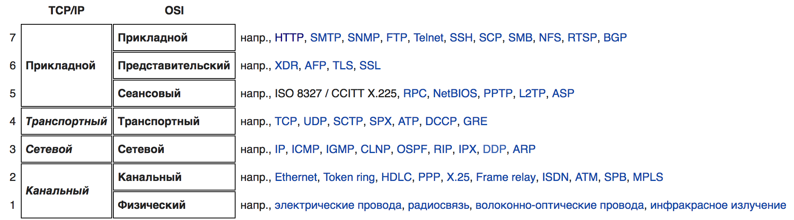

# Сетевые интерфейсы и протоколы

## Взаимодействие приложения с веб сервером

### SAPI

SAPI (Server Application Programming Interface) -- программный интерфейс позволяющий чему-то либо(интерпретатору PHP например) работать в качестве части web-приложения (а по сути -- как часть веб-сервера), в частности -- получить конкретные запросы от программы-сервера и отдавать данные (определяемые уже внутренней логикой, которую реализовал на программист).

### CGI

**CGI (Common Gateway Interface)** — стандарт интерфейса, используемого для связи внешней программы с веб-сервером. Программу, которая работает по такому интерфейсу совместно с веб-сервером, принято называть шлюзом, хотя многие предпочитают названия «скрипт» (сценарий) или «CGI-программа». По сути позволяет использовать консоль ввода и вывода для взаимодействия с клиентом.

Алгоритм работы:

1. Клиент запрашивает CGI-приложение по его URI.
2. Веб-сервер принимает запрос и устанавливает переменные окружения, через них приложению передаются данные и служебная информация.
3. Веб-сервер перенаправляет запросы через стандартный поток ввода (stdin) на вход вызываемой программы.
4. CGI-приложение выполняет все необходимые операции и формирует результаты в виде HTML.
5. Сформированный гипертекст возвращается веб-серверу через стандартный поток вывода (stdout). Сообщения об ошибках передаются через stderr.
6. Веб-сервер передает результаты запроса клиенту.

Недостатки CGI:

1. низкая производительность
2. каждое обращение к CGI-приложению вызывает порождение нового процесса
3. взаимодействуют с сервером через STDIN и STDOUT запущенного CGI-процесса
4. если приложение написано с ошибками, то возможна ситуация, когда оно, например, зациклится; браузер прервет соединение по истечении тайм-аута, но на серверной стороне процесс будет продолжаться, пока администратор не снимет его принудительно.
5. меньшая, по сравнению с другими решениями, защищенность веб-сервера
6. неправильная настройка прав доступа к серверным ресурсам из CGI-приложения может поставить под угрозу не только работоспособность веб-сервера, но и информационную безопасность

### FastCGI SAPI

Интерфейс FastCGI — клиент-серверный протокол взаимодействия веб-сервера и приложения, дальнейшее развитие технологии CGI. По сравнению с CGI является более производительным и безопасным.

1. PHP интерпретатор запускается как независимый сервер, обрабатывающий входящие запросы на исполнение PHP скриптов по протоколу FastCGI, что позволяет ему работать с любым веб-сервером, поддерживающим этот протокол
2. более производительный и безопасный
3. вместо того чтобы создавать новые процессы для каждого нового запроса, использует постоянно запущенные процессы для обработки множества запросов
4. использует Unix Domain Sockets или TCP/IP для связи с сервером
5. могут быть запущены не только на этом же сервере, но и где угодно в сети
6. возможна обработка запросов несколькими FastCGI-процессами, работающими параллельно
7. в кластере должен находиться только FastCGI-процесс, а не целый веб-сервер
8. обеспечивает дополнительную безопасность, такую как, например, запуск FastCGI-процесса под учётной записью пользователя, отличного от пользователя веб-сервера, а также может находиться в chroot'е, отличном от chroot'а веб-сервера
9. может быть использован в любом языке, поддерживающем сокеты.

### FPM SAPI

**FPM (FastCGI Process Manager), известный как php-fpm** — является альтернативной реализацией PHP FastCGI с несколькими дополнительными возможностями обычно используемыми для высоконагруженных сайтов.

- продвинутое управление процессами с корректной (graceful) процедурой остановки и запуска;
- возможность запуска воркеров с разными uid/gid/chroot/окружением, а также запуска на различных портах с использованием разных php.ini (замещение safe_mode)
- логирование стандартных потоков вывода (stdout) и ошибок (stderr)
- аварийный перезапуск в случае внезапного разрушения opcode-кеша
- поддержка ускоренной загрузки (accelerated upload)
- "slowlog" - логирование необычно медленно выполняющихся скриптов (не только их имена, но также и их трассировки. Это достигается с помощью ptrace и других подобных утилит для чтения данных исполнения удаленных процессов)
- fastcgi_finish_request() - специальная функция для завершения запроса и сброса всех буферов данных, причем процесс может продолжать выполнение каких-либо длительных действий
- динамическое/статическое порождение дочерних процессов
- базовая информация о статусе SAPI (аналогично Apache mod_status)
- конфигурационный файл, основанный на php.ini.
- с версии PHP 5.3.3, php-fpm был включён в PHP как отдельное SAPI

## CLI SAPI

**CLI SAPI** — в качестве скрипта командной строки, являющегося исполняемым файлом, который вызывается пользователем из командной строки.

1. в отличие от CGI SAPI, заголовки не пишутся в поток вывода
2. сообщения об ошибках выдаются в текстовом режиме
3. PHP CLI не поддерживает GET, POST или загрузку файлов
4. текущая директория не изменяется на рабочую директорию скрипта
5. скрипт выполняется в окружении вызвавшего пользователя
6. в этом случае возможно использование PHP для создания клиентских GUI-приложений
7. для решения административных задач в операционных системах UNIX, Linux, Microsoft Windows, Mac OS X и AmigaOS.
8. с версии PHP 5.4.0 в CLI SAPI появилась возможность запуска PHP как отдельного HTTP-сервера (один процесс интерпретатора и выполняет все запросы исключительно последовательно)

## HTTP

HTTP (англ. HyperText Transfer Protocol — «протокол передачи гипертекста») — протокол прикладного уровня передачи данных (изначально — в виде гипертекстовых документов в формате «HTML», в настоящий момент используется для передачи произвольных данных). Основой HTTP является технология «клиент-сервер», то есть предполагается существование:

- Потребителей (клиентов), которые инициируют соединение и посылают запрос;
- Поставщиков (серверов), которые ожидают соединения для получения запроса, производят необходимые действия и возвращают обратно сообщение с результатом.

HTTP используется также в качестве «транспорта» для других протоколов прикладного уровня, таких как SOAP, XML-RPC, WebDAV.

Основным объектом манипуляции в HTTP является ресурс, на который указывает URI (Uniform Resource Identifier) в запросе клиента. Обычно такими ресурсами являются хранящиеся на сервере файлы, но ими могут быть логические объекты или что-то абстрактное. Особенностью протокола HTTP является возможность указать в запросе и ответе способ представления одного и того же ресурса по различным параметрам: формату, кодировке, языку и т. д. (в частности, для этого используется HTTP-заголовок). Именно благодаря возможности указания способа кодирования сообщения, клиент и сервер могут обмениваться двоичными данными, хотя данный протокол является текстовым.

HTTP — протокол прикладного уровня; аналогичными ему являются FTP и SMTP. Обмен сообщениями идёт по обыкновенной схеме «запрос-ответ». Для идентификации ресурсов HTTP использует глобальные URI. В отличие от многих других протоколов, HTTP не сохраняет своего состояния. Это означает отсутствие сохранения промежуточного состояния между парами «запрос-ответ». Компоненты, использующие HTTP, могут самостоятельно осуществлять сохранение информации о состоянии, связанной с последними запросами и ответами (например, «куки» на стороне клиента, «сессии» на стороне сервера). Браузер, посылающий запросы, может отслеживать задержки ответов. Сервер может хранить IP-адреса и заголовки запросов последних клиентов. Однако сам протокол не осведомлён о предыдущих запросах и ответах, в нём не предусмотрена внутренняя поддержка состояния, к нему не предъявляются такие требования.

API многих программных продуктов также подразумевает использование **HTTP** для передачи данных — сами данные при этом могут иметь любой формат, например, *XML* или *JSON*.

Как правило, передача данных по протоколу **HTTP** осуществляется через **TCP/IP**-соединения. Серверное программное обеспечение при этом обычно использует TCP-порт 80 (и, если порт не указан явно, то обычно клиентское программное обеспечение по умолчанию использует именно 80-й порт для открываемых HTTP-соединений), хотя может использовать и любой другой.

### HTTP методы

#### OPTIONS

Используется для определения возможностей веб-сервера или параметров соединения для конкретного ресурса. В ответ серверу следует включить заголовок `Allow` со списком поддерживаемых методов. Также в заголовке ответа может включаться информация о поддерживаемых расширениях.

Предполагается, что запрос клиента может содержать тело сообщения для указания интересующих его сведений. Формат тела и порядок работы с ним в настоящий момент не определён; сервер пока должен его игнорировать. Аналогичная ситуация и с телом в ответе сервера.

Для того, чтобы узнать возможности всего сервера, клиент должен указать в URI звёздочку — «`*`». Запросы «`OPTIONS * HTTP/1.1`» могут также применяться для проверки работоспособности сервера (аналогично «[пингованию](https://ru.wikipedia.org/wiki/%D0%9F%D0%B8%D0%BD%D0%B3)») и тестирования на предмет поддержки сервером протокола HTTP версии 1.1.

Результат выполнения этого метода не [кэшируется](https://ru.wikipedia.org/wiki/%D0%9A%D1%8D%D1%88%D0%B8%D1%80%D0%BE%D0%B2%D0%B0%D0%BD%D0%B8%D0%B5).

#### GET

Используется для запроса содержимого указанного ресурса. С помощью метода `GET` можно также начать какой-либо процесс. В этом случае в тело ответного сообщения следует включить информацию о ходе выполнения процесса.

Клиент может передавать параметры выполнения запроса в URI целевого ресурса после символа «`?`»:
`GET /path/resource?param1=value1&param2=value2 HTTP/1.1`

Согласно стандарту HTTP, запросы типа `GET` считаются [идемпотентными](https://ru.wikipedia.org/wiki/%D0%98%D0%B4%D0%B5%D0%BC%D0%BF%D0%BE%D1%82%D0%B5%D0%BD%D1%82%D0%BD%D0%BE%D1%81%D1%82%D1%8C)[[4\]](https://ru.wikipedia.org/wiki/HTTP#cite_note-http-spec-methods-4)

Кроме обычного метода `GET`, различают ещё

- [Условный `GET`](https://ru.wikipedia.org/wiki/HTTP#Условные_GET) — содержит заголовки `If-Modified-Since`, `If-Match`, `If-Range` и подобные;
- [Частичный `GET`](https://ru.wikipedia.org/wiki/HTTP#Частичные_GET) — содержит в запросе `Range`.

Порядок выполнения подобных запросов определён стандартами отдельно.

#### HEAD

Аналогичен методу `GET`, за исключением того, что в ответе сервера отсутствует тело. Запрос `HEAD` обычно применяется для извлечения [метаданных](https://ru.wikipedia.org/wiki/%D0%9C%D0%B5%D1%82%D0%B0%D0%B4%D0%B0%D0%BD%D0%BD%D1%8B%D0%B5), проверки наличия ресурса ([валидация](https://ru.wikipedia.org/wiki/%D0%92%D0%B0%D0%BB%D0%B8%D0%B4%D0%B0%D1%86%D0%B8%D1%8F) URL) и чтобы узнать, не изменился ли он с момента последнего обращения.

Заголовки ответа могут кэшироваться. При несовпадении [метаданных](https://ru.wikipedia.org/wiki/%D0%9C%D0%B5%D1%82%D0%B0%D0%B4%D0%B0%D0%BD%D0%BD%D1%8B%D0%B5) ресурса с соответствующей информацией в кэше — копия ресурса помечается как устаревшая.

#### POST

Применяется для передачи пользовательских данных заданному ресурсу. Например, в [блогах](https://ru.wikipedia.org/wiki/%D0%91%D0%BB%D0%BE%D0%B3) посетители обычно могут вводить свои комментарии к записям в HTML-форму, после чего они передаются серверу методом [POST](https://ru.wikipedia.org/wiki/POST_(HTTP)) и он помещает их на страницу. При этом передаваемые данные (в примере с блогами — текст комментария) включаются в тело запроса. Аналогично с помощью метода `POST` обычно загружаются файлы на сервер.

В отличие от метода `GET`, метод `POST` не считается идемпотентным[[4\]](https://ru.wikipedia.org/wiki/HTTP#cite_note-http-spec-methods-4), то есть многократное повторение одних и тех же запросов `POST` может возвращать разные результаты (например, после каждой отправки комментария будет появляться очередная копия этого комментария).

При результате выполнения `200` (Ok) в тело ответа следует включить сообщение об итоге выполнения запроса. Если был создан ресурс, то серверу следует вернуть ответ `201` (Created) с указанием [URI](https://ru.wikipedia.org/wiki/URI) нового ресурса в заголовке `Location`.

Сообщение ответа сервера на выполнение метода `POST` не кэшируется.

#### PUT

Применяется для загрузки содержимого запроса на указанный в запросе URI. Если по заданному URI не существует ресурс, то сервер создаёт его и возвращает статус `201` (Created). Если же был изменён ресурс, то сервер возвращает `200` (Ok) или `204` (No Content). Сервер не должен игнорировать некорректные заголовки `Content-*`, передаваемые клиентом вместе с сообщением. Если какой-то из этих заголовков не может быть распознан или не допустим при текущих условиях, то необходимо вернуть код ошибки `501` (Not Implemented).

Фундаментальное различие методов `POST` и `PUT` заключается в понимании предназначений URI ресурсов. Метод `POST` предполагает, что по указанному URI будет производиться обработка передаваемого клиентом содержимого. Используя `PUT`, клиент предполагает, что загружаемое содержимое соответствует находящемуся по данному URI ресурсу.

Сообщения ответов сервера на метод `PUT` не кэшируются.

#### PATCH

Аналогично PUT, но применяется только к фрагменту ресурса.

#### DELETE

Удаляет указанный ресурс.

#### TRACE

Возвращает полученный запрос так, что клиент может увидеть, какую информацию промежуточные серверы добавляют или изменяют в запросе.

#### CONNECT

Преобразует соединение запроса в прозрачный [TCP/IP](https://ru.wikipedia.org/wiki/TCP/IP)-туннель, обычно чтобы содействовать установлению защищённого [SSL](https://ru.wikipedia.org/wiki/SSL)-соединения через нешифрованный [прокси](https://ru.wikipedia.org/wiki/%D0%9F%D1%80%D0%BE%D0%BA%D1%81%D0%B8-%D1%81%D0%B5%D1%80%D0%B2%D0%B5%D1%80).

### Основные HTTP заголовки

https://ru.wikipedia.org/wiki/%D0%A1%D0%BF%D0%B8%D1%81%D0%BE%D0%BA_%D0%B7%D0%B0%D0%B3%D0%BE%D0%BB%D0%BE%D0%B2%D0%BA%D0%BE%D0%B2_HTTP#%D0%9E%D1%81%D0%BD%D0%BE%D0%B2%D0%BD%D1%8B%D0%B5_%D0%B7%D0%B0%D0%B3%D0%BE%D0%BB%D0%BE%D0%B2%D0%BA%D0%B8

### HTTPS

HTTPS (HyperText Transfer Protocol Secure) — расширение протокола HTTP, поддерживающее шифрование. Данные, передаваемые по протоколу HTTPS, «упаковываются» в криптографический протокол SSL или TLS. В отличие от HTTP, для HTTPS по умолчанию используется TCP-порт 443.

HTTPS не является отдельным протоколом. Это обычный HTTP, работающий через шифрованные транспортные механизмы SSL и TLS. Он обеспечивает защиту от атак, основанных на прослушивании сетевого соединения — от снифферских атак и атак типа man-in-the-middle, при условии, что будут использоваться шифрующие средства и сертификат сервера проверен и ему доверяют.

По умолчанию HTTPS URL использует 443 TCP-порт (для незащищённого HTTP — 80). Чтобы подготовить веб-сервер для обработки https-соединений, администратор должен получить и установить в систему сертификат для этого веб-сервера. Сертификат состоит из 2 частей (2 ключей) — public и private. Public-часть сертификата используется для зашифровывания трафика от клиента к серверу в защищённом соединении, private-часть — для расшифровывания полученного от клиента зашифрованного трафика на сервере. После того как пара ключей приватный/публичный сгенерированы, на основе публичного ключа формируется запрос на сертификат в Центр сертификации, в ответ на который ЦС высылает подписанный сертификат. ЦС при подписании проверяет клиента, что позволяет ему гарантировать, что держатель сертификата является тем, за кого себя выдаёт (обычно это платная услуга).

## Новшества разных версий HTTP

### HTTP 1.1
Новым в этой версии был режим «постоянного соединения»: TCP-соединение может оставаться открытым после отправки ответа на запрос, что позволяет посылать несколько запросов за одно соединение. Клиент теперь обязан посылать информацию об имени хоста, к которому он обращается, что сделало возможной более простую организацию виртуального хостинга(заголовок Host).

### HTTP 2

Вторая крупная версия сетевого протокола HTTP, используемая для доступа к World Wide Web. Протокол основан на SPDY.

Протокол HTTP/2 является бинарным. По сравнению с предыдущим стандартом изменены способы разбития данных на фрагменты и транспортирования их между сервером и клиентом(мультиплексирвоание запросов).

В HTTP/2 сервер имеет право послать то содержимое, которое еще не было запрошено клиентом. Это позволит серверу сразу выслать дополнительные файлы, которые потребуются браузеру для отображения страниц, без необходимости анализа браузером основной страницы и запрашивания необходимых дополнений.

Также часть улучшений получена (в первом черновике HTTP/2, который представлял собой копию спецификации SPDY) за счет мультиплексирования запросов и ответов для преодоления проблемы «head-of-line blocking» протоколов HTTP 1; сжатия передаваемых заголовков и введения явной приоритизации запросов.

# Сетевые модели(стеки протоколов)

## OSI 

OSI - формальная, теоритическая сетевая модель

1. Уровень приложений: **данные**; доступ к сетевым службам, (HTTP, FTP, SMTP, RDP, SNMP, DHCP)
2. Уровень представления данных: **данные**; представление и шифрование данных (ASCII, EBCDIC)
3. Сеансовый уровень: **данные**; управление сеансом связи (RPC, PAP)
4. Транспортный уровень: **сегменты / дейтаграммы**; прямая связь между конечными пунктами и надёжность (TCP, UDP, SCTP, PORTS)
5. Сетевой уровень: **пакеты**; определение маршрута и логическая адресация (IPv4, IPv6, IPsec, AppleTalk)
6. Канальный уровень: **биты / кадры**; физическая адресация (PPP, IEEE 802.22, Ethernet, DSL, ARP, L2TP, Network Cards)
7. Физический уровень: **биты**; Работа со средой передачи, сигналами и двоичными данными (USB, кабель ("витая пара", коаксиальный, оптоволоконный), радиоканал)

### 7 — протокол прикладного уровня (Application layer)

1. взаимодействие сети и пользователя
2. уровень разрешает приложениям пользователя иметь доступ к сетевым службам, таким, как обработчик запросов к базам данных, доступ к файлам, пересылке электронной почты
3. отвечает за передачу служебной информации, предоставляет приложениям информацию об ошибках и формирует запросы к уровню представления
4. протоколы: HTTP, FTP, SMTP, RDP, SNMP, DHCP

### 6 — уровень представления (Presentation layer)

1. передаваемая информация не меняет содержания
2. преобразование данных
3. преобразование между различными наборами символов
4. сжатие данных для увеличения пропускной способности канала
5. шифрование и расшифрование
6. протоколы: ASCII, EBCDIC

### 5 — сеансовый уровень (Session layer)

1. уровень управляет созданием/завершением сеанса, обменом информацией, синхронизацией задач, определением права на передачу данных и поддержанием сеанса в периоды неактивности приложений
2. синхронизация передачи обеспечивается помещением в поток данных контрольных точек, начиная с которых возобновляется процесс при нарушении взаимодействия
3. протоколы: RPC, PAP

### 4 — транспортный уровень (Transport layer)

1. предоставляет сам механизм передачи
2. блоки данных он разделяет на фрагменты, размеры которых зависят от протокола: короткие объединяет в один, а длинные разбивает
3. протоколы этого уровня предназначены для взаимодействия типа точка-точка
4. протоколы транспортного уровня часто имеют функцию контроля доставки данных, заставляя принимающую данные систему отправлять подтверждения передающей стороне о приеме данных
5. отвечает за восстановление порядка данных при использовании **сетевых протоколов без установки соединения**
6. протоколы: TCP, UDP, SCTP, PORTS

### 3 — сетевой уровень (Network layer)

1. предназначается для определения пути передачи данных
2. трансляцию логических адресов и имён в физические
3. определение кратчайших маршрутов, коммутацию и маршрутизацию, отслеживание неполадок и заторов в сети
4. На этом уровне работает такое сетевое устройство, как маршрутизатор.
5. типы:
   1. **Протоколы с установкой соединения** начинают передачу данных с вызова или установки маршрута следования пакетов от источника к получателю. После чего начинают последовательную передачу данных и затем по окончании передачи разрывают связь.
   2. **Протоколы без установки соединения** посылают данные, содержащие полную адресную информацию в каждом пакете. Каждый пакет содержит адрес отправителя и получателя. Далее каждое промежуточное сетевое устройство считывает адресную информацию и принимает решение о маршрутизации данных. Письмо или пакет данных передается от одного промежуточного устройства к другому до тех пор, пока не будет доставлено получателю. Протоколы без установки соединения не гарантируют поступление информации получателю в том порядке, в котором она была отправлена, так как разные пакеты могут пройти разными маршрутами.
6. протоколы: IPv4, IPv6, IPsec, AppleTalk

### 2 — канальный уровень (Data Link layer)

1. получение доступа к среде передачи
2. выделение границ кадра (резервирование некоторой последовательности, обозначающей начало или конец кадра)
3. Аппаратная адресация (или адресация канального уровня). Требуется в том случае, когда кадр могут получить сразу несколько адресатов. В локальных сетях аппаратные адреса (MAC-адреса) применяются всегда.
4. обеспечение достоверности принимаемых данных. Во время передачи кадра есть вероятность, что данные исказятся. Важно это обнаружить и не пытаться обработать кадр, содержащий ошибку. Обычно на канальном уровне используются алгоритмы контрольных сумм, дающие высокую гарантию обнаружения ошибок.
5. в программировании доступ к этому уровню предоставляет драйвер сетевой платы
6. на этом уровне работают коммутаторы, мосты
7. 2 подуровня
   1. **LLC (Logical Link Control)** обеспечивает обслуживание сетевого уровня
   2. **MAC (Media Access Control)** регулирует доступ к разделяемой физической среде
      1. выступает в качестве интерфейса между подуровнем LLC и физическим (первым) уровнем
      2. обеспечивает адресацию и механизмы управления доступом к каналам, что позволяет нескольким терминалам или точкам доступа общаться между собой в многоточечной сети
      3. эмулирует полнодуплексный логический канал связи в многоточечной сети
8. протоколы: PPP, IEEE 802.22, Ethernet, DSL, ARP, L2TP, Network Cards

### 1 — физический слой (physical layer)

1. физическая и электрическая среда для передачи данных
2. способы передачи бит через физические среды линий связи, соединяющие сетевые устройства
3. описываются параметры сигналов, такие как амплитуда, частота, фаза, используемая модуляция, манипуляция
4. решаются вопросы связанные с синхронизацией, избавлением от помех, скорости передачи данных
5. устройства: USB, кабель ("витая пара", коаксиальный, оптоволоконный), радиоканал

## TCP/IP

**TCP/IP** — сетевая модель выведенная из практического использования(в отличии от OSI).

### 4 — Прикладной уровень

1. протоколы работают поверх TCP или UDP и привязаны к определённому порту
2. порты определены Агентством по выделению имен и уникальных параметров протоколов
3. протоколы: Echo, Finger, Gopher, HTTP, HTTPS, IMAP, IMAPS, IRC, NNTP, NTP, POP3, POPS, QOTD, RTSP, SNMP, SSH, Telnet, XDMCP.

### 3 — Транспортный уровень

1. в стеке TCP/IP транспортные протоколы определяют, для какого именно приложения предназначены эти данные
2. протоколы
   1. **TCP (IP идентификатор 6)** — «гарантированный» транспортный механизм с предварительным установлением соединения, предоставляющий приложению надёжный поток данных, дающий уверенность в безошибочности получаемых данных, перезапрашивающий данные в случае потери и устраняющий дублирование данных. TCP позволяет регулировать нагрузку на сеть, а также уменьшать время ожидания данных при передаче на большие расстояния. Более того, TCP гарантирует, что полученные данные были отправлены точно в такой же последовательности.
   2. **UDP (IP идентификатор 17)** — протокол передачи датаграмм без установления соединения. Также его называют протоколом «ненадёжной» передачи, в смысле невозможности удостовериться в доставке сообщения адресату, а также возможного перемешивания пакетов. В приложениях, требующих гарантированной передачи данных, используется протокол TCP. С другой стороны, благодаря такой неизбирательности и бесконтрольности, UDP доставляет пакеты данных (датаграммы) гораздо быстрее, потому для приложений, которые рассчитаны на широкую пропускную способность и быстрый обмен, UDP можно считать оптимальным протоколом. К таковым относятся сетевые и браузерные игры, а также программы просмотра потокового видео и приложения для видеосвязи (или голосовой). Также по udp обычно доставляется статистика в хайлод проектах.
3. И TCP, и UDP используют для определения протокола верхнего уровня число, называемое портом.

### 2 — Сетевой (межсетевой) уровень

1. изначально разработан для передачи данных из одной сети в другую
2. на этом уровне работают маршрутизаторы, которые перенаправляют пакеты в нужную сеть путем расчета адреса сети по маске сети
3. пакеты сетевого протокола IP могут содержать код, указывающий, какой именно протокол следующего уровня нужно использовать, чтобы извлечь данные из пакета. Это число — уникальный IP-номер протокола. ICMP и IGMP имеют номера, соответственно, 1 и 2
4. протоколы:  DVMRP, ICMP, IGMP, MARS, PIM, RIP, RIP2, RSVP

### 1 — Канальный уровень

1. описывает способ кодирования данных для передачи пакета данных на физическом уровне
2. канальный уровень иногда разделяют на 2 подуровня — LLC и MAC
3. канальный уровень описывает среду передачи данных
4. на канальном уровне рассматривают помехоустойчивое кодирование — позволяющие обнаруживать и исправлять ошибки в данных вследствие воздействия шумов и помех на канал связи

## OSI vs TCP/IP

