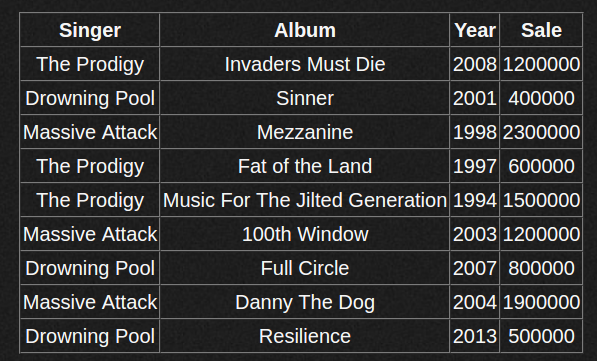

# Сетевые интерфейсы и протоколы

## Взаимодействие приложения с веб сервером

### SAPI

SAPI (Server Application Programming Interface ) -- программный интерфейс позволяющий интерпретатору PHP (или чему-то другому) работать в качестве части web-приложения (а по сути -- как часть веб-сервера), в частности -- получить конкретные запросы от программы-сервера и отдавать данные (определяемые уже внутренней логикой, которую реализовал на программист).

### CGI

CGI (от англ. Common Gateway Interface — «общий интерфейс шлюза») — стандарт интерфейса, используемого для связи внешней программы с веб-сервером. Программу, которая работает по такому интерфейсу совместно с веб-сервером, принято называть шлюзом, хотя многие предпочитают названия «скрипт» (сценарий) или «CGI-программа». По сути позволяет использовать консоль ввода и вывода для взаимодействия с клиентом.

Сам интерфейс разработан таким образом, чтобы можно было использовать любой язык программирования, который может работать со стандартными устройствами ввода-вывода. Такими возможностями обладают даже скрипты для встроенных командных интерпретаторов операционных систем, поэтому в простых случаях могут использоваться даже командные скрипты.

### FASTCGI

Интерфейс FastCGI — клиент-серверный протокол взаимодействия веб-сервера и приложения, дальнейшее развитие технологии CGI. По сравнению с CGI является более производительным и безопасным.

FastCGI снимает множество ограничений CGI-программ. Недостаток CGI-программ в том, что они должны быть перезапущены веб-сервером при каждом запросе, что приводит к понижению производительности. FastCGI, вместо того чтобы создавать новые процессы для каждого нового запроса, использует постоянно запущенные процессы для обработки множества запросов. Это позволяет экономить время.

В то время как CGI-программы взаимодействуют с сервером через STDIN и STDOUT запущенного CGI-процесса, FastCGI-процессы используют Unix Domain Sockets или TCP/IP для связи с сервером. Это даёт следующее преимущество над обычными CGI-программами: FastCGI-программы могут быть запущены не только на этом же сервере, но и где угодно в сети. Также возможна обработка запросов несколькими FastCGI-процессами, работающими параллельно.

lighttpd включает в себя внутренний распределитель нагрузки FastCGI, который может использоваться для распределения сразу на несколько FastCGI-серверов. В отличие от иных решений, в кластере должен находиться только FastCGI-процесс, а не целый веб-сервер. Это позволяет использовать FastCGI-процессу больше ресурсов, по сравнению, например, с load-balancer+apache+mod\_php.

### PHP-FPM

FPM (Менеджер процессов FastCGI) является альтернативной реализацией PHP FastCGI с несколькими дополнительными возможностями обычно используемыми для высоконагруженных сайтов.

Эти возможности включают в себя:

- продвинутое управление процессами с корректной (graceful) процедурой остановки и запуска;
- возможность запуска воркеров с различными uid/gid/chroot-окружением, а также запуска на различных портах с использованием разных php.ini (замещение safe\_mode);
- логирование стандартных потоков вывода (stdout) и ошибок (stderr);
- аварийный перезапуск в случае внезапного разрушения opcode-кэша;
- поддержка ускоренной загрузки (accelerated upload);
- "slowlog" - логирование необычно медленно выполняющихся скриптов (не только их имена, но также и их трассировки. Это достигается с помощью ptrace и других подобных утилит для чтения данных исполнения удаленных процессов);
- fastcgi\_finish\_request() - специальная функция для завершения запроса и сброса всех буферов данных, причем процесс может продолжать выполнение каких-либо длительных действий (конвертирование видео, обработка статистики и т.п.);
- Динамическое/статическое порождение дочерних процессов;
- Базовая информация о статусе SAPI (аналогично Apache mod\_status);
- Конфигурационный файл, основанный на php.ini.

## HTTP

HTTP (англ. HyperText Transfer Protocol — «протокол передачи гипертекста») — протокол прикладного уровня передачи данных (изначально — в виде гипертекстовых документов в формате «HTML», в настоящий момент используется для передачи произвольных данных). Основой HTTP является технология «клиент-сервер», то есть предполагается существование:

- Потребителей (клиентов), которые инициируют соединение и посылают запрос;
- Поставщиков (серверов), которые ожидают соединения для получения запроса, производят необходимые действия и возвращают обратно сообщение с результатом.

HTTP используется также в качестве «транспорта» для других протоколов прикладного уровня, таких как SOAP, XML-RPC, WebDAV.

Основным объектом манипуляции в HTTP является ресурс, на который указывает URI (Uniform Resource Identifier) в запросе клиента. Обычно такими ресурсами являются хранящиеся на сервере файлы, но ими могут быть логические объекты или что-то абстрактное. Особенностью протокола HTTP является возможность указать в запросе и ответе способ представления одного и того же ресурса по различным параметрам: формату, кодировке, языку и т. д. (в частности, для этого используется HTTP-заголовок). Именно благодаря возможности указания способа кодирования сообщения, клиент и сервер могут обмениваться двоичными данными, хотя данный протокол является текстовым.

HTTP — протокол прикладного уровня; аналогичными ему являются FTP и SMTP. Обмен сообщениями идёт по обыкновенной схеме «запрос-ответ». Для идентификации ресурсов HTTP использует глобальные URI. В отличие от многих других протоколов, HTTP не сохраняет своего состояния. Это означает отсутствие сохранения промежуточного состояния между парами «запрос-ответ». Компоненты, использующие HTTP, могут самостоятельно осуществлять сохранение информации о состоянии, связанной с последними запросами и ответами (например, «куки» на стороне клиента, «сессии» на стороне сервера). Браузер, посылающий запросы, может отслеживать задержки ответов. Сервер может хранить IP-адреса и заголовки запросов последних клиентов. Однако сам протокол не осведомлён о предыдущих запросах и ответах, в нём не предусмотрена внутренняя поддержка состояния, к нему не предъявляются такие требования.

API многих программных продуктов также подразумевает использование **HTTP** для передачи данных — сами данные при этом могут иметь любой формат, например, *XML* или *JSON*.

Как правило, передача данных по протоколу **HTTP** осуществляется через **TCP/IP**-соединения. Серверное программное обеспечение при этом обычно использует TCP-порт 80 (и, если порт не указан явно, то обычно клиентское программное обеспечение по умолчанию использует именно 80-й порт для открываемых HTTP-соединений), хотя может использовать и любой другой.

### HTTP методы

#### OPTIONS

Используется для определения возможностей веб-сервера или параметров соединения для конкретного ресурса. В ответ серверу следует включить заголовок `Allow` со списком поддерживаемых методов. Также в заголовке ответа может включаться информация о поддерживаемых расширениях.

Предполагается, что запрос клиента может содержать тело сообщения для указания интересующих его сведений. Формат тела и порядок работы с ним в настоящий момент не определён; сервер пока должен его игнорировать. Аналогичная ситуация и с телом в ответе сервера.

Для того, чтобы узнать возможности всего сервера, клиент должен указать в URI звёздочку — «`*`». Запросы «`OPTIONS * HTTP/1.1`» могут также применяться для проверки работоспособности сервера (аналогично «[пингованию](https://ru.wikipedia.org/wiki/%D0%9F%D0%B8%D0%BD%D0%B3)») и тестирования на предмет поддержки сервером протокола HTTP версии 1.1.

Результат выполнения этого метода не [кэшируется](https://ru.wikipedia.org/wiki/%D0%9A%D1%8D%D1%88%D0%B8%D1%80%D0%BE%D0%B2%D0%B0%D0%BD%D0%B8%D0%B5).

#### GET

Используется для запроса содержимого указанного ресурса. С помощью метода `GET` можно также начать какой-либо процесс. В этом случае в тело ответного сообщения следует включить информацию о ходе выполнения процесса.

Клиент может передавать параметры выполнения запроса в URI целевого ресурса после символа «`?`»:
`GET /path/resource?param1=value1&param2=value2 HTTP/1.1`

Согласно стандарту HTTP, запросы типа `GET` считаются [идемпотентными](https://ru.wikipedia.org/wiki/%D0%98%D0%B4%D0%B5%D0%BC%D0%BF%D0%BE%D1%82%D0%B5%D0%BD%D1%82%D0%BD%D0%BE%D1%81%D1%82%D1%8C)[[4\]](https://ru.wikipedia.org/wiki/HTTP#cite_note-http-spec-methods-4)

Кроме обычного метода `GET`, различают ещё

- [Условный `GET`](https://ru.wikipedia.org/wiki/HTTP#Условные_GET) — содержит заголовки `If-Modified-Since`, `If-Match`, `If-Range` и подобные;
- [Частичный `GET`](https://ru.wikipedia.org/wiki/HTTP#Частичные_GET) — содержит в запросе `Range`.

Порядок выполнения подобных запросов определён стандартами отдельно.

#### HEAD

Аналогичен методу `GET`, за исключением того, что в ответе сервера отсутствует тело. Запрос `HEAD` обычно применяется для извлечения [метаданных](https://ru.wikipedia.org/wiki/%D0%9C%D0%B5%D1%82%D0%B0%D0%B4%D0%B0%D0%BD%D0%BD%D1%8B%D0%B5), проверки наличия ресурса ([валидация](https://ru.wikipedia.org/wiki/%D0%92%D0%B0%D0%BB%D0%B8%D0%B4%D0%B0%D1%86%D0%B8%D1%8F) URL) и чтобы узнать, не изменился ли он с момента последнего обращения.

Заголовки ответа могут кэшироваться. При несовпадении [метаданных](https://ru.wikipedia.org/wiki/%D0%9C%D0%B5%D1%82%D0%B0%D0%B4%D0%B0%D0%BD%D0%BD%D1%8B%D0%B5) ресурса с соответствующей информацией в кэше — копия ресурса помечается как устаревшая.

#### POST

Применяется для передачи пользовательских данных заданному ресурсу. Например, в [блогах](https://ru.wikipedia.org/wiki/%D0%91%D0%BB%D0%BE%D0%B3) посетители обычно могут вводить свои комментарии к записям в HTML-форму, после чего они передаются серверу методом [POST](https://ru.wikipedia.org/wiki/POST_(HTTP)) и он помещает их на страницу. При этом передаваемые данные (в примере с блогами — текст комментария) включаются в тело запроса. Аналогично с помощью метода `POST` обычно загружаются файлы на сервер.

В отличие от метода `GET`, метод `POST` не считается идемпотентным[[4\]](https://ru.wikipedia.org/wiki/HTTP#cite_note-http-spec-methods-4), то есть многократное повторение одних и тех же запросов `POST` может возвращать разные результаты (например, после каждой отправки комментария будет появляться очередная копия этого комментария).

При результате выполнения `200` (Ok) в тело ответа следует включить сообщение об итоге выполнения запроса. Если был создан ресурс, то серверу следует вернуть ответ `201` (Created) с указанием [URI](https://ru.wikipedia.org/wiki/URI) нового ресурса в заголовке `Location`.

Сообщение ответа сервера на выполнение метода `POST` не кэшируется.

#### PUT

Применяется для загрузки содержимого запроса на указанный в запросе URI. Если по заданному URI не существует ресурс, то сервер создаёт его и возвращает статус `201` (Created). Если же был изменён ресурс, то сервер возвращает `200` (Ok) или `204` (No Content). Сервер не должен игнорировать некорректные заголовки `Content-*`, передаваемые клиентом вместе с сообщением. Если какой-то из этих заголовков не может быть распознан или не допустим при текущих условиях, то необходимо вернуть код ошибки `501` (Not Implemented).

Фундаментальное различие методов `POST` и `PUT` заключается в понимании предназначений URI ресурсов. Метод `POST` предполагает, что по указанному URI будет производиться обработка передаваемого клиентом содержимого. Используя `PUT`, клиент предполагает, что загружаемое содержимое соответствует находящемуся по данному URI ресурсу.

Сообщения ответов сервера на метод `PUT` не кэшируются.

#### PATCH

Аналогично PUT, но применяется только к фрагменту ресурса.

#### DELETE

Удаляет указанный ресурс.

#### TRACE

Возвращает полученный запрос так, что клиент может увидеть, какую информацию промежуточные серверы добавляют или изменяют в запросе.

#### CONNECT

Преобразует соединение запроса в прозрачный [TCP/IP](https://ru.wikipedia.org/wiki/TCP/IP)-туннель, обычно чтобы содействовать установлению защищённого [SSL](https://ru.wikipedia.org/wiki/SSL)-соединения через нешифрованный [прокси](https://ru.wikipedia.org/wiki/%D0%9F%D1%80%D0%BE%D0%BA%D1%81%D0%B8-%D1%81%D0%B5%D1%80%D0%B2%D0%B5%D1%80).

### Основные HTTP заголовки

### HTTPS

HTTPS (HyperText Transfer Protocol Secure) — расширение протокола HTTP, поддерживающее шифрование. Данные, передаваемые по протоколу HTTPS, «упаковываются» в криптографический протокол SSL или TLS. В отличие от HTTP, для HTTPS по умолчанию используется TCP-порт 443.

HTTPS не является отдельным протоколом. Это обычный HTTP, работающий через шифрованные транспортные механизмы SSL и TLS. Он обеспечивает защиту от атак, основанных на прослушивании сетевого соединения — от снифферских атак и атак типа man-in-the-middle, при условии, что будут использоваться шифрующие средства и сертификат сервера проверен и ему доверяют.

По умолчанию HTTPS URL использует 443 TCP-порт (для незащищённого HTTP — 80). Чтобы подготовить веб-сервер для обработки https-соединений, администратор должен получить и установить в систему сертификат для этого веб-сервера. Сертификат состоит из 2 частей (2 ключей) — public и private. Public-часть сертификата используется для зашифровывания трафика от клиента к серверу в защищённом соединении, private-часть — для расшифровывания полученного от клиента зашифрованного трафика на сервере. После того как пара ключей приватный/публичный сгенерированы, на основе публичного ключа формируется запрос на сертификат в Центр сертификации, в ответ на который ЦС высылает подписанный сертификат. ЦС при подписании проверяет клиента, что позволяет ему гарантировать, что держатель сертификата является тем, за кого себя выдаёт (обычно это платная услуга).

### HTTP/2

Вторая крупная версия сетевого протокола HTTP, используемая для доступа к World Wide Web. Протокол основан на SPDY.

Протокол HTTP/2 является бинарным. По сравнению с предыдущим стандартом изменены способы разбития данных на фрагменты и транспортирования их между сервером и клиентом.

В HTTP/2 сервер имеет право послать то содержимое, которое еще не было запрошено клиентом. Это позволит серверу сразу выслать дополнительные файлы, которые потребуются браузеру для отображения страниц, без необходимости анализа браузером основной страницы и запрашивания необходимых дополнений.

Также часть улучшений получена (в первом черновике HTTP/2, который представлял собой копию спецификации SPDY) за счет мультиплексирования запросов и ответов для преодоления проблемы «head-of-line blocking» протоколов HTTP 1; сжатия передаваемых заголовков и введения явной приоритизации запросов.

## Отличия разных версий HTTP

## OSI

## TCP/IP

**TCP/IP** — это название набора сетевых протоколов. На самом деле передаваемый пакет проходит несколько уровней. (Как на почте: сначала вы пишете писмо, потом помещаете в конверт с адресом, затем на почте на нем ставится штамп и т.д.).

**IP протокол** — это протокол так называемого сетевого уровня. Задача этого уровня — доставка ip-пакетов от компьютера отправителя к компьютеру получателю. По-мимо собственно данных, пакеты этого уровня имеют ip-адрес отправителя и ip-адрес получателя. Номера портов на сетевом уровне не используются. Какому порту, т.е. приложению адресован этот пакет, был ли этот пакет доставлен или был потерян, на этом уровне неизвестно — это не его задача, это задача транспортного уровня.

**TCP** — это протокол с установлением соединения и с гарантированной доставкой пакетов. Сначала производится обмен специальными пакетами для установления соединения, происходит что-то вроде рукопожатия (-Привет. -Привет. -Поболтаем? -Давай.). Далее по этому соединению туда и обратно посылаются пакеты (идет беседа), причем с проверкой, дошел ли пакет до получателя. Если пакет не дошел, то он посылается повторно («повтори, не расслышал»).

**UDP** — это протокол без установления соединения и с негарантированной доставкой пакетов. (Типа: крикнул что-нибудь, а услышат тебя или нет — неважно).

{width="4.4375in" height="2.6770833333333335in"} 

**TCP** и **UDP** — это протоколы так называемого транспортного уровня. Транспортный уровень находится над сетевым. На этом уровне к пакету добавляется порт отправителя и порт получателя.

Разница между протоколами TCP и UDP — в так называемой “гарантии доставки”. TCP требует отклика от клиента, которому доставлен пакет данных, подтверждения доставки, и для этого ему необходимо установленное заранее соединение. Также протокол TCP считается надежным, тогда как UDP получил даже именование “протокол ненадежных датаграмм. TCP исключает потери данных, дублирование и перемешивание пакетов, задержки. UDP все это допускает, и соединение для работы ему не требуется. Процессы, которым данные передаются по UDP, должны обходиться полученным, даже и с потерями. TCP контролирует загруженность соединения, UDP не контролирует ничего, кроме целостности полученных датаграмм.

С другой стороны, благодаря такой неизбирательности и бесконтрольности, UDP доставляет пакеты данных (датаграммы) гораздо быстрее, потому для приложений, которые рассчитаны на широкую пропускную способность и быстрый обмен, UDP можно считать оптимальным протоколом. К таковым относятся сетевые и браузерные игры, а также программы просмотра потокового видео и приложения для видеосвязи (или голосовой): от потери пакета, полной или частичной, ничего не меняется, повторять запрос не обязательно, зато загрузка происходит намного быстрее. Протокол TCP, как более надежный, с успехом применяется даже в почтовых программах, позволяя контролировать не только трафик, но и длину сообщения и скорость обмена трафиком.