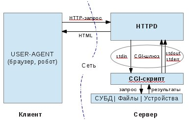

# Взаимодействие приложения с веб-сервером

### SAPI

SAPI (Server Application Programming Interface) - программный интерфейс позволяющий чему-то либо(интерпретатору PHP например) работать в качестве части web-приложения (а по сути - как часть веб-сервера), в частности - получить конкретные запросы от программы-сервера и отдавать данные (определяемые уже внутренней логикой, которую реализовал программист).

### CGI

**CGI (Common Gateway Interface)** — стандарт интерфейса, используемого для связи внешней программы с веб-сервером. Программу, которая работает по такому интерфейсу совместно с веб-сервером, принято называть шлюзом, хотя многие предпочитают названия «скрипт» (сценарий) или «CGI-программа». По сути позволяет использовать консоль ввода и вывода для взаимодействия с клиентом.

Алгоритм работы:

1. Клиент запрашивает CGI-приложение по его URI.
2. Веб-сервер принимает запрос и устанавливает переменные окружения, через них приложению передаются данные и служебная информация.
3. Веб-сервер перенаправляет запросы через стандартный поток ввода (stdin) на вход вызываемой программы.
4. CGI-приложение выполняет все необходимые операции и формирует результаты в виде HTML.
5. Сформированный гипертекст возвращается веб-серверу через стандартный поток вывода (stdout). Сообщения об ошибках передаются через stderr.
6. Веб-сервер передает результаты запроса клиенту.

Недостатки CGI:

1. низкая производительность
2. каждое обращение к CGI-приложению вызывает порождение нового процесса
3. взаимодействуют с сервером через STDIN и STDOUT запущенного CGI-процесса
4. если приложение написано с ошибками, то возможна ситуация, когда оно, например, зациклится; браузер прервет соединение по истечении тайм-аута, но на серверной стороне процесс будет продолжаться, пока администратор не снимет его принудительно.
5. неправильная настройка прав доступа к серверным ресурсам из CGI-приложения может поставить под угрозу не только работоспособность веб-сервера, но и информационную безопасность

### FastCGI SAPI

Интерфейс FastCGI — клиент-серверный протокол взаимодействия веб-сервера и приложения, дальнейшее развитие технологии CGI. По сравнению с CGI является более производительным и безопасным.

1. PHP интерпретатор запускается как независимый сервер, обрабатывающий входящие запросы на исполнение PHP скриптов по протоколу FastCGI, что позволяет ему работать с любым веб-сервером, поддерживающим этот протокол
2. более производительный и безопасный
3. вместо того чтобы создавать новые процессы для каждого нового запроса, использует постоянно запущенные процессы для обработки множества запросов
4. использует Unix Domain Sockets или TCP/IP для связи с сервером
5. могут быть запущены не только на этом же сервере, но и где угодно в сети
6. возможна обработка запросов несколькими FastCGI-процессами, работающими параллельно
7. в кластере должен находиться только FastCGI-процесс, а не целый веб-сервер
8. обеспечивает дополнительную безопасность, такую как, например, запуск FastCGI-процесса под учётной записью пользователя, отличного от пользователя веб-сервера, а также может находиться в chroot'е, отличном от chroot'а веб-сервера
9. может быть использован в любом языке, поддерживающем сокеты.

### FPM SAPI

**FPM (FastCGI Process Manager), известный как php-fpm** — является альтернативной реализацией PHP FastCGI с несколькими дополнительными возможностями обычно используемыми для высоконагруженных сайтов.

- продвинутое управление процессами с корректной (graceful) процедурой остановки и запуска;
- возможность запуска воркеров с разными uid/gid/chroot/окружением, а также запуска на различных портах с использованием разных php.ini (замещение safe_mode)
- логирование стандартных потоков вывода (stdout) и ошибок (stderr)
- аварийный перезапуск в случае внезапного разрушения opcode-кеша
- поддержка ускоренной загрузки (accelerated upload)
- "slowlog" - логирование необычно медленно выполняющихся скриптов (не только их имена, но также и их трассировки. Это достигается с помощью ptrace и других подобных утилит для чтения данных исполнения удаленных процессов)
- fastcgi_finish_request() - специальная функция для завершения запроса и сброса всех буферов данных, причем процесс может продолжать выполнение каких-либо длительных действий
- динамическое/статическое порождение дочерних процессов
- базовая информация о статусе SAPI (аналогично Apache mod_status)
- конфигурационный файл, основанный на php.ini.
- с версии PHP 5.3.3, php-fpm был включён в PHP как отдельное SAPI

## CLI SAPI

**CLI SAPI** — в качестве скрипта командной строки, являющегося исполняемым файлом, который вызывается пользователем из командной строки.

- в отличие от CGI SAPI, заголовки не пишутся в поток вывода
- сообщения об ошибках выдаются в текстовом режиме
- PHP CLI не поддерживает GET, POST или загрузку файлов
- текущая директория не изменяется на рабочую директорию скрипта
- скрипт выполняется в окружении вызвавшего пользователя
- в этом случае возможно использование PHP для создания клиентских GUI-приложений
- для решения административных задач в операционных системах UNIX, Linux, Microsoft Windows, Mac OS X и AmigaOS.
- с версии PHP 5.4.0 в CLI SAPI появилась возможность запуска PHP как отдельного HTTP-сервера (один процесс интерпретатора и выполняет все запросы исключительно последовательно)

## NGINX+PHP-FPM vs ApacheModPhp

Апач использует модель prefork(но вообще естьи другие варианты). Каждый процесс обрабатывает единовременно только одно пользовательское соединение. Невыгодно запускать процесс во время установки соединения, поэтому процесс запускается заранее. Апач это старый, тяжеловесный и ресурсоемкий сервер. В стандартную компоновку входит много модулей, которые могут не использоваться непосредственно при обработке запроса, но инициализируются(например даже если запрос идет на статику будет инициализирвоаться ModPhp) тем самым дико замедляя работу.

У nginx есть один главный и несколько рабочих процессов. Основная задача главного процесса — чтение и проверка конфигурации и управление рабочими процессами. Рабочие процессы выполняют фактическую обработку запросов. nginx использует асинхронную модель(процессу не надо ждать пока ответит PHP, в этот момент он может обрабатывать другие запросы), основанную на событиях, и зависящие от операционной системы механизмы для эффективного распределения запросов между рабочими процессами. Отделение основной работы от обработки соединений позволяет каждому воркеру заниматься своей работой и отвлекаться на обработку соединений только тогда когда произошло новое событие. Каждое соединение, обрабатываемое воркером, помещается в event loop вместе с другими соединениями. В этом цикле события обрабатываются асинхронно, позволяя обрабатывать задачи в неблокирующей манере. Когда соединение закрывается оно удаляется из цикла. Вместо того чтобы выделять на каждый запрос отдельный поток или процесс (как это делают серверы с традиционной архитектурой), NGINX мультиплексирует обработку множества соединений и запросов в одном рабочем процессе. Для этого применяются сокеты в неблокирующем режиме и такие эффективные методы работы с событиями, как [epoll](http://man7.org/linux/man-pages/man7/epoll.7.html) и [kqueue](https://www.freebsd.org/cgi/man.cgi?query=kqueue). Этот подход к обработке соединений позволяет Nginx'у невероятно масштабироваться при ограниченных ресурсах. Поскольку сервер однопоточный и он не создает процессы под каждое соединение, использование памяти и CPU относительно равномерно, даже при высоких нагрузках.  

### C10k 

C10k (10k connections — проблема 10 тысяч соединений) — условное название задачи конфигурирования и обслуживания высокопроизводительного сервера, способного обслуживать порядка 10 тыс. соединений одновременно. Формально аппаратное обеспечение современных компьютеров имеет должную производительность для выполнения задачи, однако неэффективные алгоритмы могут приводить к возникновению «заторов».

Ряд известных веб-серверов особо подчёркивают решение задачи C10k, среди таковых Nginx, Lighttpd, Cherokee HTTP Server, Tornado, Node.js, Yaws. Для обхода проблемы используются различные техники: пулирование потоков выполнения (вместо выделения на каждое соединение отдельного потока), применение легковесных процессов, поддержка функций соединений средствами исключительно пользовательского пространства (с минимизацией системных вызовов для обхода ограничений ядра операционной системы).

По состоянию на середину 2010-х годов серверный аппаратный узел среднего уровня способен обрабатывать до 10 млн соединений, и в связи с чем появились требования к программному обеспечению обеспечивать соответствующий уровень производительности по количеству одновременных подключений, обозначаемые как C10M.

*Дополнительно:*

- https://habr.com/post/260065/
- https://habr.com/post/260669/
- https://habr.com/post/267721/