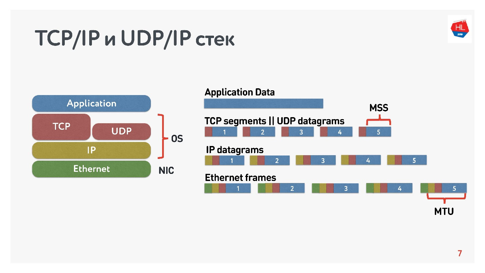
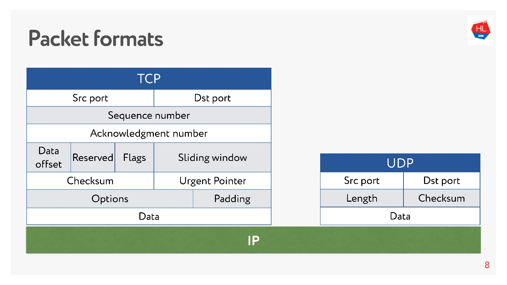

# TCP/UDP

Основные отличия tcp от udp.

- `TCP гарантирует доставку пакетов данных в неизменных виде, последовательности и без потерь, UDP ничего не гарантирует.`
- `TCP нумерует пакеты при передаче, а UDP нет`
- `TCP работает в дуплексном режиме, в одном пакете можно отправлять информацию и подтверждать получение предыдущего пакета.`
- `TCP требует заранее установленного соединения, UDP соединения не требует, у него это просто поток данных.`
- `UDP обеспечивает более высокую скорость передачи данных.`
- `TCP надежнее и осуществляет контроль над процессом обмена данными.`
- `UDP предпочтительнее для программ, воспроизводящих потоковое видео, видеофонии и телефонии, сетевых игр.`
- `UPD не содержит функций восстановления данных`

На схеме представлены TCP/IP и UDP/IP стек. Внизу есть Ethernet-пакеты, IP-пакеты, и дальше на уровне ОС есть TCP и UDP. TCP и UDP в этом стеке не сильно друг от друга отличаются. Они инкапсулируются в IP-пакеты, и приложения могут ими пользоваться. Чтобы увидеть отличия, нужно посмотреть внутрь TCP- и UDP-пакета.

И там, и там есть порты. Но **в UDP есть только контрольная сумма** — длина пакета, этот протокол максимально простой. А в TCP — очень много данных, которые явно указывают окно, acknowledgement, sequence, пакеты и так далее. Очевидно, **TCP более сложный**. Если говорить очень грубо, то TCP — это протокол надежной доставки, а UDP — ненадежной.

*Дополнительно*:

- [TCP против UDP](https://habr.com/ru/company/oleg-bunin/blog/461829/)

