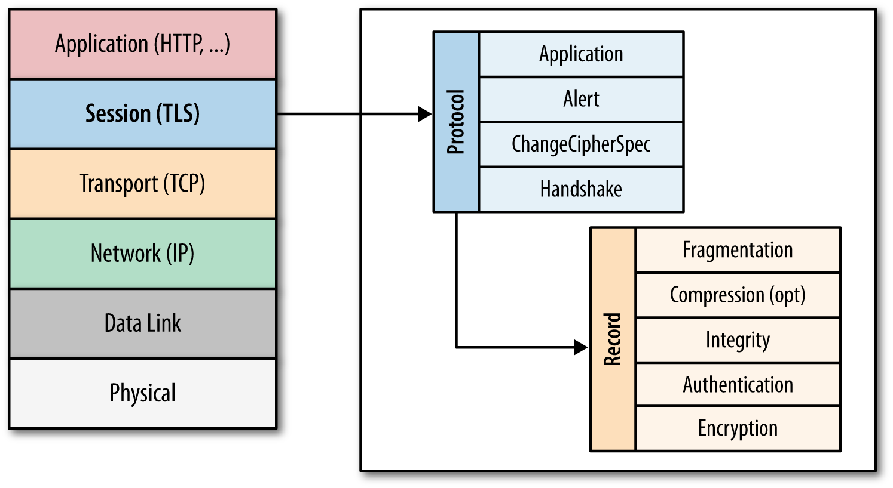
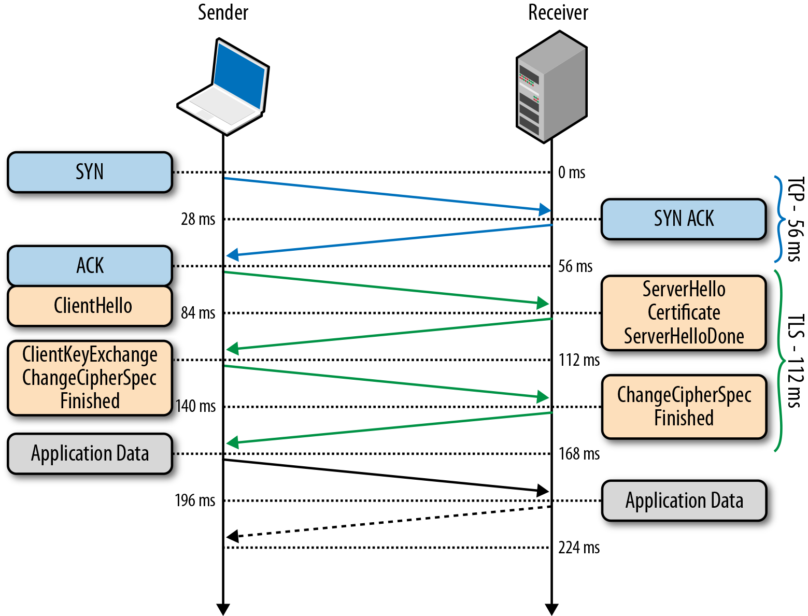

## TLS

SSL и TLS представляют собой развитие одной и той же технологии. Аббревиатура TLS (Transport Layer Security) появилась в качестве замены обозначения SSL (Secure Sockets Layer) после того, как протокол окончательно стал интернет-стандартом. Такая замена вызвана юридическими аспектами, так как спецификация SSL изначально принадлежала компании Netscape. И сейчас нередко названия SSL и TLS продолжают использовать в качестве синонимов, но каноническим именем является TLS, а протоколы семейства SSL окончательно устарели и не должны использоваться.

Конкретное место TLS (SSL) в стеке протоколов Интернета показано на схеме:

##### **TLS Handshake**

Основные шаги процедуры создания защищённого сеанса связи:

- клиент подключается к серверу, поддерживающему TLS, и запрашивает защищённое соединение;
- клиент предоставляет список поддерживаемых [алгоритмов шифрования](https://ru.wikipedia.org/wiki/Шифрование) и [хеш-функций](https://ru.wikipedia.org/wiki/Хеширование);
- сервер выбирает из списка, предоставленного клиентом, наиболее надёжные алгоритмы среди тех, которые поддерживаются сервером, и сообщает о своём выборе клиенту;
- сервер отправляет клиенту цифровой сертификат для собственной аутентификации. Обычно цифровой сертификат содержит имя сервера, имя удостоверяющего центра сертификации и открытый ключ сервера;
- клиент, до начала передачи данных, проверяет валидность (аутентичность) полученного серверного сертификата относительно имеющихся у клиента корневых сертификатов удостоверяющих центров (центров сертификации). Клиент также может проверить, не отозван ли серверный сертификат, связавшись с сервисом доверенного удостоверяющего центра;
- для шифрования сессии используется [сеансовый ключ](https://ru.wikipedia.org/wiki/Сеансовый_ключ). Получение общего секретного сеансового ключа клиентом и сервером проводится по протоколу Диффи-Хеллмана. Существует исторический метод передачи сгенерированного клиентом секрета на сервер при помощи шифрования асимметричной криптосистемой RSA (используется ключ из сертификата сервера). Данный метод не рекомендован, но иногда продолжает встречаться на практике.

На этом заканчивается процедура подтверждения связи. Между клиентом и сервером установлено безопасное соединение, данные, передаваемые по нему, шифруются и расшифровываются с использованием симметричной криптосистемы до тех пор, пока соединение не будет завершено.

*Дополнительно:*

- [TLS — Википедия](https://ru.wikipedia.org/wiki/TLS)
- [Что такое TSL](https://habr.com/ru/post/258285/)
- [Ключи, шифры, сообщения: как работает TLS](https://tls.dxdt.ru/tls.html)
- [Руководство по выживанию — TLS/SSL и сертификаты SSL](https://www.opennet.ru/docs/RUS/ldap_apacheds/tech/ssl.html)