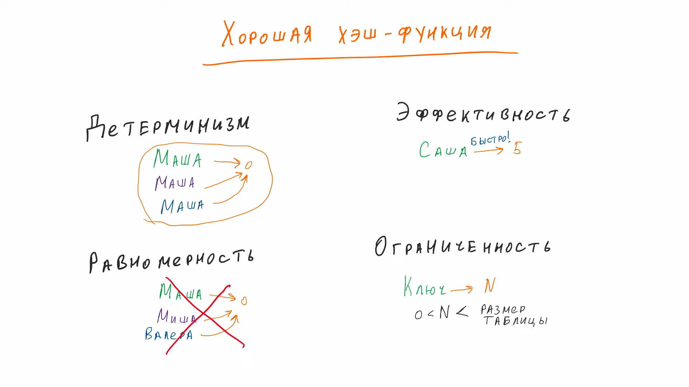
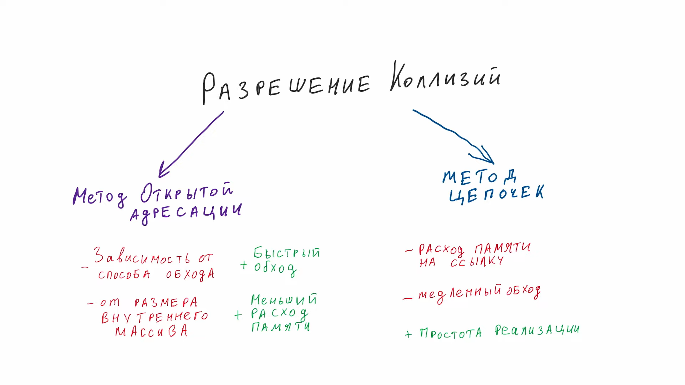
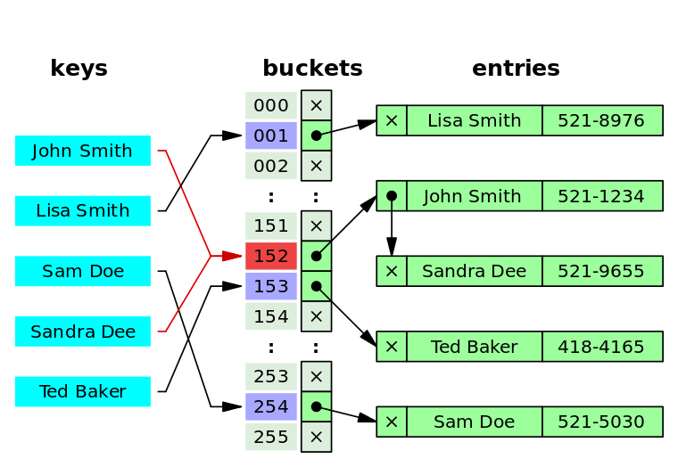
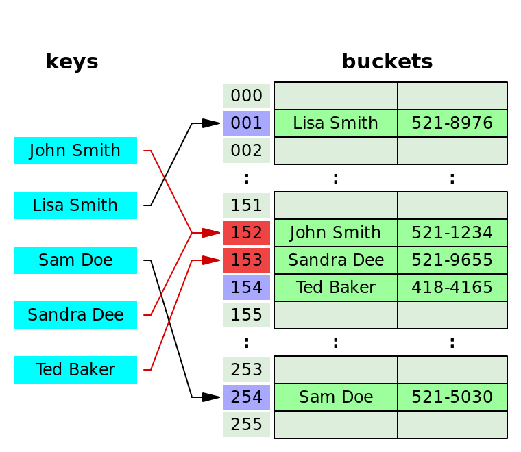

# Хэш таблица

**Хеш-таблица(hash table)** — структура данных, реализующая интерфейс ассоциативного массива, позволяет хранить пары `ключ => значение` и выполнять три операции:

- добавление
- поиск 
- удаление

Главное свойство **hash table** — все операции(вставка, поиск и удаление) в среднем выполняются за **O(1)**, среднее время поиска по ней также равно **O(1)** и **O(n)** в худшем случае.

Выполнение операции в хеш-таблице начинается с вычисления **хеш-функции** от ключа. Получающееся хеш-значение играет роль индекса. Затем выполняемая операция (добавление, удаление или поиск) перенаправляется объекту, который хранится в соответствующей ячейке массива. 

Ситуация, когда для различных ключей получается одно и то же хеш-значение, называется коллизией. Существует несколько способов разрешения коллизий.

### Метод цепочек

Этот метод часто называют **открытым хешированием**. Его суть проста — элементы с одинаковым хешем попадают в одну ячейку в виде связного списка(возможны оптимизации, где вместо списка будет дерево). Каждая ячейка массива *H* является указателем на связный список(цепочку) пар ключ-значение, соответствующих одному и тому же хеш-значению ключа. Коллизии просто приводят к тому, что появляются цепочки длиной более одного элемента.

### Открытая индексация (или закрытое хеширование)

Метод открытой адресации (open addressing) представляет собой один из способов решения коллизий в хеш-таблицах. Вместо того чтобы создавать цепочки (списки) для элементов с одинаковыми хеш-значениями, метод открытой адресации предлагает разместить элементы в самой таблице, перемещая их на другие позиции, если возникают коллизии.

При вставке нового элемента происходит попытка разместить его в таблице на соответствующей позиции, определенной хеш-функцией. Если позиция занята, то начинается поиск следующей свободной позиции в таблице. Этот процесс может включать в себя различные стратегии поиска, такие как линейное пробирование, квадратичное пробирование, двойное хеширование и др. Для успешной работы алгоритмов поиска последовательность проб должна быть такой, чтобы все ячейки хеш-таблицы оказались просмотренными ровно по одному разу.

Алгоритм поиска просматривает ячейки хеш-таблицы в том же самом порядке, что и при вставке, до тех пор, пока не найдется либо элемент с искомым ключом, либо свободная ячейка (что означает отсутствие элемента в хеш-таблице). Этот порядок вычисляется на лету, что позволяет сэкономить на памяти для указателей, требующихся в хеш-таблицах с цепочками.

### Рехеширование

Рехеширование (rehashing) - это процесс изменения размера хеш-таблицы и перераспределения её элементов для уменьшения коллизий и обеспечения эффективной работы структуры данных. Оно может происходить при превышении определенной заполненности таблицы (например, 70% от максимальной) или по другим условиям.

Основные шаги рехеширования в хеш-таблицах:

1. **Создание новой таблицы:** Сначала создается новая хеш-таблица с более большим или меньшим размером по сравнению с текущей таблицей. Выбор размера новой таблицы может зависеть от стратегии рехеширования.
2. **Перераспределение элементов:** Затем элементы из текущей таблицы перераспределяются в новую таблицу с использованием обновленных хеш-функций. Это может потребовать вычисления новых хеш-значений для каждого элемента и его перемещения в соответствующую позицию новой таблицы.
3. **Обновление ссылок:** Все ссылки на таблицу теперь должны указывать на новую таблицу, так чтобы последующие операции вставки, поиска и удаления работали с обновленной структурой данных.

Существует несколько стратегий рехеширования:

1. **Удвоение размера:** При этой стратегии новая таблица имеет удвоенный размер по сравнению с текущей. Это позволяет более равномерно распределить элементы и обеспечить эффективную работу таблицы. Однако это требует дополнительной памяти.
2. **Уменьшение размера:** В некоторых случаях, если таблица стала слишком маленькой после множественных удалений, может потребоваться уменьшить её размер, чтобы сэкономить память.
3. **Двойное хеширование:** Это метод рехеширования, при котором элементы перераспределяются в таблицу нового размера с использованием другой хеш-функции. Это может помочь избежать кластеризации элементов, если первая хеш-функция вызывает коллизии.

Преимущества рехеширования:

- Уменьшение коллизий: Рехеширование позволяет более равномерно распределить элементы, уменьшая вероятность коллизий и улучшая производительность.
- Динамическое изменение размера: Таблица может адаптироваться к изменяющейся нагрузке, увеличивая или уменьшая свой размер по мере необходимости.

Недостатки рехеширования:

- Дополнительные затраты: Рехеширование может потребовать выделения памяти для новой таблицы и перемещения элементов, что может быть дорогим по ресурсам.
- Временная сложность: Процесс рехеширования может занять время, что может замедлить работу структуры данных на короткий срок.

Выбор стратегии рехеширования и параметров (например, размера новой таблицы) зависит от конкретных потребностей и характеристик приложения.

*Дополнительно:*

- [Хэширование](http://aliev.me/runestone/SortSearch/Hashing.html)
- [Хэш-Таблица](https://www.wikiwand.com/ru/%D0%A5%D0%B5%D1%88-%D1%82%D0%B0%D0%B1%D0%BB%D0%B8%D1%86%D0%B0)