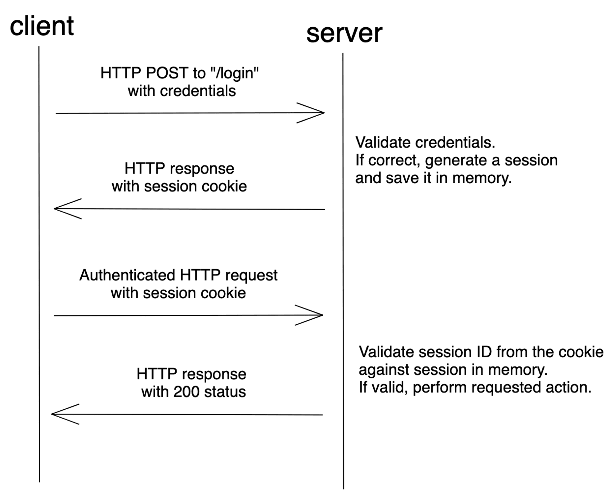

# Аутентификация на основе Cookie и сессий

При сеансовой аутентификации состояние пользователя хранится на сервере. При первом входе сервер проверяет учётные данные, генерирует сессию и отправляет идентификатор сессии в браузер, который сохраняет его в cookie. Это позволяет пользователю не вводить имя и пароль при каждом обращении к сайту.

Сеансовая аутентификация является stateful: сервер должен находить сохранённую сессию для связи идентификатора с пользователем.

##### Преимущества и недостатки

| Преимущества                                                                                                   | Недостатки                                                                                                                                                                                                                                                                                                              |
| -------------------------------------------------------------------------------------------------------------- | ----------------------------------------------------------------------------------------------------------------------------------------------------------------------------------------------------------------------------------------------------------------------------------------------------------------------- |
| Более быстрый последующий вход в систему, так как не требуется вводить учётные данные.                         | Требует сохранения состояния (stateful). Сервер ведет учёт каждого сеанса на своей стороне. Хранилище информации о сеансе пользователей должно быть общим для нескольких сервисов, чтобы обеспечить аутентификацию. Из-за этого он не подходит для REST-сервисов, поскольку REST — это протокол без хранения состояния. |
| Достаточно простая реализация. Многие фреймворки предоставляют эту возможность из коробки.                     | Без специальных настроек (domain, path , samesite) cookie отправляются при каждом запросе, даже если он не требует аутентификации.                                                                                                                                                                                      |
| Удобнее для пользователя, поскольку ему не приходится каждый раз при обращении к серверу вводить имя и пароль. | Без правильной настройки безопасности метод может быть уязвим для CSRF-атак.                                                                                                                                                                                                                                            |
