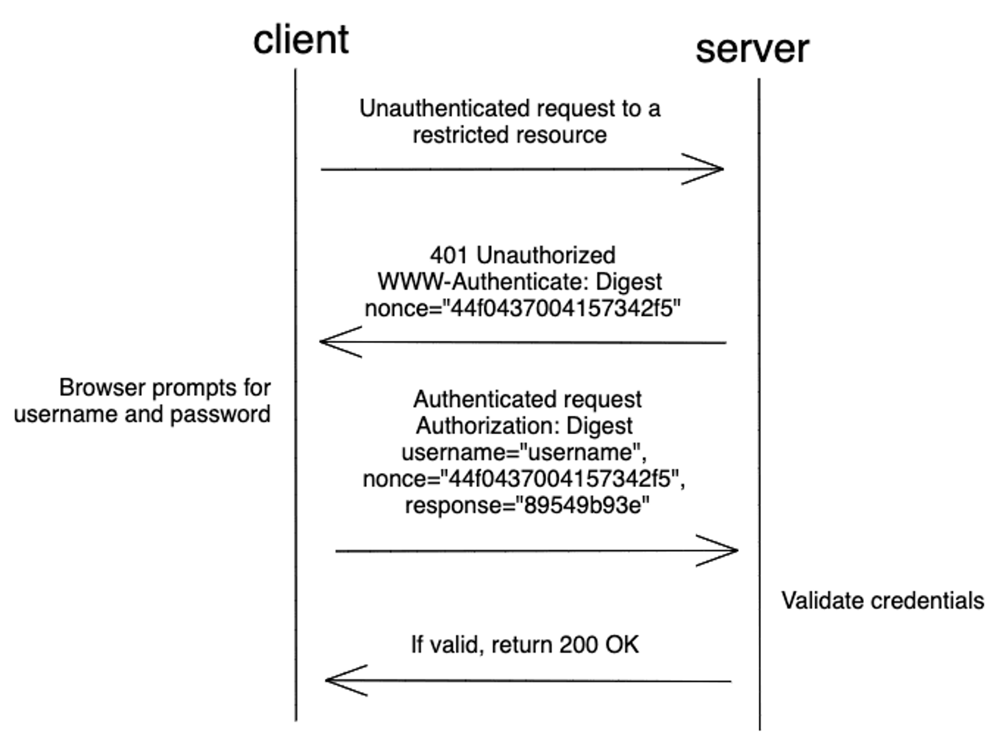

# HTTP Digest Authentication

HTTP Digest Authentication (или Digest Access Authentication) — более безопасная форма базовой аутентификации. В отличие от Basic Auth, здесь пароль передается в виде хеша, что повышает уровень безопасности.



1. Неаутентифицированный клиент запрашивает ресурс с ограниченным доступом.

2. Сервер генерирует случайное значение, называемое nonce, и отправляет обратно статус HTTP **401 Unauthorized** с заголовком **WWW-Authenticate**, имеющим значение **Digest** вместе с nonce:
```
WWW-Authenticate: Digest
        realm="Access to the '/' path",
        nonce="e4549c0548886bc2",
        algorithm="MD5"
```


3. Получив ответ с заголовком **WWW-Authenticate**, браузер запрашивает у пользователя логин и пароль.

4. После ввода учётных данных браузер отправляет серверу ответ **Authorization**:
```
Authorization: Digest username="User1",
        realm="Access to the '/' path",
        nonce="e4549c0548886bc2",
        uri="/",
        algorithm=MD5,
        response="6299988bb4f05c0d8ad44295873858cf"
```

Значение response в ответе формируется следующим образом:

```
response = H(HA1:nonce:HA2)

HA1 = H(username:realm:password)

HA2 = H(method:digestURI)
```

Пример:
```
response = SHA256(HA1:”e4549c0548886bc2”:HA2)

HA1 = SHA256(”User1”:”/”:”User1Password”)

HA2 = SHA256(”GET”:”/”)
```

Актуальный стандарт HTTP **Digest Authentication** описывается в [RFC7616](https://httpwg.org/specs/rfc7616.html). Ответ **Authorization** может содержать дополнительные поля для дополнительной защиты (счётчик запросов **nc**, одноразовый номер клиента **cnonce**, качество кода защиты **qop**).

Также **RFC7616** добавляет алгоритм хеширования **SHA256** на замену небезопасному алгоритму **MD5**, использование которого поддерживается, но не рекомендуется.

5. Получив ответ **Authorization**, сервер выполняет вычисляет свой вариант response и сравнивает его с тем, что получено от клиента.

6. Если хеши совпадают, пользователь получает доступ к запрошенному ресурсу.

##### Преимущества и недостатки

|Преимущества|Недостатки|
|---|---|
|Более безопасен, чем Basic auth, поскольку пароль не передается открытым текстом.|Метод уязвим для атак типа «человек посередине» (man-in-the-middle), если не используется https.|
|Простота реализации.|Учётные данные должны передаваться при каждом запросе.|
|Поддерживается всеми основными браузерами.|
