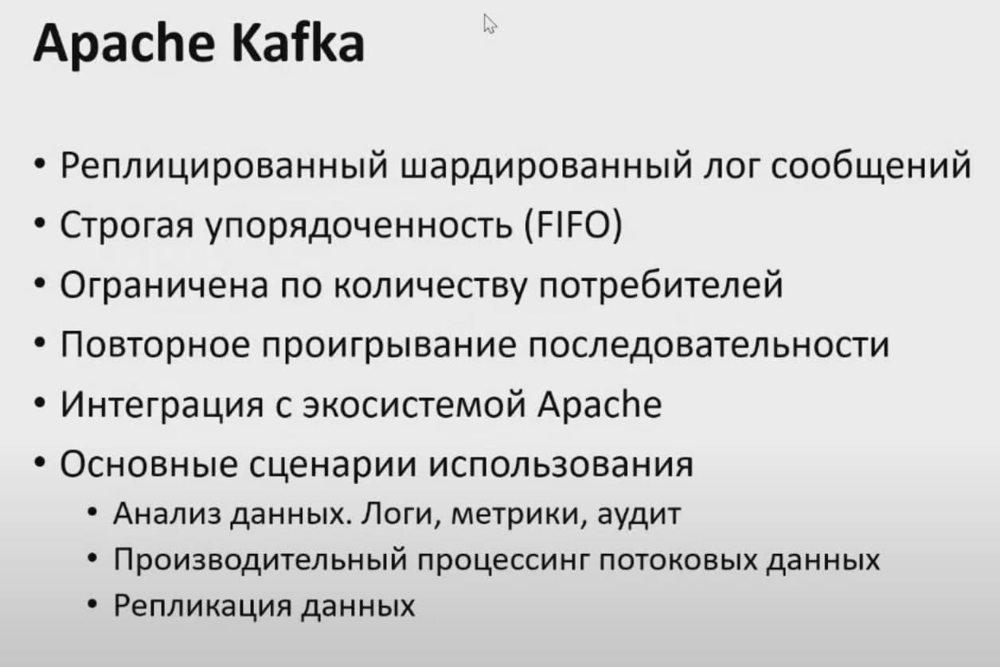

# Apache Kafka



Обычно считается, что **Kafka** — это распределенная и реплицированная очередь сообщений. С технической точки зрения все верно, но термин очередь сообщений не все понимают одинаково. Я предпочитаю другое определение: **распределенный и реплицированный журнал коммитов**. Эта формулировка кажется более точной, ведь мы все прекрасно знаем, как журналы записываются на диск. Просто в этом случае на диск попадают сообщения, отправленные в Kafka

## Базовые компоненты

### Topic
Поток сообщений, который является частью определенной категории или названия канала, называется топиком Kafka. Producer записывают свои данные в топик, а consumer читает данные из этого топика.

На самом деле представляет собой лишь логический блок(абстракцию), которую мы используем для определения куда писать или откуда читать данные. Фактически данные хранятся в партициях.

### Broker
Кластер Kafka состоит из одного или нескольких серверов, известных как брокеры. В Kafka брокер работает как контейнер, который может содержать несколько топиков с разными partitions. Уникальный ID используется для идентификации брокера в кластере Kafka. Подключение к любому из брокеров Kafka в кластере подразумевает подключение ко всему кластеру

### Producer
Producers в Kafka публикует сообщения в одном или нескольких топиков. Они отправляют данные в кластер Kafka

### Consumer and Consumer
GroupConsumers читает данные из кластера Kafka. Данные, которые должны быть прочитаны Consumers, получаются от брокера. Consumer group в Kafka объединяет несколько consumers, таким образом, что каждый consumer читает часть сообщений определенного топика

### Partition
Топик в Kafka разделен на настраиваемое количество частей, которые называются partitions. Partition разделяет топик по нескольким брокерам, таким образом снижая нагрузку на каждый отдельный сервер. Consumers могут быть объединены в consumer group, и тогда один сonsumer может получать сообщения не из всего топика, а только из некоторых его partitions, что обеспечивает распределение нагрузки на обработку сообщений

### Partition Offset
Сообщения или записи в Kafka относятся к partition, каждой записи присваивается число - offset, чтобы определить положение в partition. Запись идентифицируется в своем partition с помощью значения offset. Offset partition имеет значение только для этого конкретного partition. Для старых записей будут меньшие значения offset, поскольку записи добавляются в конец partition


### Replicas
Реплики похожи на резервную копию partition в Kafka. Используется для предотвращения потери данных в случае сбоя или планового отключения и размещаются на нескольких серверах в кластере Kafka


## Подробнее

Системы очередей обычно состоят из трёх базовых компонентов:

1. сервер,
2. продюсеры, которые отправляют сообщения в некую именованную очередь, заранее сконфигурированную администратором на сервере,
3. консьюмеры, которые считывают те же самые сообщения по мере их появления.

Консьюмеры получают данные с сервера, используя две разные модели запросов: pull или push.


**pull-модель** — консьюмеры сами отправляют запрос раз в n секунд на сервер для получения новой порции сообщений. При таком подходе клиенты могут эффективно контролировать собственную нагрузку. Кроме того, pull-модель позволяет группировать сообщения в батчи, таким образом достигая лучшей пропускной способности. К минусам модели можно отнести потенциальную разбалансированность нагрузки между разными консьюмерами, а также более высокую задержку обработки данных.

**push-модель** — сервер делает запрос к клиенту, посылая ему новую порцию данных. По такой модели, например, работает RabbitMQ. Она снижает задержку обработки сообщений и позволяет эффективно балансировать распределение сообщений по консьюмерам. Но для предотвращения перегрузки консьюмеров в случае с RabbitMQ клиентам приходится использовать функционал QS, выставляя лимиты.

Как правило, приложение пишет и читает из очереди с помощью нескольких инстансов продюсеров и консьюмеров. Это позволяет эффективно распределить нагрузку.


Типичный жизненный цикл сообщений в системах очередей:

- Продюсер отправляет сообщение на сервер.
- Консьюмер фетчит сообщение и его уникальный идентификатор сервера.
- Сервер помечает сообщение как in-flight. Сообщения в таком состоянии всё ещё хранятся на сервере, но временно не - доставляются другим консьюмерам. Таймаут этого состояния контролируется специальной настройкой.
- Консьюмер обрабатывает сообщение, следуя бизнес-логике. Затем отправляет ack или nack-запрос обратно на сервер, используя уникальный идентификатор, полученный ранее — тем самым либо подтверждая успешную обработку сообщения, либо сигнализируя об ошибке.
- В случае успеха сообщение удаляется с сервера навсегда. В случае ошибки или таймаута состояния in-flight сообщение доставляется консьюмеру для повторной обработки.


## Базовые компоненты Kafka
Как и сервисы обработки очередей, Kafka условно состоит из трёх компонентов:

1. сервер (по-другому ещё называется брокер),
2. продюсеры — они отправляют сообщения брокеру,
3. консьюмеры — считывают эти сообщения, используя модель pull.


Пожалуй, фундаментальное отличие Kafka от очередей состоит в том, как сообщения хранятся на брокере и как потребляются консьюмерами.

Сообщения в Kafka не удаляются брокерами по мере их обработки консьюмерами — данные в Kafka могут храниться днями, неделями, годами. Благодаря этому одно и то же сообщение может быть обработано сколько угодно раз разными консьюмерами и в разных контекстах.

В этом кроется главная мощь и главное отличие Kafka от традиционных систем обмена сообщениями.

Теперь давайте посмотрим, как Kafka и системы очередей решают одну и ту же задачу. Начнём с системы очередей.

Представим, что есть некий сайт, на котором происходит регистрация пользователя. Для каждой регистрации мы должны:

- отправить письмо пользователю,
- пересчитать дневную статистику регистраций.

В случае с RabbitMQ или Amazon SQS функционал может помочь нам доставить сообщения всем сервисам одновременно. Но при необходимости подключения нового сервиса придётся конфигурировать новую очередь.


Kafka упрощает задачу. Достаточно послать сообщения всего один раз, а консьюмеры сервиса отправки сообщений и консьюмеры статистики сами считают его по мере необходимости.


Kafka также позволяет тривиально подключать новые сервисы к стриму регистрации. Например, сервис архивирования всех регистраций в S3 для последующей обработки с помощью Spark или Redshift можно добавить без дополнительного конфигурирования сервера или создания дополнительных очередей.

Кроме того, раз Kafka не удаляет данные после обработки консьюмерами, эти данные могут обрабатываться заново, как бы отматывая время назад сколько угодно раз. Это оказывается невероятно полезно для восстановления после сбоев и, например, верификации кода новых консьюмеров. В случае с RabbitMQ пришлось бы записывать все данные заново, при этом, скорее всего, в отдельную очередь, чтобы не сломать уже имеющихся клиентов.

## Структура данных

```kafka-run-class.bat kafka.tools.DumpLogSegments --deep-iteration --print-data-log --files logs\freblogg-2\00000000000000000000.log```

Получим результат:

```
umping logs\freblogg-2\00000000000000000000.log
Starting offset: 0

offset: 0 position: 0 CreateTime: 1533443377944 isvalid: true keysize: -1 valuesize: 11 producerId: -1 headerKeys: [] payload: Hello World

offset: 1 position: 79 CreateTime: 1533462689974 isvalid: true keysize: -1 valuesize: 6 producerId: -1 headerKeys: [] payload: amazon
```

Здесь мы видим смещение, время создания, размер ключа и значения, а еще само сообщение (payload).

Сообщения в Kafka организованы и хранятся в именованных топиках (Topics), каждый топик состоит из одной и более партиций (Partition), распределённых между брокерами внутри одного кластера. Подобная распределённость важна для горизонтального масштабирования кластера, так как она позволяет клиентам писать и читать сообщения с нескольких брокеров одновременно.

Когда новое сообщение добавляется в топик, на самом деле оно записывается в одну из партиций этого топика. Сообщения с одинаковыми ключами всегда записываются в одну и ту же партицию, тем самым гарантируя очередность или порядок записи и чтения.

## Сегменты

Что это за файлы index и log в каталоге партиции? Партиция, может, и единица хранения в Kafka, но не минимальная. Каждая партиция разделена на сегменты, то есть коллекции сообщений. Kafka не хранит все сообщения партиции в одном файле (как в файле лога), а разделяет их на сегменты. Это дает несколько преимуществ. (Разделяй и властвуй, как говорится.)

Главное — это упрощает стирание данных. Я уже говорил, что сами мы не можем удалить сообщение из партиции, но Kafka может это сделать на основе политики хранения для топика. Удалить сегмент проще, чем часть файла, особенно когда продюсер отправляет в него данные.

```
$ ls -lh freblogg-0
total 20M
- freblogg 197121 10M Aug 5 08:26 00000000000000000000.index
- freblogg 197121 0 Aug 5 08:26 00000000000000000000.log
- freblogg 197121 10M Aug 5 08:26 00000000000000000000.timeindex
- freblogg 197121 0 Aug 5 08:26 leader-epoch-checkpoint
```

Нули (00000000000000000000) в файлах log и index в каждой папке партиции — это имя сегмента. У файла сегмента есть файлы segment.log, segment.index и segment.timeindex.

Kafka всегда записывает сообщения в файлы сегментов в рамках партиции, причем у нас всегда есть активный сегмент для записи. Когда Kafka достигает лимита по размеру сегмента, создается новый файл сегмента, который станет активным.

Для гарантии сохранности данных каждая партиция в Kafka может быть реплицирована n раз, где n — replication factor. Таким образом гарантируется наличие нескольких копий сообщения, хранящихся на разных брокерах.


У каждой партиции есть **Leader** — брокер, который работает с клиентами. Именно лидер работает с продюсерами и в общем случае отдаёт сообщения консьюмерам. К лидеру осуществляют запросы **Followers** — брокеры, которые хранят реплику всех данных партиций. Сообщения всегда отправляются лидеру и, в общем случае, читаются с лидера.

Чтобы понять, кто является лидером партиции, перед записью и чтением клиенты делают запрос метаданных от брокера. Причём они могут подключаться к любому брокеру в кластере.


Основная структура данных в Kafka — это **распределённый, реплицируемый лог**. Каждая партиция — это и есть тот самый реплицируемый лог, который хранится на диске. Каждое новое сообщение, отправленное продюсером в партицию, сохраняется в «голову» этого лога и получает свой уникальный, монотонно возрастающий offset (64-битное число, которое назначается самим брокером).

Как мы уже выяснили, сообщения не удаляются из лога после передачи консьюмерам и могут быть вычитаны сколько угодно раз.

Время гарантированного хранения данных на брокере можно контролировать с помощью специальных настроек. Длительность хранения сообщений при этом не влияет на общую производительность системы. Поэтому совершенно нормально хранить сообщения в Kafka днями, неделями, месяцами или даже годами.


## Consumer Groups

Каждый **консьюмер** Kafka обычно является частью какой-нибудь **консьюмер-группы**.

Каждая группа имеет уникальное название и регистрируется брокерами в кластере Kafka. Данные из одного и того же топика могут считываться множеством консьюмер-групп одновременно. Когда несколько консьюмеров читают данные из Kafka и являются членами одной и той же группы, то каждый из них получает сообщения из разных партиций топика, таким образом распределяя нагрузку.

Каждый консьюмер в консьюмер-группе читает только из своей выделенной партиции топика. Если количество консьюмеров совпадает с количеством партиций в топике, то каждый консьюмер будет читать только из своей партиции, и соответственно не будет видеть сообщения, которые находятся в других партициях. Это может быть полезно для обработки большого объема данных и для масштабирования консьюмеров.

Однако, если количество консьюмеров не совпадает с количеством партиций, то некоторые партиции будут обрабатываться несколькими консьюмерами. Это может быть полезно, если некоторые из партиций генерируют больше данных, чем другие.

Используя партиционность, можно обеспечить балансировку нагрузки между консьюмерами и обеспечить распределенную обработку данных. Это может улучшить производительность и масштабируемость вашей системы.

Если мы добавим ещё одного консьюмера в группу, то партиции автоматически распределятся между ними. Скажем, у нас 3 партиции. c1(consumer1) теперь будет читать сообщения из первой и второй партиции, а c2 — из третьей. Добавив ещё одного консьюмера (c3), мы добьёмся идеального распределения нагрузки, и каждый из консьюмеров в этой группе будет читать данные из одной партиции.
А вот если мы добавим в группу ещё одного консьюмера (c4), то он не будет задействован в обработке сообщений вообще.

Важно понять: внутри одной консьюмер-группы партиции назначаются консьюмерам уникально, чтобы избежать повторной обработки.

Если консьюмеры не справляются с текущим объёмом данных, то следует добавить новую партицию в топик. Только после этого консьюмер c4 начнёт свою работу.

## Параллелизм в партициях

Чтобы гарантировать порядок чтения сообщений из партиции, Kafka дает доступ к партиции только одному консюмеру (из группы консюмеров). Если партиция получает сообщения a, f и k, консюмер читает их в том же порядке: a, f и k. Это важно, ведь порядок потребления сообщений на уровне топика не гарантирован, если у вас несколько партиций.

Если консюмеров будет больше, параллелизм не увеличится. Нужно больше партиций. Чтобы два консюмера параллельно считывали данные из топика, нужно создать две партиции — по одной на каждого. Партиции в одном топике могут находиться в разных брокерах, поэтому два консюмера топика могут считывать данные из двух разных брокеров.

Механизм партиционирования является нашим основным инструментом масштабирования Kafka. Группы являются инструментом отказоустойчивости. Кстати, как вы думаете, что будет, если один из консьюмеров в группе упадёт? Совершенно верно: партиции автоматически распределятся между оставшимися консьюмерами в этой группе.

Добавлять партиции в Kafka можно на лету, без перезапуска клиентов или брокеров. Клиенты автоматически обнаружат новую партицию благодаря встроенному механизму обновления метаданных. Однако, нужно помнить две важные вещи:

- Гарантия очерёдности данных — если вы пишете сообщения с ключами и хешируете номер партиции для сообщений, исходя из общего числа, то при добавлении новой партиции вы можете просто сломать порядок этой записи.
Партиции невозможно удалить после их создания, можно удалить только весь топик целиком.
- И ещё неочевидный момент: если вы добавляете новую партицию на проде, то есть в тот момент, когда в топик пишут сообщения продюсеры, то важно помнить про настройку `auto.offset.reset=earliest` в консьюмере, иначе у вас есть шанс потерять или просто не обработать кусок данных, записавшихся в новую партицию до того, как консьюмеры обновили метаданные по топику и начали читать данные из этой партиции.

Помимо этого, механизм групп позволяет иметь несколько несвязанных между собой приложений, обрабатывающих сообщения.


Как мы обсуждали ранее, можно добавить новую группу консьюмеров к тому же самому топику, например, для обработки и статистики регистраций. Эти две группы будут читать одни и те же сообщения из топика тех самых ивентов регистраций — в своём темпе, со своей внутренней логикой.

А теперь, зная внутреннее устройство консьюмеров в Kafka, давайте вернёмся к изначальному вопросу: «Каким образом мы можем обозначить сообщения в партиции, как обработанные?».

Для этого Kafka предоставляет механизм консьюмер-офсетов. Как мы помним, каждое сообщение партиции имеет свой собственный, уникальный, монотонно возрастающий офсет. Именно этот офсет и используется консьюмерами для сохранения партиций.

Консьюмер делает специальный запрос к брокеру, так называемый offset-commit с указанием своей группы, идентификатора топик-партиции и, собственно, офсета, который должен быть отмечен как обработанный. Брокер сохраняет эту информацию в своём собственном специальном топике. При рестарте консьюмер запрашивает у сервера последний закоммиченный офсет для нужной топик-партиции, и просто продолжает чтение сообщений с этой позиции.

В примере консьюмер в группе email-service-group, читающий партицию p1 в топике registrations, успешно обработал три сообщения с офсетами 0, 1 и 2. Для сохранения позиций консьюмер делает запрос к брокеру, коммитя офсет 3. В случае рестарта консьюмер запросит свою последнюю закоммиченную позицию у брокера и получит в ответе 3. После чего начнёт читать данные с этого офсета.


Консьюмеры вольны коммитить совершенно любой офсет (валидный, который действительно существует в этой топик-партиции) и могут начинать читать данные с любого офсета, двигаясь вперёд и назад во времени, пропуская участки лога или обрабатывая их заново.

Ключевой для понимания факт: **в момент времени может быть только один закоммиченный офсет для топик-партиции в консьюмер-группе**. Иными словами, мы не можем закоммитить несколько офсетов для одной и той же топик-партиции, эмулируя каким-то образом выборочный acknowledgment (как это делалось в системах очередей).

Представим, что обработка сообщения с офсетом 1 завершилась с ошибкой. Однако мы продолжили выполнение нашей программы в консьюмере и запроцессили сообщение с офсетом 2 успешно. В таком случае перед нами будет стоять выбор: какой офсет закоммитить — 1 или 3. В настоящей системе мы бы рекомендовали закоммитить офсет 3, добавив при этом функционал, отправляющий ошибочное сообщение в отдельный топик для повторной обработки (ручной или автоматической). Подобные алгоритмы называются Dead letter queue.

Разумеется, консьюмеры, находящиеся в разных группах, могут иметь совершенно разные закоммиченные офсеты для одной и той же топик-партиции.

## Apache ZooKeeper

Важный компонент кластера Kafka — **Apache ZooKeeper**.

**ZooKeeper** выполняет роль консистентного хранилища метаданных и распределённого сервиса логов. Именно он способен сказать, живы ли ваши брокеры, какой из брокеров является контроллером (то есть брокером, отвечающим за выбор лидеров партиций), и в каком состоянии находятся лидеры партиций и их реплики.

В случае падения брокера именно в ZooKeeper контроллером будет записана информация о новых лидерах партиций. Причём с версии 1.1.0 это будет сделано асинхронно, и это важно с точки зрения скорости восстановления кластера. Самый простой способ превратить данные в тыкву — потеря информации в ZooKeeper. Тогда понять, что и откуда нужно читать, будет очень сложно.

В настоящее время ведутся активные работы по избавлению Kafka от зависимости в виде ZooKeeper, но пока он всё ещё с нами (если интересно, посмотрите на Kafka improvement proposal 500, там подробно расписан план избавления от ZooKeeper).

Важно помнить, что ZooKeeper по факту является ещё одной распределённой системой хранения данных, за которой необходимо следить, поддерживать и обновлять по мере необходимости.

Традиционно ZooKeeper раскатывается отдельно от брокеров Kafka, чтобы разделить границы возможных отказов. Помните, что падение ZooKeeper — это практически падение всего кластера Kafka. К счастью, нагрузка на ZooKeeper при нормальной работе кластера минимальна. Клиенты Kafka никогда не коннектятся к ZooKeeper напрямую.

*Дополнительно:*

- [Apache Kafka: основы технологии](https://slurm.io/blog/tpost/pnyjznpvr1-apache-kafka-osnovi-tehnologii)
- [Практический взгляд на хранение в Kafka](https://slurm.io/blog/tpost/b9uf02mv31-prakticheskii-vzglyad-na-hranenie-v-kafk)
- [RabbitMQ против Kafka](https://habr.com/company/itsumma/blog/416629/)
- [RabbitMQ против Kafka: применение Kafka в событийно ориентированных приложениях](https://habr.com/ru/company/itsumma/blog/418389/)
- [Apache Kafka и RabbitMQ: семантика и гарантия доставки сообщений](https://habr.com/ru/company/itsumma/blog/437446/)
- [Apache Kafka – мой конспект](https://habr.com/post/354486/)
- [Apache Kafka: обзор](https://habr.com/ru/company/piter/blog/352978/)
- [understanding-kafka-topics-and-partitions](https://stackoverflow.com/questions/38024514/understanding-kafka-topics-and-partitions)