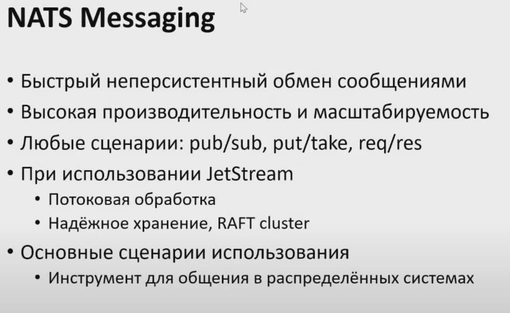

# Nats

NATS — относительно молодой проект, созданный Derek Collison, за плечами которого более 20 лет работы над распределенными очередями сообщений.

Нас покорила простота администрирования кластера NATS. Чтобы подключить новый узел, процессу NATS достаточно указать адрес любого другого узла кластера, и он мгновенно скачивает всю топологию и определяет живые/мертвые узлы. Сообщения в NATS группируются по темам, и каждый узел знает, какие узлы имеют живых подписчиков на какие темы. Все сообщения в кластере доставляются напрямую от отправителя получателю, без промежуточных шагов и с минимальной задержкой.

По производительности NATS опережает все очереди с “гарантированной доставкой”. NATS написан на языке Go, но имеет клиентские библиотеки для всех популярных языков. Кроме того, клиенты NATS также знают топологию кластера и способны самостоятельно переподключаться в случае потери связи со своим узлом.