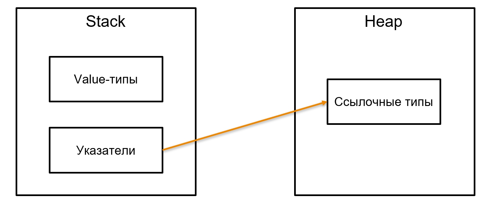

# Управление памятью

# Stack & Heap

Обычно в языках программирования есть две области памяти — Stack и Heap:



На Stack (грубо говоря, это стек нашего метода) мы храним переменные, вызовы, указатели на ссылочные типы. А в Heap обычно хранится то, что называется ссылочными (reference) объектами — всё, что не примитив. String обычно хранится на Heap почти во всех языках, а на Stack лежат boolean, int и указатели на эти референсные типы.

Почему такие названия — Stack и Heap? Потому что Stack — это стек. Представьте стопку тарелок — это стек. Вы всегда берёте тарелку сверху. А Heap — это когда их в кучу навалили и каждую ищите по примерному адресу — надо искать смещение, коллектить и прочее:


# Stack

## **Contiguous Stack (Непрерывный стек)**

Это классическая модель стека, где выделяется единый непрерывный блок памяти фиксированного размера (например, 8MB в pthread). Если стек переполняется, то либо программа падает с `Stack Overflow`, либо (в редких случаях) происходит сложное расширение стека.

**Минусы:**

- Если выделить слишком маленький стек, возможен `Stack Overflow`.
- Если выделить слишком большой стек, будет перерасход памяти (особенно в многопоточных приложениях).
- Расширение стека требует выделения нового блока и копирования данных, что дорого.

Go изначально использовал `Segmented Stack`  (до Go 1.3). В этой модели стек состоял из цепочки небольших сегментов (по 4KB). Когда стек переполнялся, создавался новый сегмент, который ссылался на предыдущий.

**Плюсы:**

- Экономия памяти: каждый горутина начинала с небольшого стека.
- Гибкость: стек мог динамически расти, добавляя сегменты.

**Минусы:**

- Частые переполнения (stack growth) приводили к накладным расходам.
- Плохая локальность данных в кэше процессора.
- Вызовы функций через несколько сегментов требовали дополнительных инструкций.

Из-за этих проблем в **Go 1.3** ввели  стек с динамическим ростом.

В языке Go управление памятью осуществляется автоматически с помощью сборки мусора (garbage collection), что
освобождает разработчика от ручного управления памятью. Вот некоторые ключевые аспекты управления памятью в Go:

## **Go’s Growing Stack (Гибридный подход)**

Современный Go использует **непрерывный стек с динамическим расширением**:

1. Горутин стартует с **маленького стека** (~2KB).
2. Если стек переполняется, Go **выделяет новый, в 2 раза больший блок**.
3. Старый стек **копируется в новый**.
4. Указатели на локальные переменные **обновляются** благодаря механизму stack reallocation.

**Плюсы:**

- Лучшая локальность данных.
- Уменьшены накладные расходы.
- Динамический рост без `Stack Overflow`.

**Минус:**

- Операция расширения требует копирования стека, но это редкое событие.

В результате **Go использует не классический contiguous stack, а гибридный подход с динамическим ростом**.

## Устройства стэка Go

- Стек горутины изначально размещается в памяти стека (stack memory), а не в куче.
- Когда стек переполняется:
  - Go выделяет новый, более крупный участок памяти(обычно в стеке, но иногда в куче)
  
  - Копирует содержимое старого стека в новый.
  
  - Обновляет указатели (чтобы ссылки на старый стек не сломались).

- Когда горутина **переполняет стек**, Go:
  
  1. **Создаёт новый стек (обычно в стеке, но иногда в куче)**.
  2. **Копирует содержимое старого стека в новый**.
  3. **Обновляет указатели** (чтобы ссылки на старый стек не сломались).
- Где выделяется новый стек?
  - Go Runtime обычно выделяет новый стек в стеке, а не в куче.
  - НО! Если стек становится слишком большим (>1MB), он может быть выделен в куче.


## Как работают выделение и освобождение памяти в стеке ?

📌 **Основной принцип:** **Last In, First Out (LIFO)** – это значит, что последняя выделенная переменная **освобождается первой**.

🔹 **Стек растёт вниз (в сторону уменьшения адресов памяти)**.  
🔹 Когда мы создаём новую переменную – **указатель стека (`stack pointer`) просто сдвигается вниз**.  
🔹 Когда функция завершает работу – **указатель стека просто "поднимается обратно"**, освобождая всю выделенную память.


Разберём на примере:

```go
func example() {
    a := 1  // Переменная a (1-я в стеке)
    b := 2  // Переменная b (2-я в стеке)
    c := 3  // Переменная c (3-я в стеке)
    d := 4  // Переменная d (4-я в стеке)
    e := 5  // Переменная e (5-я в стеке)
} // Здесь ВСЕ переменные a, b, c, d, e сразу освобождаются
```

💡 **Как это выглядит в памяти (стек растёт вниз)?**

```
┌────────┐  <-- stack pointer после вызова функции
│    e   │  (5-я переменная)
│    d   │  (4-я переменная)
│    c   │  (3-я переменная)
│    b   │  (2-я переменная)
│    a   │  (1-я переменная)
└────────┘  <-- stack pointer до вызова функции
```

👉 Как только `example()` завершается – стек просто **отматывается назад** → ВСЕ переменные разом освобождаются.

---

### **Как мы обращаемся к переменным в стеке?**

🔹 Доступ к данным идёт через **адреса внутри стека**.  
🔹 Компилятор отслеживает **смещение (`offset`)** от `stack pointer` и генерирует код, который использует инструкции процессора для работы с этими значениями.  
🔹 В **разных архитектурах** доступ к стеку может быть через регистры (`RSP`, `RBP` в x86_64) или прямые смещения.

---

### **Почему LIFO?**

- Если бы стек работал не по LIFO, то освобождать память пришлось бы вручную, а это усложнило бы управление ресурсами.
- LIFO позволяет **разом освобождать всю память функции** без дополнительных операций.

# Heap

 Куча в Go управляется через **Go Runtime** и представляет собой область памяти, разделённую на блоки разного размера.

**Основные компоненты:**

- **Span'ы** – непрерывные участки памяти, из которых выделяются объекты.
- **Page'и** – минимальные единицы управления памятью (размер 8 KB).
- **Arena** – крупные блоки памяти, выделяемые у ОС.
- **Free List** – список свободных блоков памяти, доступных для повторного использования.

💡 **Куча организована как система уровней (размерных классов):**

- Маленькие объекты (≤32 KB) выделяются в **мелких Span'ах**.
- Большие объекты (>32 KB) выделяются как **отдельные блоки**.

## **Как Go выделяет память в куче?**

Когда программа запрашивает память в куче (`new()` или `make()`):

1. **Go Runtime проверяет Free List** → если есть свободные блоки нужного размера, они используются.
2. Если подходящего блока нет → **запрашивается новый Span** из кучи.
3. Если свободной памяти нет → **запрашивается память у ОС (`mmap`)**.
4. Если куча слишком большая → **запускается GC, чтобы освободить неиспользуемые объекты**.


## Почему куча медленнее стека?


| Фактор           | Стек                          | Куча                                      |
| ---------------- | ----------------------------- | ----------------------------------------- |
| **Аллокация**    | O(1) – просто сдвиг указателя | O(log N) – поиск свободного блока         |
| **Освобождение** | Автоматическое (LIFO)         | Зависит от GC                             |
| Кеширование      | Локальные данные (быстрее)    | Объекты могут быть разбросаны (медленнее) |
| Фрагментация     | Нет                           | Возможна                                  |

## Когда переменная идёт в стек, а когда в кучу?

Go использует **Escape Analysis** на этапе компиляции, чтобы решить, где хранить переменную.

- Если **переменная используется только внутри функции** → она остаётся в **стеке**.
- Если **переменная "выходит за границы функции" (например, передаётся по указателю)** → она **уходит в кучу**.

Вот некоторые особенности анализа эскейпа в Go:

## Garbage Collector

Garbage Collector (GC) **автоматически освобождает неиспользуемую память в куче**.

### **Как работает GC в Go?**

- Использует **три поколения объектов**: **молодые, средние, старые**.
- Чаще проверяет **молодые объекты**, реже – **старые** (чтобы минимизировать паузы).
- Работает **параллельно с программой**, но всё равно может вызывать задержки.

Если хочешь **уменьшить давление на GC**:

1. **Использовать стек вместо кучи** (избегать ненужных указателей).
2. **Переиспользовать объекты** (например, использовать `sync.Pool`).
3. **Ограничивать количество временных объектов**, создаваемых в циклах. 


## **Выводы**

- Куча в Go управляется **Go Runtime** и состоит из **Span'ов, Page'ов и Arena'ов**.
- Выделение памяти идёт через **Free List** или запрашивается у ОС (`mmap`).
- **Garbage Collector (GC)** автоматически очищает неиспользуемые объекты.
- Куча **медленнее стека** из-за накладных расходов на GC и фрагментации.
- Go использует **escape analysis**, чтобы автоматически решать, где хранить переменную.
- **Оптимизация**: меньше аллокаций в куче = быстрее работа кода.

👉 

*Дополнительно:*

- [The Go Memory Model - The Go Programming Language](https://go.dev/ref/mem)

- [Механизмы выделения памяти в Go](https://habr.com/ru/company/ruvds/blog/442648/)


