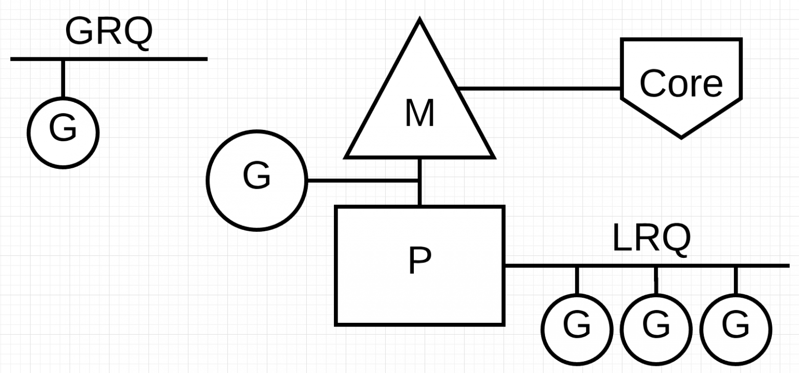

# Планировщик

Выделяют 3 модели для нарезания вычисления на потоки. 

Первой является **N:1**, где несколько пользовательских потоков запущено на едином потоке ядра операционной системы. Этот способ имеет то преимущество, что осуществляется очень быстрое переключение контекстов, но нет возможности воспользоваться преимуществами многоядерных систем. 

Вторая — это **1:1**, где каждый пользовательский поток выполнения совпадает с одним потоком операционной системы. Он использует все ядра автоматически, но переключение контекста происходит медленно, потому что требует прерываний работы операционной системы.

Go пытается взять лучшее из обоих миров с помощью **М:N** планировщика. При этом произвольное число Go-рутин (**M**) планируется на произвольное количество потоков (**N**) операционной системы. Этим вы получаете одновременно быстрое переключение контекста, и возможность воспользоваться всеми ядрами в вашей системе. Основным недостатком данного подхода является сложность его включения в планировщик.  

Чтобы исполнять задачу планирования, планировщик Go использует 3 основных сущностей:


**Треугольник представляет поток** операционной системы. Выполнением такого потока управляет операционная система, и работает это во многом подобно вашим стандартным потокам POSIX. В исполнимом коде это называется **M машиной**.

**Круг представляет Go-рутину.** Он включает стек, указатель команд и другую важную информацию для планирования Go-рутины, такую как канал, который на ней может быть блокирован. В исполнимом коде это обозначается как **G**.

**Прямоугольник представляет контекст планирования**. Вы можете понимать его как локализованная версию планировщика, который выполняет код Go-рутин в единственном потоке ядра. **Это важная часть, которая позволяет нам уйти от N:1 планировщика к М:N планировщику.** Во время выполнения кода контекст обозначается как **P для процессора**. В общем это и всё, если коротко.


В планировщике Go есть две разные очереди выполнения: глобальная очередь выполнения (**GRQ**) и локальная очередь выполнения (**LRQ**). Каждому **P** присваивается **LRQ**, который управляет горутинами, назначенными для выполнения в контексте **P**. Эти горутины по очереди включаются и выключаются из контекста **M**, назначенного для этого **P**. **GRQ** предназначен для горутин, которые не были назначены для **P**. Существует процесс, чтобы переместить горутины из **GRQ** в **LRQ**




Каждая локальная очередь проверяет глобальную каждый 61 такт процессора.

```golang
runtime.schedule() {
    // only 1/61 of the time, check the global runnable queue for a G.
    // if not found, check the local queue.
    // if not found,
    //     try to steal from other Ps.
    //     if not, check the global runnable queue.
    //     if not found, poll network.
}
```

Это означает, что **P** будет приоритетнее запускать Goroutines в своем собственном **LRQ**, затем из **LRQ** других **P**, затем из **GRQ**, затем из сетевого опроса. Существует также небольшой шанс(1/61) немедленно запустить Goroutine из **GRQ**. Наличие нескольких очередей позволяет построить такую систему приоритетов.

## Work stealing

 В многопоточных вычислениях, возникли две парадигмы в планировании: делиться задачами (work sharing) и красть задачи (work stealing).

- **Work-sharing**: Когда процессор генерирует новые потоки, он пытается мигрировать их на другие процессоры, в надежде, что они попадут к простаивающему или недостаточно нагруженному процессору.
- **Work-stealing**: Недостаточно нагруженный процессор активно ищет потоки других процессоров и "крадет" некоторые из них.


Когда новая **G** создается или существующая **G** становится готовой к исполнению, она помещается в локальную очередь готовых к исполнению горутин текущего **P**. Когда **P** заканчивается исполнение **G**, он пытается вытащить (pop) **G** из своей очереди. Если список пуст, **P** выбирает случайным образом другой процессор (**P**) и пытается украсть половину горутин из его очереди.


## Вытесняющая многозадачность


Для начала напомню, что такое кооперативная и не кооперативная многозадачность.

С не кооперативной (**вытесняющей**) многозадачностью мы все с вами прекрасно знакомы на примере планировщика ОС. Данный планировщик работает в фоне, выгружает потоки на основании различных эвристик, а вместо выгруженных процессорное время начинают получать другие потоки.

Для **кооперативного** планировщика характерно другое поведение — он спит пока одна из горутин явно не разбудит его с намеком о готовности отдать свое место другой. Планировщик далее сам решит, надо ли убирать из контекста текущую горутину, и если да, кого поставить на ее место. Примерно так и работал планировщик GO.


в **GO** 1.14 изменился принцип работы планировщика, рассмотрим причины по которым эти изменения были сделаны. Взгляните на код:


```go
func main() {
	runtime.GOMAXPROCS(1)
	go func() {
		var u int
		for {
			u -= 2
			if u == 1 {
				break
			}
		}
	}()
	<-time.After(time.Millisecond * 5) // в этом месте main горутина разбудит планировщик, а он в свою очередь запустит горутину с циклом

	fmt.Println("go 1.13 has never been here")
}
```

Если скомпилировать его с версией **GO < 1.14**, то строчку «go 1.13 has never been here» вы на экране не увидите. Происходит это потому, что, как только планировщик дает процессорное время горутине с бесконечным циклом, она всецело захватывает P, внутри этой горутины не происходит ни каких вызовов функций, а значит и планировщик мы больше не разбудим. И только явный вызов runtime.Gosched() даст нашей программе завершиться.


В версии до 1.12 runtime Gosched использовал **safe-points** места, где точно можно вызвать планировщик без боязни, что мы попадем в атомарную для GC секцию кода. Как мы уже говорили, данные safe-points располагаются в прологе функции (но далеко не каждой функции, заметьте). Если вы разбирали go-шный ассемблер, то могли бы возразить — никаких очевидных вызовов планировщика там не видно. Да это так, но вы можете найти там инструкцию вызова **runtime.morestack**, а если заглянуть внутрь этой функции то обнаружится вызов планировщика. 


*Дополнительно:*

- https://habr.com/ru/users/not91/publications/articles/

- https://habr.com/ru/articles/333654/

- https://habr.com/ru/articles/502506/