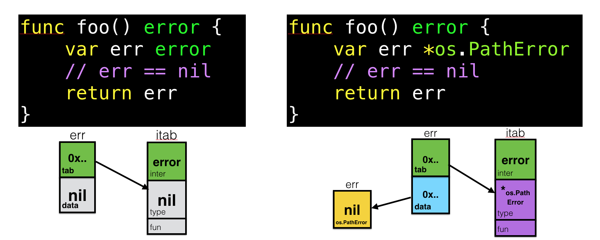

## Интерфейсы

```go
type iface struct {
    tab  *itab
    data unsafe.Pointer
}

type itab struct {
    inter *interfacetype
    _type *_type
    hash  uint32 // copy of _type.hash. Used for type switches.
    _     [4]byte
    fun   [1]uintptr // variable sized. fun[0]==0 means _type does not implement inter.
}

type interfacetype struct {
    typ     _type
    pkgpath name
    mhdr    []imethod
} 

//пустой интерфейс interface{}
type eface struct {
    _type *_type
    data  unsafe.Pointer
}
```

Интерфейсы представляют абстракцию поведения других типов. Интерфейсы позволяют определять функции, которые не привязаны к конкретной реализации. То есть интерфейсы определяют некоторый функционал, но не реализуют его.

Для определения интерфейса применяется ключевое слово `interface`:

```go
type Car interface {
    move(x int, y int) err
    stop()    
}
```

### Nill interface vs nil pointer interface

Тут важно понимать, что если переменная объявлена не под типо интерфейса, а под каким то конкретным типом, реализующим интерфейс - то при её сравнении с nil получим false, так как в структуре itab уже будет храниться значение конкретного типа в поле `type` и с точки зрения go это уже не будет **nil interface** a будет **nil pointer interface**



## Type Assertion vs Type Conversoin

| Выражение             | Что делает?                  | Работает только с           | Паника?                      |
| --------------------- | ---------------------------- | --------------------------- | ---------------------------- |
| `variable.(*MyType)`  | Проверяет тип в интерфейсе   | Интерфейс (`interface{}`)   | Да, если тип не совпадает    |
| `(*MyType)(variable)` | Преобразует совместимые типы | Указатели, `unsafe.Pointer` | Нет (либо ошибка компиляции) |


