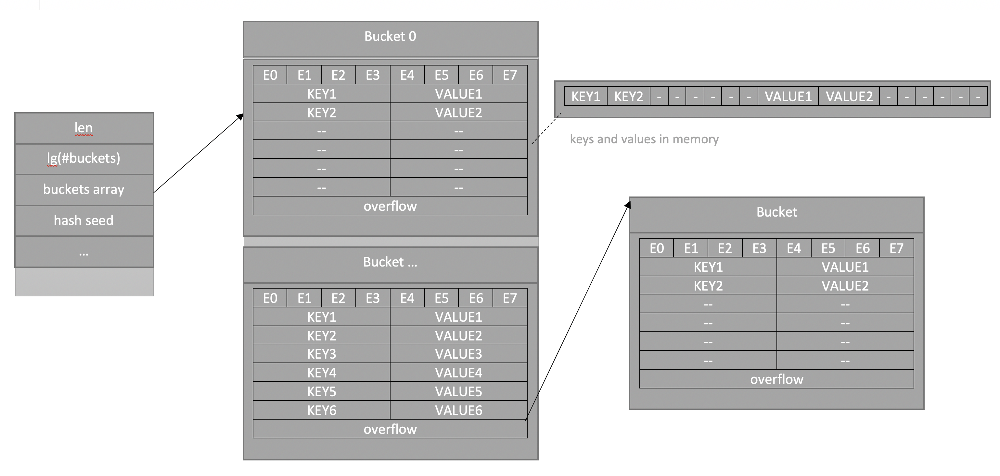

#  Map

Отображение или **map** представляет ссылку на хеш-таблицу - структуру данных, где каждый элемент представляет пару "ключ-значение". При этом каждый элемент имеет уникальный ключ, по которому можно получить значение элемента. Отображение определяется как объект типа `map[K]V`, где К представляет тип ключа, а V - тип значения. Причем тип ключа K должен быть comparable(поддерживать операцию сравнения `==`)

```go
// A header for a Go map.
type hmap struct {
	// Note: the format of the hmap is also encoded in cmd/compile/internal/gc/reflect.go.
	// Make sure this stays in sync with the compiler's definition.
	count     int // # live cells == size of map.  Must be first (used by len() builtin)
	flags     uint8
	B         uint8  // log_2 of # of buckets (can hold up to loadFactor * 2^B items)
	noverflow uint16 // approximate number of overflow buckets; see incrnoverflow for details
	hash0     uint32 // hash seed

	buckets    unsafe.Pointer // array of 2^B Buckets. may be nil if count==0.
	oldbuckets unsafe.Pointer // previous bucket array of half the size, non-nil only when growing
	nevacuate  uintptr        // progress counter for evacuation (buckets less than this have been evacuated)

	extra *mapextra // optional fields
}
```



Например, определение отображения, которое в качестве ключей имеет тип `string`, а в качестве значений - тип `int`:

```go
var people map[string] int   
```

Для проверки наличия элемента по определенному ключу можно получать два значения, второе и будет показывать наличие:

```go
	var people = map[string]int{"Tom": 1, "Bob": 2, "Sam": 4, "Alice": 8}

	if val, ok := people["Tom"]; ok {
		fmt.Println(val)
	}
```

Адрес элемента мапы получить невозможно(сделано из-за того что адрес может стать недействителен, после рехеширования)

```go
_ = &ages["bob"] // ТАК НЕЛЬЗЯ!!!
```

При чтении из nil мапы, ничего страшного не произойдёт, получим нулевое значение для типа. Но если писать в nil map то словим панику.

```go
	m1 := map[string]int{
		"key": 1,
	}
	m1 = nil 
	fmt.Println(m1["key"]) // 0
	m1["key"] = 1 //panic: assignment to entry in nil map

```