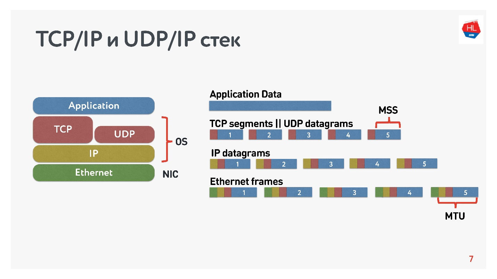

# TCP/IP

Протокол TCP/IP - это набор сетевых протоколов, используемых для обмена данными в компьютерных сетях. Он состоит из
четырех уровней, каждый из которых выполняет определенные функции. Вот краткое описание каждого уровня протокола TCP/IP:

### Уровень доступа к сети (Network Interface Layer):

Этот уровень отвечает за передачу данных через физическую сеть, такую как Ethernet или Wi-Fi. Он определяет способы
кодирования, физические характеристики кабелей, методы доступа и другие аспекты, связанные с конкретной технологией
передачи данных.

### Уровень интернета (Internet Layer):

Этот уровень обеспечивает маршрутизацию пакетов данных через различные сети. Он использует IP-адресацию для определения
и доставки пакетов данных между узлами сети. Протокол IP (Internet Protocol) является ключевым протоколом этого уровня.
Он также обрабатывает фрагментацию и сборку пакетов данных при передаче через сети с различными максимальными размерами
пакетов.

### Транспортный уровень (Transport Layer):

Этот уровень обеспечивает надежную доставку данных между хостами. Два наиболее распространенных протокола на этом
уровне - это TCP (Transmission Control Protocol) и UDP (User Datagram Protocol). TCP обеспечивает надежную и
упорядоченную доставку данных, контроль потока и обнаружение и восстановление потерянных пакетов. UDP, в отличие от TCP,
предоставляет ненадежную доставку без гарантии порядка и восстановления потерянных пакетов.

Прикладной уровень (Application Layer):
Этот уровень содержит различные протоколы, используемые приложениями для обмена данными. Некоторые из наиболее известных
протоколов этого уровня включают HTTP (HyperText Transfer Protocol) для передачи веб-страниц, SMTP (Simple Mail Transfer
Protocol) для отправки электронной почты, FTP (File Transfer Protocol) для передачи файлов и DNS (Domain Name System)
для разрешения имен хостов в IP-адреса.

Эти уровни взаимодействуют друг с другом, чтобы обеспечить передачу данных через сети, обработку ошибок, контроль потока
и другие функции, необходимые для эффективной коммуникации

# TCP/UDP

Основные отличия tcp от udp.

- `TCP гарантирует доставку пакетов данных в неизменных виде, последовательности и без потерь, UDP ничего не гарантирует.`
- `TCP нумерует пакеты при передаче, а UDP нет`
- `TCP работает в дуплексном режиме, в одном пакете можно отправлять информацию и подтверждать получение предыдущего пакета.`
- `TCP требует заранее установленного соединения, UDP соединения не требует, у него это просто поток данных.`
- `UDP обеспечивает более высокую скорость передачи данных.`
- `TCP надежнее и осуществляет контроль над процессом обмена данными.`
- `UDP предпочтительнее для программ, воспроизводящих потоковое видео, видеофонии и телефонии, сетевых игр.`
- `UPD не содержит функций восстановления данных`

На схеме представлены TCP/IP и UDP/IP стек. Внизу есть Ethernet-пакеты, IP-пакеты, и дальше на уровне ОС есть TCP и UDP.
TCP и UDP в этом стеке не сильно друг от друга отличаются. Они инкапсулируются в IP-пакеты, и приложения могут ими
пользоваться. Чтобы увидеть отличия, нужно посмотреть внутрь TCP- и UDP-пакета.

И там, и там есть порты. Но **в UDP есть только контрольная сумма** — длина пакета, этот протокол максимально простой. А
в TCP — очень много данных, которые явно указывают окно, acknowledgement, sequence, пакеты и так далее. Очевидно, **TCP
более сложный**. Если говорить очень грубо, то TCP — это протокол надежной доставки, а UDP — ненадежной.

*Дополнительно*:

- [Протокол TCP](https://networkguru.ru/protokol-transportnogo-urovnia-tcp-chto-nuzhno-znat/)
- [TCP против UDP](https://habr.com/ru/company/oleg-bunin/blog/461829/)

