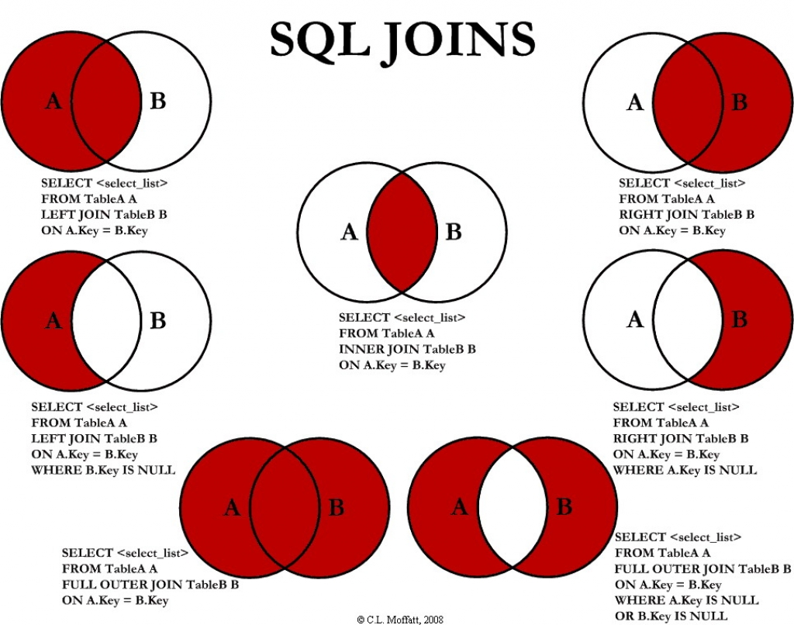

# **Памятка****PHP-программисту для подготовки к собеседованиям**

{ 

# Предисловие

Книга является методичкой(кратким справочником) по темам/вопросам, знание которых может понадобиться при собеседовании на должность middle/senior programmer(с уклоном в php backend)

Книга не является исчерпывающим руководством, а скорее служит лишь тезисным помощником в повторении нужного материала для подготовки к собеседованию и структурированию собственных знаний.

Свою критику, предложения, пожелания, дополнение и прочее можете предложить в этом чате, там все авторы есть:

[*https://telegram.me/phpgeeks*](https://telegram.me/phpgeeks)

Или можете написать мне напрямую

[*https://telegram.me/arturpanteleev*

# Основы алгоритмов

## Асимптотический анализ

Когда мы говорим об измерении сложности алгоритмов, мы подразумеваем анализ времени, которое потребуется для обработки очень большого набора данных. Такой анализ называют асимптотическим. Сколько времени потребуется на обработку массива из десяти элементов? Тысячи? Десяти миллионов? Если алгоритм обрабатывает тысячу элементов за пять миллисекунд, что случится, если мы передадим в него миллион? Будет ли он выполняться пять минут или пять лет?

## Порядок роста

Порядок роста описывает то, как сложность алгоритма растет с увеличением размера входных данных. Чаще всего он представлен в виде O-нотации (от нем. «Ordnung» — порядок) : O(f(x)), где f(x) — формула, выражающая сложность алгоритма. В формуле может присутствовать переменная n, представляющая размер входных данных. Ниже приводится список наиболее часто встречающихся порядков роста, но он ни в коем случае не полный.

### Константный — O(1)

Порядок роста O(1) означает, что вычислительная сложность алгоритма не зависит от размера входных данных. Следует помнить, однако, что единица в формуле не значит, что алгоритм выполняется за одну операцию или требует очень мало времени. Он может потребовать и микросекунду, и год. Важно то, что это время не зависит от входных данных.

### Линейный — O(n)

Порядок роста O(n) означает, что сложность алгоритма линейно растет с увеличением входного массива. Если линейный алгоритм обрабатывает один элемент пять миллисекунд, то мы можем ожидать, что тысячу элементов он обработает за пять секунд.

Такие алгоритмы легко узнать по наличию цикла по каждому элементу входного массива.

### Логарифмический — O( log n)

Порядок роста O( log n) означает, что время выполнения алгоритма растет логарифмически с увеличением размера входного массива. (Прим. пер.: в анализе алгоритмов по умолчанию используется логарифм по основанию 2). Большинство алгоритмов, работающих по принципу «деления пополам», имеют логарифмическую сложность. Метод Contains бинарного дерева поиска (binary search tree) также имеет порядок роста O(log n).

### Линеарифметический — O(n·log n)

Линеарифметический (или линейно-логарифмический) алгоритм имеет порядок роста O(n·log n). Некоторые алгоритмы типа «разделяй и властвуй» попадают в эту категорию. В следующих частях мы увидим два таких примера — сортировка слиянием и быстрая сортировка.

### Квадратичный — O(n 2)

Время работы алгоритма с порядком роста O(n 2) зависит от квадрата размера входного массива. Несмотря на то, что такой ситуации иногда не избежать, квадратичная сложность — повод пересмотреть используемые алгоритмы или структуры данных. Проблема в том, что они плохо масштабируются. Например, если массив из тысячи элементов потребует

1 000 000 операций, массив из миллиона элементов потребует 1 000 000 000 000 операций. Если одна операция требует миллисекунду для выполнения, квадратичный алгоритм будет обрабатывать миллион элементов 32 года. Даже если он будет в сто раз быстрее, работа займет 84 дня.

## Наилучший, средний и наихудший случаи

Что мы имеем в виду, когда говорим, что порядок роста сложности алгоритма — O(n)? Это усредненный случай? Или наихудший? А может быть, наилучший?

Обычно имеется в виду наихудший случай, за исключением тех случаев, когда наихудший и средний сильно отличаются. К примеру, мы увидим примеры алгоритмов, которые в среднем имеют порядок роста O(1), но периодически могут становиться O(n) (например, ArrayList.add). В этом случае мы будем указывать, что алгоритм работает в среднем за константное время, и объяснять случаи, когда сложность возрастает.Самое важное здесь то, что O(n) означает, что алгоритм потребует не более n шагов.

## Что мы измеряем?

При измерении сложности алгоритмов и структур данных мы обычно говорим о двух вещах: количество операций, требуемых для завершения работы (вычислительная сложность), и объем ресурсов, в частности, памяти, который необходим алгоритму (пространственная сложность).

Алгоритм, который выполняется в десять раз быстрее, но использует в десять раз больше места, может вполне подходить для серверной машины с большим объемом памяти. Но на встроенных системах, где количество памяти ограничено, такой алгоритм использовать нельзя.

В этих статьях мы будем говорить о вычислительной сложности, но при рассмотрении алгоритмов сортировки затронем также вопрос ресурсов.

Операции, количество которых мы будем измерять, включают в себя:

-   сравнения («больше», «меньше», «равно»);

-   присваивания;

-   выделение памяти.

То, какие операции мы учитываем, обычно ясно из контекста.

К примеру, при описании алгоритма поиска элемента в структуре данных мы почти наверняка имеем в виду операции сравнения. Поиск — это преимущественно процесс чтения, так что нет смысла делать присваивания или выделение памяти.

Когда мы говорим о сортировке, мы можем учитывать как сравнения, так и выделения и присваивания. В таких случаях мы будем явно указывать, какие операции мы рассматриваем.

# Основные структуры данных

**Структура данных** (англ. data structure) — программная единица, позволяющая хранить и обрабатывать множество однотипных и/или логически связанных данных в вычислительной технике. Для добавления, поиска, изменения и удаления данных структура данных предоставляет некоторый набор функций, составляющих её интерфейс.

Термин «структура данных» может иметь несколько близких, но тем не менее различных значений:

-   Абстрактный тип данных;

-   Реализация какого-либо абстрактного типа данных;

-   Экземпляр типа данных, например, конкретный список;

-   В контексте функционального программирования — уникальная единица (англ. unique identity), сохраняющаяся при изменениях. О ней неформально говорят как об одной структуре данных, несмотря на возможное наличие различных версий.

Структуры данных формируются с помощью типов данных, ссылок и операций над ними в выбранном языке программирования.

Различные виды структур данных подходят для различных приложений; некоторые из них имеют узкую специализацию для определённых задач. Например, B-деревья обычно подходят для создания баз данных, в то время как хеш-таблицы используются повсеместно для создания различного рода словарей, например, для отображения доменных имён в интернет-адреса компьютеров.

## Абстра́ктный тип да́нных (АТД)

Это множество объектов, определяемое списком компонентов (операций , применимых к этим объектам, и их свойств). Вся внутренняя структура такого типа спрятана от разработчика программного обеспечения — в этом и заключается суть абстракции. Абстрактный тип данных определяет набор функций, независимых от конкретной реализации типа, для оперирования его значениями. Конкретные реализации АТД называются структурами данных.

В программировании абстрактные типы данных обычно представляются в виде интерфейсов, которые скрывают соответствующие реализации типов. Программисты работают с абстрактными типами данных исключительно через их интерфейсы, поскольку реализация может в будущем измениться. Такой подход соответствует принципу инкапсуляции в объектно-ориентированном программировании. Сильной стороной этой методики является именно сокрытие реализации. Раз вовне опубликован только интерфейс, то пока структура данных поддерживает этот интерфейс, все программы, работающие с заданной структурой абстрактным типом данных, будут продолжать работать. Разработчики структур данных стараются, не меняя внешнего интерфейса и семантики функций, постепенно дорабатывать реализации, улучшая алгоритмы по скорости, надежности и используемой памяти.

Различие между абстрактными типами данных и структурами данных, которые реализуют абстрактные типы, можно пояснить на следующем примере. Абстрактный тип данных список может быть реализован при помощи массива или линейного списка, с использованием различных методов динамического выделения памяти. Однако каждая реализация определяет один и тот же набор функций, который должен работать одинаково (по результату, а не по скорости) для всех реализаций.

Абстрактные типы данных позволяют достичь модульности программных продуктов и иметь несколько альтернативных взаимозаменяемых реализаций отдельного модуля.

## Ассоциативный массив 

Абстрактный тип данных (интерфейс к хранилищу данных), позволяющий хранить пары вида «(ключ, значение)» и поддерживающий операции добавления пары, а также поиска и удаления пары по ключу.

## Стек (LIFO)

Абстрактный тип данных, представляющий собой список элементов, организованных по принципу LIFO (англ. last in — first out, «последним пришёл — первым вышел»).

Изменяемый набор элементов, формирующийся по правилу «Последним пришел, первым ушел». Может храниться как в векторном представлении (выделенная, не изменяемая область памяти), так и в виде списка (динамически выделяется память под каждый элемент). При векторном представлении стек может переполняться.

Программный вид стека используется для обхода структур данных, например, дерево или граф. При использовании рекурсивных функций также будет применяться стек, но аппаратный его вид. Кроме этих назначений, стек используется для организации стековой машины, реализующей вычисления в обратной инверсной записи.

Для отслеживания точек возврата из подпрограмм используется стек вызовов. Арифметические сопроцессоры, программируемые микрокалькуляторы и язык Forth используют стековую модель вычислений.

## Очередь (FIFO)

Абстрактный тип данных с дисциплиной доступа к элементам «первый пришёл — первый вышел» (FIFO, First In — First Out). Добавление элемента (принято обозначать словом enqueue — поставить в очередь) возможно лишь в конец очереди, выборка — только из начала очереди (что принято называть словом dequeue — убрать из очереди), при этом выбранный элемент из очереди удаляется. Очередь может иметь векторную или списковую структуру хранения, но при векторной структуре хранения может произойти переполнение очереди.

## Двусвязная очередь

Двусвязная очередь (жарг. дэк, дек от англ. deque — double ended queue; двухсторонняя очередь, двусвязный список, очередь с двумя концами) — структура данных, в которой элементы можно добавлять и удалять как в начало, так и в конец, то есть дисциплинами обслуживания являются одновременно FIFO и LIFO.

## Граф

В математической теории графов и информатике граф — это совокупность объектов со связями между ними. Объекты представляются как вершины, или узлы графа, а связи — как дуги, или рёбра. Для разных областей применения виды графов могут различаться направленностью, ограничениями на количество связей и дополнительными данными о вершинах или рёбрах.

Граф называется:\
\* связным, если для любых вершин u,v есть путь из u в v.\
\* деревом, если он связный и не содержит простых циклов.\
\* полным, если любые его две (различные, если не допускаются петли) вершины соединены ребром.\
\* двудольным, если его вершины можно разбить на два непересекающихся подмножества V1 и V2 так, что всякое ребро соединяет вершину из V1 с вершиной из V2.\
\* планарным, если граф можно изобразить диаграммой на плоскости без пересечений рёбер.

### Свя́зный спи́сок

Базовая динамическая структура данных, состоящая из узлов, каждый из которых содержит как собственно данные, так и одну или две ссылки («связки») на следующий и/или предыдущий узел списка. Принципиальным преимуществом перед массивом является структурная гибкость: порядок элементов связного списка может не совпадать с порядком расположения элементов данных в памяти компьютера, а порядок обхода списка всегда явно задаётся его внутренними связями.

### Линейный однонаправленный список 

Cтруктура данных, состоящая из элементов одного типа, связанных между собой последовательно посредством указателей. Каждый элемент списка имеет указатель на следующий элемент. Последний элемент списка указывает на NULL. Элемент, на который нет указателя, является первым (головным) элементом списка. Здесь ссылка в каждом узле указывает на следующий узел в списке. В односвязном списке можно передвигаться только в сторону конца списка. Узнать адрес предыдущего элемента, опираясь на содержимое текущего узла, невозможно.

### Двусвязный список (двунаправленный связный список) 

Здесь ссылки в каждом узле указывают на предыдущий и на последующий узел в списке. По двусвязному списку можно эффективно передвигаться в любом направлении — как к началу, так и к концу. В этом списке проще производить удаление и перестановку элементов, так как легко доступны адреса тех элементов списка, указатели которых направлены на изменяемый элемент.

### Кольцевой связный список

Разновидностью связных списков является кольцевой (циклический, замкнутый) список. Он тоже может быть односвязным или двусвязным. Последний элемент кольцевого списка содержит указатель на первый, а первый (в случае двусвязного списка) — на последний.

## Дерево

Иерархическая структура элементов, называемыми узлами (вершинами). На самом верхнем уровне имеется только один узел — корень дерева. Каждый узел, кроме корня, связан только с одним узлом на более высоком уровне. Каждый элемент может быть связан ребром с одним или несколькими элементами на следующем, более низком, уровне. Элементы, не имеющий потомков называются листьями. От корня до любой вершины существует один путь.

Любой узел дерева с потомками на всех уровнях так же образует дерево, называемое поддеревом.

### M-арное дерево

Число поддеревьев данного узла образует степень узла, максимальное значение m степени всех узлов дерева является степенью дерева. **Дерево степени 2 называется бинарным деревом.**

Если в дереве на каждом уровне задан порядок следования вершин, то такое дерево называется упорядоченным

### Бинарное дерево поиска

Это двоичное дерево, для которого выполняются следующие условия:

У всех узлов левого поддерева произвольного узла X значения ключей данных меньше, нежели значение ключа данных самого узла X.

У всех узлов правого поддерева произвольного узла X значения ключей данных больше либо равно, нежели значение ключа данных самого узла X.

{width="2.153584864391951in" height="1.802325021872266in"}

### АВЛ-Дерево

Сбалансированное по высоте двоичное дерево поиска: для каждой его вершины высота её двух поддеревьев различается не более чем на 1.

АВЛ — аббревиатура, образованная первыми буквами создателей Адельсон-Вельского Георгия Максимовича и Ландиса Евгения Михайловича.

### {width="4.447916666666667in" height="1.1770833333333333in"}

### Красно-чёрное дерево

Это двоичное дерево поиска, в котором каждый узел имеет атрибут цвет, принимающий значения красный или чёрный. В дополнение к обычным требованиям, налагаемым на двоичные деревья поиска, к красно-чёрным деревьям применяются следующие требования:

-   Узел либо красный, либо чёрный.

-   Корень — чёрный. (В других определениях это правило иногда опускается. Это правило слабо влияет на анализ, так как корень всегда может быть изменен с красного на чёрный, но не обязательно наоборот).

-   Все листья(NIL) — чёрные.

-   Оба потомка каждого красного узла — чёрные.

-   {width="4.246527777777778in" height="1.4534722222222223in"}Всякий простой путь от данного узла до любого листового узла, являющегося его потомком, содержит одинаковое число чёрных узлов.

### B-дерево

**B-дерево** – это структура хранения данных, являющаяся разновидностью дерева поиска. Особенностями В-деревьев является: сбалансированность, ветвистость, отсортированность и логарифмическое время работы всех стандартных операций (поиск, вставка, удаление). Сбалансированность означает, что все листы находятся на одинаковом расстоянии от корня. В отличие от бинарных деревьев В-деревья допускают большое число потомков для любого из узлов. Это свойство называется ветвистостью. Благодаря ветвистости, В-деревья очень удобны для хранения крупных последовательных блоков данных, поэтому такая структура часто находит применение в базах данных и файловых системах.

m – порядок В-дерева – это максимальное число потомков для любого узла. Кроме узлов в дереве присутствует ещё одна сущность – ключи. Именно в них и содержится вся полезная информация. Каждый узел дерева можно представить в виде упорядоченной последовательности ”потомок1; ключ1; потомок2; ключ2; … потомок(N-1); ключ(N-1); потомокN”. Важно заметить, что ключи располагаются между ссылками на потомков и, таким образом, ключей всегда на 1 меньше. В организации В-дерева можно выделить несколько ключевых правил:

-   Каждый узел содержит строго меньше m (порядок дерева) потомков.
-   Каждый узел содержит не менее m/2 потомков.
-   Корень может содержать меньше m/2 потомков.
-   У корневого узла есть хотя бы 2 потомка, если он не является листом.
-   Все листья находятся на одном уровне и содержат только данные (ключи).

{width="3.9902777777777776in" height="2.011111111111111in"}

# Базы данных

## ACID

В информатике акроним **ACID** описывает требования к транзакционной системе (например, к СУБД), обеспечивающие наиболее надёжную и предсказуемую её работу. Требования **ACID** были в основном сформулированы в конце 70-х годов Джимом Греем.

### Atomicity — Атомарность 

Атомарность гарантирует, что никакая транзакция не будет зафиксирована в системе частично. Будут либо выполнены все её подоперации, либо не выполнено ни одной. Поскольку на практике невозможно одновременно и атомарно выполнить всю последовательность операций внутри транзакции, вводится понятие «отката» (rollback): если транзакцию не удаётся полностью завершить, результаты всех её до сих пор произведённых действий будут отменены и система вернётся во «внешне исходное» состояние — со стороны будет казаться, что транзакции и не было. (Естественно, счётчики, индексы и другие внутренние структуры могут измениться, но, если СУБД запрограммирована без ошибок, это не повлияет на внешнее её поведение.)

### Consistency — Согласованность

Транзакция, достигающая своего нормального завершения (EOT — end of transaction, завершение транзакции) и, тем самым, фиксирующая свои результаты, сохраняет согласованность базы данных. Другими словами, каждая успешная транзакция по определению фиксирует только допустимые результаты.

Согласованность является более широким понятием. Например, в банковской системе может существовать требование равенства суммы, списываемой с одного счёта, сумме, зачисляемой на другой. Это бизнес-правило и оно не может быть гарантировано только проверками целостности, его должны соблюсти программисты при написании кода транзакций. Если какая-либо транзакция произведёт списание, но не произведёт зачисление, то система останется в некорректном состоянии и свойство согласованности будет нарушено.

### Isolation — Изолированность

Во время выполнения транзакции параллельные транзакции не должны оказывать влияние на её результат. Изолированность — требование дорогое, поэтому в реальных БД существуют режимы, не полностью изолирующие транзакцию

### Durability — Долговечность

Независимо от проблем на нижних уровнях (к примеру, обесточивание системы или сбои в оборудовании) изменения, сделанные успешно завершённой транзакцией, должны остаться сохранёнными после возвращения системы в работу. Другими словами, если пользователь получил подтверждение от системы, что транзакция выполнена, он может быть уверен, что сделанные им изменения не будут отменены из-за какого-либо сбоя.

[]{#_vct4wbo1ysxd .anchor}

## Проблемы параллельного доступа с использованием транзакций

При параллельном выполнении транзакций возможны следующие проблемы:

-   потерянное обновление (англ. lost update) — при одновременном изменении одного блока данных разными транзакциями одно из изменений теряется;

-   «грязное» чтение (англ. dirty read) — чтение данных, добавленных или изменённых транзакцией, которая впоследствии не подтвердится (откатится);

-   неповторяющееся чтение (англ. non-repeatable read) — при повторном чтении в рамках одной транзакции ранее прочитанные данные оказываются изменёнными;

-   фантомное чтение (англ. phantom reads) — одна транзакция в ходе своего выполнения несколько раз выбирает множество строк по одним и тем же критериям. Другая транзакция в интервалах между этими выборками добавляет или удаляет строки или изменяет столбцы некоторых строк, используемых в критериях выборки первой транзакции, и успешно заканчивается. В результате получится, что одни и те же выборки в первой транзакции дают разные множества строк.

## Уровень изолированности транзакций

**Уровень изолированности транзакций** — значение, определяющее уровень, при котором в транзакции допускаются несогласованные данные, то есть степень изолированности одной транзакции от другой. Более высокий уровень изолированности повышает точность данных, но при этом может снижаться количество параллельно выполняемых транзакций. С другой стороны, более низкий уровень изолированности позволяет выполнять больше параллельных транзакций, но снижает точность данных.

Стандарт SQL-92 определяет шкалу из четырёх уровней изоляции: Read uncommitted, Read committed, Repeatable read, Serializable.

### Read uncommitted (чтение незафиксированных данных) 

Низший (первый) уровень изоляции. Он гарантирует только отсутствие потерянных обновлений\[1\]. Если несколько параллельных транзакций пытаются изменять одну и ту же строку таблицы, то в окончательном варианте строка будет иметь значение, определенное всем набором успешно выполненных транзакций. При этом возможно считывание не только логически несогласованных данных, но и данных, изменения которых ещё не зафиксированы.

Типичный способ реализации данного уровня изоляции — блокировка данных на время выполнения команды изменения, что гарантирует, что команды изменения одних и тех же строк, запущенные параллельно, фактически выполнятся последовательно, и ни одно из изменений не потеряется. Транзакции, выполняющие только чтение, при данном уровне изоляции никогда не блокируются.

### Read committed (чтение фиксированных данных)

На этом уровне обеспечивается защита от чернового, «грязного» чтения, тем не менее, в процессе работы одной транзакции другая может быть успешно завершена и сделанные ею изменения зафиксированы. В итоге первая транзакция будет работать с другим набором данных.

Реализация завершённого чтения может основываться на одном из двух подходов: блокировании или версионности.

**Блокирование читаемых и изменяемых данных:**

Заключается в том, что читающая транзакция блокирует читаемые данные в разделяемом (shared) режиме, в результате чего параллельная транзакция, пытающаяся изменить эти данные, приостанавливается, а пишущая транзакция блокирует изменяемые данные для читающих транзакций, работающих на уровне read committed или более высоком, до своего завершения, препятствуя, таким образом, «грязному» чтению.

**Сохранение нескольких версий параллельно изменяемых строк.**

При каждом изменении строки СУБД создаёт новую версию этой строки, с которой продолжает работать изменившая данные транзакция, в то время как любой другой «читающей» транзакции возвращается последняя зафиксированная версия. Преимущество такого подхода в том, что он обеспечивает бо́льшую скорость, так как предотвращает блокировки. Однако он требует, по сравнению с первым, существенно бо́льшего расхода оперативной памяти, которая тратится на хранение версий строк. Кроме того, при параллельном изменении данных несколькими транзакциями может создаться ситуация, когда несколько параллельных транзакций произведут несогласованные изменения одних и тех же данных (поскольку блокировки отсутствуют, ничто не помешает это сделать). Тогда та транзакция, которая зафиксируется первой, сохранит свои изменения в основной БД, а остальные параллельные транзакции окажется невозможно зафиксировать (так как это приведёт к потере обновления первой транзакции). Единственное, что может в такой ситуации СУБД — это откатить остальные транзакции и выдать сообщение об ошибке «Запись уже изменена».

### Repeatable read (повторяемость чтения)

Уровень, при котором читающая транзакция «не видит» изменения данных, которые были ею ранее прочитаны. При этом никакая другая транзакция не может изменять данные, читаемые текущей транзакцией, пока та не окончена.

Блокировки в разделяющем режиме применяются ко всем данным, считываемым любой инструкцией транзакции, и сохраняются до её завершения. Это запрещает другим транзакциям изменять строки, которые были считаны незавершённой транзакцией. Однако другие транзакции могут вставлять новые строки, соответствующие условиям поиска инструкций, содержащихся в текущей транзакции. При повторном запуске инструкции текущей транзакцией будут извлечены новые строки, что приведёт к фантомному чтению. Учитывая то, что разделяющие блокировки сохраняются до завершения транзакции, а не снимаются в конце каждой инструкции, степень параллелизма ниже, чем при уровне изоляции READ COMMITTED. Поэтому пользоваться данным и более высокими уровнями транзакций без необходимости обычно не рекомендуется.

### Serializable (упорядочиваемость)

Самый высокий уровень изолированности; транзакции полностью изолируются друг от друга, каждая выполняется так, как будто параллельных транзакций не существует. Только на этом уровне параллельные транзакции не подвержены эффекту «фантомного чтения».

Еще в транзакционных системах есть такое понятие как блокировки.

## Нормализация

**Нормализация** — это процесс организации данных в базе данных, включающий создание таблиц и установление отношений между ними в соответствии с правилами (нормальными формами), которые обеспечивают защиту данных и делают базу данных более гибкой, устраняя избыточность и несогласованные зависимости.

### Первая нормальная форма

-   Требует определить первичный ключ для таблицы, то есть тот столбец или комбинацию столбцов, которые однозначно определяют каждую строку

-   Строки таблиц не должны зависеть друг от друга, т.е. первая запись не должна влиять на вторую и наоборот, вторая на третью и т.д. Размещение записей в таблице не имеет никакого значения.

-   Аналогичная ситуация со столбцами записей. Их порядок не должен влиять на понимание информации.

**Таблиц**а **не в 1НФ:**

  Марка   Модель
------- ---------
  BMW     X5, X3
  Skoda   Octavia

Нарушение нормализации 1НФ происходит в моделях BMW, т.к. в одной ячейке содержится список из 3 элементов: M5, X5M, M1, т.е. он не является атомарным. Преобразуем таблицу к 1НФ:

**Таблица в 1НФ:**

  Марка   Модель
------- ---------
  BMW     X5
  BMW     X3
  Skoda   Octavia

### Вторая нормальная форма

-   Таблица обязана соответствовать первой нормальной форме.

-   Все столбцы, не входящие в полный первичный ключ, должны зависеть от полного первичного ключа

**Таблица не в 2НФ:**

  Марка                      Модель    Цена      Скидка\_на\_марку
-------------------------- --------- --------- -------------------
  BMW                        X5        3000000   5%
  BMW                        X3        2500000   5%
  []{#gjdgxs .anchor}Skoda   Octavia   900000    10%

Таблица находится в первой нормальной форме, но не во второй. Цена машины зависит от модели и марки. Скидка зависят от марки, то есть зависимость от первичного ключа неполная. Исправляется это путем декомпозиции на два отношения, в которых не ключевые атрибуты зависят от ПК.

**Таблицы во 2НФ:**

  Марка   Модель    Цена
------- --------- ---------
  BMW     X5        3000000
  BMW     X3        2500000
  Skoda   Octavia   900000

  Марка   Скидка\_на\_марку
------- -------------------
  BMW     5%
  Skoda   10%

### 

### Третья нормальная форма

-   Отношение находится в 3НФ, когда находится во 2НФ

-   выносить все не ключевые поля, содержимое которых может относиться к нескольким записям таблицы в отдельные таблицы

  Марка    Магазин   Телефон
  -------- --------- -----------
  BMW      Дилер1    +77777777
  Audi     Дилер1    +77777777
  Nissan   Дилер2    +88888888

Таблица находится во 2НФ, но не в 3НФ.

В отношении атрибут «Марка» является первичным ключом. Личных телефонов у автомобилей нет, и телефон зависит исключительно от магазина.

Таким образом, в отношении существуют следующие функциональные зависимости: Марка → Магазин, Магазин → Телефон, Марка → Телефон.

Зависимость Марка → Телефон является транзитивной, следовательно, отношение не находится в 3НФ.

В результате разделения исходного отношения получаются два отношения, находящиеся в 3НФ:

  Модель   Магазин
-------- ---------
  BMW      Дилер1
  Audi     Дилер1
  Nissan   Дилер2

  Дилер    Телефон
-------- -----------
  Дилер1   +77777777
  Дилер2   +88888888

Еще есть частный случай третьей нормальной формы (Нормальная форма Бойса-Кодда) + 5НФ и 6НФ

При том, что идеи нормализации весьма полезны для проектирования баз данных, они отнюдь не являются универсальным или исчерпывающим средством повышения качества проекта БД. Это связано с тем, что существует слишком большое разнообразие возможных ошибок и недостатков в структуре БД, которые нормализацией не устраняются. Несмотря на эти рассуждения, теория нормализации является очень ценным достижением реляционной теории и практики, поскольку она даёт научно строгие и обоснованные критерии качества проекта БД и формальные методы для усовершенствования этого качества. Этим теория нормализации резко выделяется на фоне чисто эмпирических подходов к проектированию

[]{#_119w58dgh3b9 .anchor}**Теорема CAP**

Теорема САР (известная также как теорема Брюера) — эвристическое утверждение о том, что в любой реализации распределённых вычислений возможно обеспечить не более двух из трёх следующих свойств:

-   согласованность данных (англ. consistency) — во всех вычислительных узлах в один момент времени данные не противоречат друг другу;

-   доступность (англ. availability) — любой запрос к распределённой системе завершается корректным откликом, однако без гарантии, что ответы всех узлов системы совпадают;

-   устойчивость к разделению (англ. partition tolerance) — расщепление распределённой системы на несколько изолированных секций не приводит к некорректности отклика от каждой из секций.

## Репликация и шардинг

-   Master-Master

-   Master-Slave

-   Вертикальный и горизонтальный шардинг

-   Инвалидация кеша при репликации

-   Бинарный лог

# Mysql

## Индексы 

Индекс формируется из значений одного или нескольких столбцов таблицы и указателей на соответствующие строки таблицы и, таким образом, позволяет искать строки, удовлетворяющие критерию поиска. Ускорение работы с использованием индексов достигается в первую очередь за счёт того, что индекс имеет структуру, оптимизированную под поиск, например хэш таблицы или сбалансированные деревья.

Хеш-таблицам свойственны коллизии, когда для различных ключей получается одно и тоже хэш значение.

Некоторые общие принципы, связанные с созданием индексов:

-   индексы необходимо создавать для столбцов, которые используются в джойнах, по которым часто производится поиск и операции сортировки. При этом необходимо учесть, что индексы всегда автоматически создаются для столбцов, на которые накладывается ограничение primary key. Чаще всего они создаются и для столбцов с foreign key;

-   индекс обязательно в автоматическом режиме создается для столбцов, на которые наложено ограничение уникальности;

-   лучше всего индексы создавать для тех полей, в которых - минимальное число повторяющихся значений и данные распределены равномерно.

-   Если поиск постоянно производится по определенному набору столбцов (одновременно), то в этом случае, возможно, есть смысл создать композитный индекс - один индекс для группы столбцов;

-   при внесении изменений в таблицы автоматически изменяются и индексы, наложенные на эту таблицу. В результате индекс может быть сильно фрагментирован, что сказывается на производительности. Периодически следует проверять степень фрагментации индексов и дефрагментировать их. При загрузке большого количества данных иногда есть смысл вначале удалить все индексы, а после завершения операции создать их заново;

## Типы таблиц

## 

## 

## 

## 

## 

## 

## {width="4.583333333333333in" height="3.6145833333333335in"}JOIN

# Архитектура и проектирование ПО

## ООП 

**Объе́ктно-ориенти́рованное программи́рование (ООП)** — методология программирования, основанная на представлении программы в виде совокупности объектов, каждый из которых является экземпляром определенного класса, а классы образуют иерархию наследования.

**Инкапсуляция (encapsulation)** — это фундаментальная объектно-ориентированная концепция, позволяющая упаковывать данные и поведение в единый компонент с разделением его на обособленные части — интерфейс и реализацию. Последнее осуществляется благодаря принципу изоляции решений разработки в ПО, известному как **сокрытие информации (англ. information hiding)**.

**Сокрытие информации** – это сокрытие деталей проектирования, которые могут измениться в будущем, для ограничения каскадных изменений в программной системе и для упрощения ее разработки и сопровождения.

**Полиморфизм** – это свойство системы использовать разные объекты с одинаковым интерфейсом без информации о типе и внутренней структуре объекта.

**Наследование** – это свойство системы, позволяющее описать новый класс на основе уже существующего с частично или полностью заимствующейся функциональностью. Класс, от которого производится наследование, называется базовым или родительским. Новый класс – потомком, наследником или производным классом.

**Агрегирование** - В объектно-ориентированном программировании под агрегированием подразумевают методику создания нового класса из уже существующих классов путём включения, называемого также делегированием. Об агрегировании также часто говорят как об «отношении принадлежности» по принципу «у машины есть корпус, колёса и двигатель».

Вложенные объекты нового класса обычно объявляются закрытыми, что делает их недоступными для прикладных программистов, работающих с классом. С другой стороны, создатель класса может изменять эти объекты, не нарушая при этом работы существующего клиентского кода. Кроме того, замена вложенных объектов на стадии выполнения программы позволяет динамически изменять её поведение. Механизм наследования такой гибкостью не обладает, поскольку для производных классов устанавливаются ограничения, проверяемые на стадии компиляции.

На базе агрегирования реализуется методика делегирования, когда поставленная перед внешним объектом задача перепоручается внутреннему объекту, специализирующемуся на решении задач такого рода.

**Агрегация (агрегирование по ссылке**) — отношение «часть-целое» между двумя равноправными объектами, когда один объект (контейнер) имеет ссылку на другой объект. Оба объекта могут существовать независимо: если контейнер будет уничтожен, то его содержимое — нет.

**Композиция (агрегирование по значению)** — более строгий вариант агрегирования, когда включаемый объект может существовать только как часть контейнера. Если контейнер будет уничтожен, то и включённый объект тоже будет уничтожен.

## SOLID

1\. **Принцип единственной ответственности (Single responsibility)** - «На каждый объект должна быть возложена одна единственная обязанность». Т.е. другими словами — конкретный класс должен решать конкретную задачу — ни больше, ни меньше.

2\. **Принцип открытости/закрытости (Open-closed)** - «Программные сущности должны быть открыты для расширения, но закрыты для модификации». На более простых словах это можно описать так — все классы, функции и т.д. должны проектироваться так, чтобы для изменения их поведения, нам не нужно было изменять их исходный код.

3\. **Принцип подстановки Барбары Лисков (Liskov substitution)** - «Объекты в программе могут быть заменены их наследниками без изменения свойств программы». Своими словами я бы это сказал так — при использовании наследника класса результат выполнения кода должен быть предсказуем и не изменять свойств метод.

4\. **Принцип разделения интерфейса (Interface segregation)** - «Много специализированных интерфейсов лучше, чем один универсальный» . Соблюдение этого принципа необходимо для того, чтобы классы-клиенты использующий/реализующий интерфейс знали только о тех методах, которые они используют, что ведёт к уменьшению количества неиспользуемого кода.

5\. **Принцип инверсии зависимостей (Dependency Invertion)** - «Зависимости внутри системы строятся на основе абстракций. Модули верхнего уровня не зависят от модулей нижнего уровня. Абстракции не должны зависеть от деталей. Детали должны зависеть от абстракций». Данное определение можно сократить — «зависимости должны строится относительно абстракций, а не деталей».

Дополнительно: [*https://habrahabr.ru/post/208442/*](https://habrahabr.ru/post/208442/)

### GRASP 

**GRASP** (general responsibility assignment software patterns — общие шаблоны распределения обязанностей; также существует английское слово "grasp" — «контроль, хватка») — шаблоны, используемые в объектно-ориентированном проектировании для решения общих задач по назначению обязанностей классам и объектам.

**1. Информационный эксперт** (Information Expert)Шаблон определяет базовый принцип распределения обязанностей:

Обязанность должна быть назначена тому, кто владеет максимумом необходимой информации для исполнения — информационному эксперту.

Этот шаблон — самый очевидный и важный из девяти. Если его не учесть — получится спагетти-код, в котором трудно разобраться.

Локализация же обязанностей, проводимая согласно шаблону:

-   Повышает:

-   Инкапсуляцию;

-   Простоту восприятия;

-   Готовность компонентов к повторному использованию;

-   Снижает: степень зацеплений.

2\. Создатель (Creator)

-   Класс должен создавать экземпляры тех классов, которые он может:

-   Содержать или агрегировать;

-   Записывать;

-   Использовать;

-   Инициализировать, имея нужные данные.

Так применяется шаблон «Информационный эксперт» (смотрите пункт №1) в вопросах создания объектов.

Альтернатива — шаблон «Фабрика» (создание объектов концентрируется в отдельном классе).

**3. Контроллер (Controller)**

Отвечает за операции, запросы на которые приходят от пользователя, и может выполнять сценарии одного или нескольких вариантов использования (например, создание и удаление) Не выполняет работу самостоятельно, а делегирует компетентным исполнителям;

Может представлять собой:

-   Систему в целом;

-   Подсистему;

-   Корневой объект;

-   Устройство.

    **4. Слабое зацепление** (Low Coupling)

«Степень зацепления» (сопряжения\[2\]) — мера неотрывности элемента от других элементов (либо мера данных, имеющихся у него о них).

«Слабое» зацепление — распределение обязанностей и данных, обеспечивающее взаимную независимость классов. Класс со «слабым» зацеплением:

-   Не зависит от внешних изменений;

-   Прост для повторного использования.

**5. Высокая степень связности** (High Cohesion)

Предметные области следует разделять по классам.

Связность класса — мера подобия предметных областей его методов:

«Высокая» степень — сфокусированные подсистемы (предметная область определена, управляема и понятна);

«Низкая» степень — абстрактные подсистемы. Затруднены:

-   Восприятие;

-   Повторное использование;

-   Поддержка;

-   Устойчивость к внешним изменениям.

**6. Полиморфизм** (Polymorphism)

Устройство и поведение системы:

-   Определяется данными;

-   Задано полиморфными операциями её интерфейса.

Пример: Адаптация коммерческой системы к многообразию систем учёта налогов может быть обеспечена через внешний интерфейс объектов-адаптеров (смотрите также: Шаблон «Адаптеры»).

**7. Чистая выдумка** (Pure Fabrication)

Не относится к предметной области, но:

-   Уменьшает зацепление;

-   Повышает связность;

-   Упрощает повторное использование.

«Pure Fabrication» отражает концепцию сервисов в модели проблемно-ориентированного проектирования.

Пример задачи: Не используя средства класса «А», внести его объекты в базу данных.

Решение: Создать класс «Б» для записи объектов класса «А» (смотрите также: «Data Access Object»).

**8. Посредник (Indirection)**

См. также: Посредник (шаблон проектирования)

Слабое зацепление между элементами системы (и возможность повторного использования) обеспечивается назначением промежуточного объекта их посредником.

Пример: В архитектуре Model-View-Controller, контроллер (англ. controller) ослабляет зацепление данных (англ. model) за их представление (англ. view).

**9. Устойчивость к изменениям (Protected Variations)**

Шаблон защищает элементы от изменения другими элементами (объектами или подсистемами) с помощью вынесения взаимодействия в фиксированный интерфейс, через который (и только через который) возможно взаимодействие между элементами. Поведение может варьироваться лишь через создание другой реализации интерфейса.

## Паттерны проектирования

Паттерн проектирования(design pattern) в разработке программного обеспечения — повторимая архитектурная конструкция, представляющая собой решение проблемы проектирования в рамках некоторого часто возникающего контекста.

Обычно паттерн не является законченным образцом, который может быть прямо преобразован в код; это лишь пример решения задачи, который можно использовать в различных ситуациях. Объектно-ориентированные шаблоны показывают отношения и взаимодействия между классами или объектами, без определения того, какие конечные классы или объекты приложения будут использоваться.

### Порождающие 

**Порождающие шаблоны (Creational)** — шаблоны проектирования, которые абстрагируют процесс инстанцирования. Они позволяют сделать систему независимой от способа создания, композиции и представления объектов. Шаблон, порождающий классы, использует наследование, чтобы изменять инстанцируемый класс, а шаблон, порождающий объекты, делегирует инстанцирование другому объекту.

-   **Simple Factory**(Простая Фабрика) Сам по себе не является паттерном. Подход, при котором логика создания объектов выносится в отдельный класс.

-   **Абстрактная фабрика** (Abstract factory) — порождающий шаблон проектирования, предоставляет интерфейс для создания семейств взаимосвязанных или взаимозависимых объектов, не специфицируя их конкретных классов. Шаблон реализуется созданием абстрактного класса Factory, который представляет собой интерфейс для создания компонентов системы (например, для оконного интерфейса он может создавать окна и кнопки). Затем пишутся классы, реализующие этот интерфейс.

-   **Фабричный метод** (Factory Method также известен как Виртуальный конструктор (Virtual Constructor)) — порождающий шаблон проектирования, предоставляющий подклассам интерфейс для создания экземпляров некоторого класса. В момент создания наследники могут определить, какой класс создавать. Иными словами, Фабрика делегирует создание объектов наследникам родительского класса. Это позволяет использовать в коде программы не специфические классы, а манипулировать абстрактными объектами на более высоком уровне.

-   **Прототип** (Prototype ) Задаёт виды создаваемых объектов с помощью экземпляра-прототипа и создаёт новые объекты путём копирования этого прототипа. Он позволяет уйти от реализации и позволяет следовать принципу «программирование через интерфейсы». В качестве возвращающего типа указывается интерфейс/абстрактный класс на вершине иерархии, а классы-наследники могут подставить туда наследника, реализующего этот тип. Проще говоря, это паттерн создания объекта через клонирование другого объекта вместо создания через конструктор.

-   **Строитель**(Builder) — порождающий шаблон проектирования предоставляет способ создания составного объекта. Отделяет конструирование сложного объекта от его представления, так что в результате одного и того же процесса конструирования могут получаться разные представления.

-   **Одиночка** (Singleton) — порождающий шаблон проектирования, гарантирующий, что в однопоточном приложении будет единственный экземпляр класса с глобальной точкой доступа.

### Структурные 

**Структурные шаблоны (Structural)** определяют различные сложные структуры, которые изменяют интерфейс уже существующих объектов или его реализацию, позволяя облегчить разработку и оптимизировать программу. Структурные шаблоны проектирования упрощают проектирование путем выявления простого способа реализовать отношения между субъектами.

-   **Адаптер (Adapter)** — структурный шаблон проектирования, предназначенный для организации использования функций объекта, недоступного для модификации, через специально созданный интерфейс.

-   **Мост** (Bridge) — структурный шаблон проектирования, используемый в проектировании программного обеспечения чтобы «разделять абстракцию и реализацию так, чтобы они могли изменяться независимо». Шаблон мост использует инкапсуляцию, агрегирование и может использовать наследование для того, чтобы разделить ответственность между классами.

-   **Компоновщик** (Composite pattern) — структурный шаблон проектирования, объединяющий объекты в древовидную структуру для представления иерархии от частного к целому. Компоновщик позволяет клиентам обращаться к отдельным объектам и к группам объектов одинаково

-   **Декоратор** (Decorator) — структурный шаблон проектирования, предназначенный для динамического подключения дополнительного поведения к объекту. Шаблон Декоратор предоставляет гибкую альтернативу практике создания подклассов с целью расширения функциональности.

-   **Фасад** (Facade) — структурный шаблон проектирования, позволяющий скрыть сложность системы путём сведения всех возможных внешних вызовов к одному объекту, делегирующему их соответствующим объектам системы.

-   **Приспособленец** (Flyweight, "легковесный (элемент)") — структурный шаблон проектирования, при котором объект, представляющий себя как уникальный экземпляр в разных местах программы, по факту не является таковым.

-   **Заместитель** (Proxy) — структурный шаблон проектирования, который предоставляет объект, который контролирует доступ к другому объекту, перехватывая все вызовы (выполняет функцию контейнера).

### Поведенческие 

Поведенческие шаблоны (behavioral patterns) — шаблоны проектирования, определяющие алгоритмы и способы реализации взаимодействия различных объектов и классов. Поведенческие шаблоны проектирования определяют общие закономерности связей между объектами, реализующими данные паттерны. Следование этим шаблонам уменьшает связность системы и облегчает коммуникацию между объектами, что улучшает гибкость программного продукта.

-   **Цепочка обязанностей** ( Chain of responsibility) — поведенческий шаблон проектирования, предназначенный для организации в системе уровней ответственности.

-   **Команда (Command**) — поведенческий шаблон проектирования, используемый при объектно-ориентированном программировании, представляющий действие. Объект команды заключает в себе само действие и его параметры.

-   **Интерпретатор (Interpreter)** — поведенческий шаблон проектирования, решающий часто встречающуюся, но подверженную изменениям, задачу. Также известен как Little (Small) Language

-   **Итератор (iterator)** — интерфейс, предоставляющий доступ к элементам коллекции (массива или контейнера) и навигацию по ним. В различных системах итераторы могут иметь разные общепринятые названия. В терминах систем управления базами данных итераторы называются курсорами.

-   **Посредник (Mediator)** — поведенческий шаблон проектирования, обеспечивающий взаимодействие множества объектов, формируя при этом слабую связанность и избавляя объекты от необходимости явно ссылаться друг на друга

-   **Хранитель (Memento**) — поведенческий шаблон проектирования, позволяющий, не нарушая инкапсуляцию, зафиксировать и сохранить внутреннее состояние объекта так, чтобы позднее восстановить его в это состояние.

-   **Наблюдатель (Observer**) — поведенческий шаблон проектирования. Также известен как «подчинённые» (Dependents). Создает механизм у класса, который позволяет получать экземпляру объекта этого класса оповещения от других объектов об изменении их состояния, тем самым наблюдая за ними.

-   **Состояние (State)** — поведенческий шаблон проектирования. Используется в тех случаях, когда во время выполнения программы объект должен менять своё поведение в зависимости от своего состояния.

-   **Стратегия (Strategy)** — поведенческий шаблон проектирования, предназначенный для определения семейства алгоритмов, инкапсуляции каждого из них и обеспечения их взаимозаменяемости. Это позволяет выбирать алгоритм путём определения соответствующего класса. Шаблон Strategy позволяет менять выбранный алгоритм независимо от объектов-клиентов, которые его используют.

-   **Шаблонный метод (Template method)** — поведенческий шаблон проектирования, определяющий основу алгоритма и позволяющий наследникам переопределять некоторые шаги алгоритма, не изменяя его структуру в целом.

-   **Посетитель (visitor)** — поведенческий шаблон проектирования, описывающий операцию, которая выполняется над объектами других классов. При изменении visitor нет необходимости изменять обслуживаемые классы.

### Шаблоны архитектуры системы

-   **Model-view-controller (MVC, «модель-представление-контроллер», «модель-вид-контроллер»)** — схема использования нескольких шаблонов проектирования, с помощью которых модель приложения, пользовательский интерфейс и взаимодействие с пользователем разделены на три отдельных компонента таким образом, чтобы модификация одного из компонентов оказывала минимальное воздействие на остальные. Данная схема проектирования часто используется для построения архитектурного каркаса, когда переходят от теории к реализации в конкретной предметной област

-   **HMVC ( *Hierarchical model–view–controller*)** — Иерархические Модель-Вид-Контроллер, одно из расширений архитектурного [*паттерна*](https://ru.wikipedia.org/wiki/%D0%A8%D0%B0%D0%B1%D0%BB%D0%BE%D0%BD_%D0%BF%D1%80%D0%BE%D0%B5%D0%BA%D1%82%D0%B8%D1%80%D0%BE%D0%B2%D0%B0%D0%BD%D0%B8%D1%8F) [*MVC*](https://ru.wikipedia.org/wiki/Model-View-Controller), позволяющее решить некоторые проблемы масштабируемости приложений, имеющих классическую MVC-архитектуру. Согласно парадигме HMVC, каждая отдельная MVC триада используется в качестве слоя в иерархической структуре. При этом, каждая триада в этой иерархии независима от других, и может обратиться к контроллеру другой триады. Такой подход существенно облегчает и ускоряет разработку сложных приложений, облегчает их дальнейшую поддержку и масштабирование, способствует повторному использованию кода.

-   **Model Model-View-Presenter (MVP**) — шаблон проектирования, производный от MVC, который используется в основном для построения пользовательского интерфейса. Элемент Presenter в данном шаблоне берёт на себя функциональность посредника (аналогично контроллеру в MVC) и отвечает за управление событиями пользовательского интерфейса (например, использование мыши) так же, как в других шаблонах обычно отвечает представление.

-   **Model-View-ViewModel (MVVM)** — применяется при проектировании архитектуры приложения. используется для разделения модели и её представления, что необходимо для изменения их отдельно друг от друга. Например, разработчик задает логику работы с данными, а дизайнер соответственно работает с пользовательским интерфейсом. MVVM удобно использовать вместо классического MVC и ему подобных в тех случаях, когда в платформе, на которой ведётся разработка, присутствует «связывание данных».В шаблонах проектирования MVC/MVP изменения в пользовательском интерфейсе не влияют непосредственно на Mодель, а предварительно идут через Контроллер (англ. Controller) или Presenter. В таких технологиях как WPF и Silverlight есть концепция «связывания данных», позволяющая связывать данные с визуальными элементами в обе стороны. Следовательно, при использовании этого приема применение модели MVC становится крайне неудобным из-за того, что привязка данных к представлению напрямую не укладывается в концепцию MVC/MVP.

-   **PageController** - В основе контроллера страниц лежит идея создания компонентов, которые будут выполнять роль контроллеров для каждой страницы Web-сайта. На практике количество контроллеров не всегда в точности соответствует количеству страниц, поскольку иногда при щелчке на ссылке открываются страницы с разным динамическим содержимым. Если говорить более точно, контроллер необходим для каждого действия, под которым подразумевается щелчок на кнопке или гиперссылке.Контроллер страниц может быть реализован в виде сценария (сценария CGI, сервлета и т.п.) или страницы сервера (ASP, PHP, JSP и т.п.). Использование страницы сервера обычно предполагает сочетание в одном файле контроллера страниц и представления по шаблону (Template View). Это хорошо для представления по шаблону, но не очень подходит для котроллера страниц, поскольку значительно затрудняет правильное структурирование этого компонента. Данная проблема не столь важна, если страница применяется только для простого отображения информации. Тем не менее, если использование страницы предполагает наличие логики, связанной с извлечением пользовательских данных или выбором представления для отображения результатов, страница сервера может заполниться кошмарным кодом "скриптлета", т.е. внедренного сценария.

-   **FrontController** - Один контроллер обрабатывает все запросы к веб-сайту.В сложных веб-сайтах есть много одинаковых действий, которые надо производить во время обработки запросов. Это, например, контроль безопасности, многоязычность и настройка интерфейса пользователя. Когда поведение входного контроллера разбросано между несколькими объектами, дублируется большое количество кода. Помимо прочего возникают сложности смены поведения в реальном времени. Паттерн Front Controller объединяет всю обработку запросов, пропуская запросы через единственный объект-обработчик. Этот объект содержит общую логику поведения, которая может быть изменена в реальном времени при помощи декораторов. После обработки запроса контроллер обращается к конкретному объекту для отработки конкретного поведения.

#### Шаблоны для работы с базами данных

-   **ActiveRecord** - реализует популярный подход объектно-реляционного проецирования (ORM). Каждый класс AR отражает таблицу (или представление) базы данных, экземпляр AR — строку в этой таблице, а общие операции CRUD реализованы как методы AR. В результате мы можем использовать более объектно-ориентированный подход доступа к данным

-   **Data Mapper** — это программная прослойка, разделяющая объект и БД. Его обязанность — пересылать данные между ними и изолировать их друг от друга. При использовании Data Mapper'а объекты не нуждаются в знании о существовании БД. Они не нуждаются в SQL-коде, и (естественно) в информации о структуре БД. Так как Data Mapper - это разновидность паттерна Mapper, сам объект-Mapper неизвестен объекту.

#### Разное

-   **Делегирование (Delegation)** — основной шаблон проектирования, в котором объект внешне выражает некоторое поведение, но в реальности передаёт ответственность за выполнение этого поведения связанному объекту. Шаблон делегирования является фундаментальной абстракцией, на основе которой реализованы другие шаблоны - композиция (также называемая агрегацией), примеси (mixins) и аспекты (aspects).

-   **Lazy Load (Ленивая Загрузка)** подразумевает отказ от загрузки дополнительных данных, когда в этом нет необходимости. Вместо этого ставится маркер о том, что данные не загружены и их надо загрузить в случае, если они понадобятся. Как известно, если Вы ленивы, то вы выигрываете в том случае, если дело, которое вы не делали на самом деле и не надо было делать.

-   **Registry**(реестр) — это ООП замена глобальным переменным, предназначеная для хранения данных и передачи их между модулями системы. Соответственно, его наделяют стандартными свойствами — запись, чтение, удаление. Вот типовая реализация.

-   **Репозиторий** представляет собой концепцию хранения коллекции для сущностей определенного типа.

## Inversion of Control

### Inversion of Control

1.Инверсия управления (IoC, Inversion of Control) – это достаточно общее понятие, которое отличает библиотеку от фреймворка. Классическая модель подразумевает, что вызывающий код контролирует внешнее окружение и время и порядок вызова библиотечных методов. Однако в случае фреймворка обязанности меняются местами: фреймворк предоставляет некоторые точки расширения, через которые он вызывает определенные методы пользовательского кода.

2.Инверсия управления в ооп— важный принцип объектно-ориентированного программирования, используемый для уменьшения зацепления в компьютерных программах.

Модули верхнего уровня не должны зависеть от модулей нижнего уровня. И те, и другие должны зависеть от абстракции.Абстракции не должны зависеть от деталей. Детали должны зависеть от абстракций.

### Dependency injection

**Внедрение зависимости** ( Dependency injection, DI) — процесс предоставления внешней зависимости программному компоненту. Является специфичной формой «инверсии управления» (англ. Inversion of control, IoC), когда она применяется к управлению зависимостями. В полном соответствии с принципом единой обязанности объект отдаёт заботу о построении требуемых ему зависимостей внешнему, специально предназначенному для этого общему механизму.

### Service locator 

**Service locator** используется для инкапсуляции процессов, связанных с получением услуги с сильным уровень абстракции. Этот паттерн использует центральный реестр, известный как "service locator", который по запросу возвращает информацию, необходимую для выполнения определенной задачи. паттерн **Service locator** — это реализация паттерна Инверсия управления.

### IoC-контейнер

Одной из реализаций IoC в применении к управлению зависимостями является внедрение зависимостей. Внедрение зависимости используется во многих фреймворках, которые называются IoC-контейнерами.

Если сравнить с более низкоуровневыми технологиями, IoC-контейнер — это компоновщик, который собирает не объектные файлы, а объекты ООП (экземпляры класса) во время исполнения программы. Очевидно, для реализации подобной идеи было необходимо создать не только сам компоновщик, но и фабрику, производящую объекты. Аналогом такого компоновщика (естественно, более функциональным) является компилятор, одной из функций которого является создание объектных файлов. В идее компоновки программы во время исполнения нет ничего нового. Предоставление программисту инструментов внедрения зависимостей дало значительно бо́льшую гибкость в разработке и удобство в тестировании кода

## Умные абревиатуры

**Solid** – был рассмотрен ранее.

**GRASP** – был рассмотрен ранее

**KISS** — Keep It Simple, Stupid! (делайте вещи проще) — не нужно усложнять дизайн там, где в этом нет необходимости. Чем проще, тем лучше.

**DRY** — Don’t Repeat Yourself (не повторяйтесь) — не нужно «изобретать велосипед». Любой функционал в коде должен быть реализован ровно один раз, не говоря уже о том, что copy-paste-кода вообще не должно быть.

**YAGNI** — You Ain’t Gonna Need It (вам это не понадобится) — нужно ориентироваться на реальную экономическую необходимость. Если от кода не требуется каких-то вещей, то не нужно их реализовывать. Например, если вы работаете над маленьким сайтом, который надо сдать в сжатые сроки, и который приурочен к одному мероприятию, после чего будет закрыт, то не надо продумывать его архитектуру с точки зрения возможного расширения функционала в будущем. В общем, надо оценивать необходимость своего труда взвешенно.

**TDD**

**BDD**

**DDD**

# PHP

## Магические методы PHP

## Нововведения разных версий PHP

-   5.\*

-   5.3

-   5.4

-   5.5

-   5.6

-   7.0

-   7.1

-   7.2

# Git

-   Отличие merge от rebase

-   rebase onto

-   reflog

-   cherry-pick

-   reset(--sogt –hard –mixed) vs checkout

-   work area / stage area / commit

# Highload

# Операционные системы(теория)

## Load Average

Средние значения нагрузки в Linux — это «средние значения нагрузки системы», показывающие потребность в исполняемых потоках (задачах) в виде усреднённого количества исполняемых и ожидающих потоков. Это мера нагрузки, которая может превышать обрабатываемую системой в данный момент. Большинство инструментов показывает три средних значения: для 1, 5 и 15 минут:

\$ uptime

16:48:24 up 4:11, 1 user, load average: 25.25, 23.40, 23.46

top - 16:48:42 up 4:12, 1 user, load average: 25.25, 23.14, 23.37

\$ cat /proc/loadavg

25.72 23.19 23.35 42/3411 43603

Некоторые интерпретации:

-   Если значения равны 0.0, то система в состоянии простоя.

-   Если среднее значение для 1 минуты выше, чем для 5 или 15, то нагрузка растёт.

-   Если среднее значение для 1 минуты ниже, чем для 5 или 15, то нагрузка снижается.

-   Если значения нагрузки выше, чем количество процессоров, то у вас могут быть проблемы с производительностью (в зависимости от ситуации).

По этому набору из трёх значений вы можете оценить динамику нагрузки, что безусловно полезно. Также эти метрики полезны, когда требуется какая-то одна оценка потребности в ресурсах, например, для автоматического масштабирования облачных сервисов. Но чтобы разобраться с ними подробнее, нужно обратиться и к другим метрикам. Само по себе значение в диапазоне 23—25 ничего не значит, но обретает смысл, если известно количество процессоров, и если речь идёт о нагрузке, относящейся к процессору.

# Основы Linux

Постараемся охватить все самое полезное, то что может пригодиться в повседневной жизни. Чтобы было удобнее читать, разделим этот список на категории команд по назначению. Большинство рассмотренных здесь утилит не требуют дополнительной установки, они будут предустановлены в любом дистрибутиве Linux, а если не будут, то их несложно найти в официальных репозиториях.

#### Команды Linux для управления файлами

1\. ls

Утилита для просмотра содержимого каталогов. По умолчанию показывает текущий каталог. Если в параметрах передать путь, то она перечислит содержимое того каталога. Полезные опции -l (List) и -a (All). Первая форматирует вывод в виде списка с более подробной информацией, а вторая включает показ скрытых файлов.

2\. cat

Печатает содержимое файла, переданного в параметре, в стандартный вывод. Если передать несколько файлов, команда склеит их. Также можно перенаправить вывод в еще один файл, с помощью символа '&gt;'. Если нужно вывести только определенное количество строк используйте опцию -n (Number).

3\. cd

Позволяет перейти из текущего каталога, в указанный. Если запустить без параметров - возвращает в домашний каталог. Вызов с двумя точками возвращает на уровень вверх относительно текущего каталога. Вызов с тире (cd -) возвращает к предыдущему каталогу.

4\. pwd

Печатает на экран текущий каталог. Это может быть полезно, если ваша командная строка Linux не выводит такую информацию, а также особенно полезно в Bash программировании, для получения ссылки на каталог в котором выполняется скрипт.

5\. mkdir

Создание новых каталогов. Наиболее удобная опция - p (Parents), позволяет создать всю структуру подкаталогов одной командой, даже если они еще не существуют.

6\. file

Показывает тип файла. В Linux файлы не обязаны всегда иметь расширения для того, чтобы с ними работать. Поэтому пользователю иногда трудно определить, что за файл перед ним. Эта маленькая утилита решает проблему.

7\. cp

Копирование файлов и каталогов. Она не копирует каталоги рекурсивно по умолчанию, поэтому не забудьте добавить опцию -r (Recursive) или -a (Archive). Последняя включает режим сохранения атрибутов, владельца и временного штампа, в дополнение к рекурсивному копированию.

8\. mv

Перемещение или переименование файлов и каталогов. Примечательно, что переименование и перемещение - это одна и та же операция. Переименование - это перемещение файла в ту же папку с другим именем.

9\. rm

Удаляет файлы и папки. Очень полезная команда Linux, с помощью нее вы можете убрать весь беспорядок. Однако будьте осторожны при ее использовании. Хоть и для того чтобы повредить систему вам нужно серьезно постараться, вы можете удалить собственные важные файлы. Rm не удаляет файлы в корзину, из которой потом все можно будет восстановить. Так что будьте осторожны, чтобы потом не говорили: "rm съела мою курсовую". Все действия необратимы. Если нужно рекурсивное удаление, используйте опцию -r.

10\. ln

Создает жесткие или символические ссылки на файлы. Символические или программные ссылки - это что-то похожее на ярлыки в Windows. Они предоставляют удобный способ доступа к определенному файлу. Символические ссылки указывают на файл, но не имеют никаких метаданных. Жесткие ссылки в отличие от символических указывают на физический адрес области диска, где хранятся данные файла.

11\. chmod

Изменяет права доступа к файлу. Это чтение, запись и выполнение. Каждый пользователь может изменять права для своих файлов.

12\. chown

Изменяет владельца файла. Только суперпользователь может изменять владельцев. Для рекурсивного изменения используйте опцию -R.

13\. find

Поиск в файловой системе, файлов и папок. Это очень гибкая и мощная команда Linux не только из-за своих возможностей поиска, но и благодаря возможности выполнять произвольные команды для найденных файлов.

14\. locate

В отличие от find ведет поиск в базе данных updatedb, для шаблонов имен файлов. Эта база данных содержит снимок файловой системы, что позволяет искать очень быстро. Но этот поиск ненадежен, потому что вы не можете быть уверены, что ничего не изменилось с момента последнего снимка.

15\. du

Показать размер файла или каталога. Одни из наиболее полезных опций - h (Human), которая преобразует размеры файлов в легко читаемый формат, -s (Summarize) выводит минимум данных и -d (Depth) - устанавливает глубину рекурсии по каталогам.

16\. df

Анализатор дискового пространства. По умолчанию вывод достаточно подробный - перечислены все файловые системы, их размер, количество использованного и свободного пространства. Тоже есть опция h, делающая размеры легко читаемыми.

17.dd

Как сказано в официальном руководстве, это команда терминала для копирования и преобразования файлов. Не очень понятное описание, но это все что делает dd. Вы передаете ей файл-источник и пункт назначения, и пару дополнительных опций. Затем она делает копию одного файла в другой. Вы можете задать точный размер данных, которые нужно записать или скопировать. Работает утилита со всеми устройствами. Например, если вы хотите перезаписать жесткий диск нулями из /dev/zero, можете сделать это. Также она часто используется для создания LiveUSB или гибридных ISO образов.

18 mount / umount

Это команды консоли Linux для подключения и отключения файловых систем Linux. Можно подключать все, от USB накопителей, до ISO образов. И только у суперпользователя есть права для этого.

#### Linux команды консоли для работы с текстом

19\. more / less

Это две простенькие команды терминала, для просмотра длинных текстов, которые не вмещаются на одном экране. Представьте себе очень длинный вывод команды. Или вы вызвали cat для просмотра файла и вашему эмулятору терминала потребовалось несколько секунд, чтобы прокрутить весь текст. Если ваш терминал не поддерживает прокрутки, вы можете сделать это с помощью less. Less новее, чем more и поддерживает больше опций, поэтому использовать more нет причин.

20\. head / tail

Еще одна пара, но здесь у каждой команды своя область применения. Head выводит несколько первых строк из файла (голова), а tail выдает несколько последних строк (хвост). По умолчанию каждая утилита выводит десять строк. Но это можно изменить с помощью опции -n. Еще один полезный параметр -f. Это сокращение от Follow (следовать), утилита постоянно выводит изменения в файле на экран. Например, если вы хотите следить за лог файлом, вместо того чтобы постоянно открывать и закрывать его используйте tail -nf.

21\. grep

Grep как и другие инструменты Linux делает одно действие, но делает его хорошо. Она ищет текст по шаблону. По умолчанию она принимает стандартный ввод, но вы можете искать в файлах. Шаблон может быть строкой, или регулярным выражением. Она может вывести как совпадающие, так и несовпадающие строки и их контекст. Каждый раз, когда вы выполняете команду, которая выдает очень много информации, не нужно анализировать все вручную, пусть grep делает свою магию.

22\. sort

Сортировка строк текста по различным критериям. Наиболее полезные: -n (Numeric) - по числовому значению, и -r (Reverse), которая переворачивает вывод. Это может быть полезно для сортировки вывода du. Например, если хотите отсортировать файлы по размеру, просто соедините эти команды.

23\. wc

Утилита командной строки Linux для подсчета количества слов, строк, байт и символов.

24\. diff

Показывает различия между двумя файлами, в построчном сравнении. Причем выводятся только строки, в которых обнаружены отличия. Измененные строки отмечаются символом "с", удаленные - "d", а новые - "а".

#### Команды Linux для управления процессами

25\. kill / xkill / pkill / killall

Все они служат для завершения процессов. Но они принимают различные параметры для идентификации процессов. Kill нужен PID процесса, xkill - достаточно кликнуть по окну, чтобы закрыть его, killall и pkill принимают имя процесса. Используйте ту, которая удобна в определенной ситуации.

26\. ps / pgrep

Как уже говорилось, чтобы уничтожить процесс нужен его идентификатор. Один из способов получить его, это утилита ps, которая печатает информацию о запущенных процессах. По умолчанию вывод очень длинный, поэтому используйте опцию -e, чтобы увидеть информацию об определенном процессе. Это только снимок состояния на момент вызова, и информация не будет обновляться. Команда ps с ключом aux выводит полную информацию о процессах. Pgrep работает следующим образом - вы задаете имя процесса, а утилита показывает его идентификатор.

27\. top / htop

Обе команды похожи, обе отображают процессы, и могут быть использованы как консольные системные мониторы. Я рекомендую установить htop, если в вашем дистрибутиве он не поставляется по умолчанию, так как это намного улучшенная версия top. Вы сможете не только просматривать, но и контролировать процессы через его интерактивный интерфейс.

28\. time

Время выполнения процесса. Это секундомер для выполнения программы. Полезно если вам интересно насколько сильно ваша реализация алгоритма отстает от стандартной. Но несмотря на такое название она не сообщит вам текущее время, используйте для этого команду date.

#### Команды Linux окружения пользователя

29\. su / sudo

Su и sudo - это два способа выполнить одну и ту же задачу - запустить программу от имени другого пользователя. В зависимости от вашего дистрибутива, вы, наверное, используете одну или другую. Но работают обе. Разница в том, что su переключает вас на другого пользователя, а sudo только выполняет команду от его имени. Поэтому использование sudo будет наиболее безопасным вариантом работы.

30\. date

В отличие от time, делает именно то, чего вы от него и ожидаете - выводит дату и время в стандартный вывод. Вывод можно форматировать, в зависимости от ваших потребностей: вывести год, месяц, день, установить 12-ти или 24-ти часовой формат, получить наносекунды или номер недели. Например, date +"%j %V", выведет день в году и номер недели в формате ISO.

31\. alias

Эта команда создает синонимы для других команд Linux. Это означает, что вы можете делать новые команды или группы команд, а также переименовывать существующие. Это очень удобно для сокращения длинных команд, которые вы часто используете, или создания более понятных имен для команд которые вы используете нечасто и не можете запомнить.

32\. uname

Выводит некоторую основную информацию о системе. Без параметров она не покажет ничего полезного, кроме строчки Linux, но если задать параметр -a (All) можно получить информацию о ядре, имени хоста и узнать архитектуру процессора.

33\. uptime

Сообщает вам время работы системы. Не очень существенная информация, но может быть полезна для случайных вычислений или просто ради интереса, как давно был перезагружен сервер.

34\. sleep

Вам, наверное, интересно как же ее можно использовать. Но даже кроме Bash скриптинга, у нее есть свои преимущества. Например, если вы хотите выключить компьютер через определенный промежуток времени, или в качестве импровизированной тревоги.

#### Команды Linux для управления пользователями

35\. useradd / userdel / usermod

Эти команды консоли Linux позволяют вам добавлять, удалять и изменять учетные записи пользователей. Скорее всего, вы не будете использовать их очень часто. Особенно если это домашний компьютер, и вы являетесь единственным пользователем. И даже если нет, управлять пользователями можно с помощью графического интерфейса, но лучше о них знать на случай, если вдруг понадобится.

36\. passwd

Эта команда позволяет изменить пароль учетной записи пользователя. Как суперпользователь, вы можете сбросить пароли всех пользователей, несмотря на то, что не можете их увидеть. Хорошая практика безопасности - менять пароль не очень редко.

#### Linux команды для просмотра документации

37\. man / whatis

Команда man открывает руководство по определенной команде. Для всех основных команд Linux есть man страницы. Whatis какие разделы руководств есть для данной команды.

38\. whereis

Показывает полный путь к исполняемому файлу программы. Также может показать путь к исходникам если они есть в системе.

#### Команды Linux для управления сетью

39\. ip

Если список команд Linux для управления сетью вам кажется слишком коротким, скорее всего, вы незнакомы с утилитой ip. В пакете net-tools содержится множество других утилит ipconfig, netstat и другие устаревшие, вроде iproute2. Все это заменяет одна утилита - ip. Вы можете рассматривать ее как швейцарский армейский нож для работы с сетью, или непонятную массу, но в любом случае за ней будущее.

40\. ping

Ping - это ICMP ECHO\_REQUEST дейтаграммы, но на самом деле это неважно. Важно то, что утилита ping может быть очень полезным диагностическим инструментом. Она поможет быстро проверить подключены ли вы к маршрутизатору или к интернету, и дает кое-какое представление о качестве этой связи.

41\. nethogs

Если у вас медленный интернет, то вам, наверное, было бы интересно знать сколько трафика использует та или иная программа в Linux, или вообще какая программа потребляет всю скорость. Теперь это можно сделать с помощью утилиты nethogs. Для того чтобы задать сетевой интерфейс используйте опцию -i.

42\. traceroute

Это усовершенствованная версия ping. Кроме непосредственно доступности узла, мы можем увидеть полный маршрут сетевых пакетов, а также время доставки их на каждый узел.

# Сетевые интерфейсы и протоколы

## Взаимодействие приложения с веб сервером

### SAPI

SAPI (Server Application Programming Interface ) -- программный интерфейс позволяющий интерпретатору PHP (или чему-то другому) работать в качестве части web-приложения (а по сути -- как часть веб-сервера), в частности -- получить конкретные запросы от программы-сервера и отдавать данные (определяемые уже внутренней логикой, которую реализовал на программист).

### CGI

CGI (от англ. Common Gateway Interface — «общий интерфейс шлюза») — стандарт интерфейса, используемого для связи внешней программы с веб-сервером. Программу, которая работает по такому интерфейсу совместно с веб-сервером, принято называть шлюзом, хотя многие предпочитают названия «скрипт» (сценарий) или «CGI-программа». По сути позволяет использовать консоль ввода и вывода для взаимодействия с клиентом.

Сам интерфейс разработан таким образом, чтобы можно было использовать любой язык программирования, который может работать со стандартными устройствами ввода-вывода. Такими возможностями обладают даже скрипты для встроенных командных интерпретаторов операционных систем, поэтому в простых случаях могут использоваться даже командные скрипты.

### FASTCGI

Интерфейс FastCGI — клиент-серверный протокол взаимодействия веб-сервера и приложения, дальнейшее развитие технологии CGI. По сравнению с CGI является более производительным и безопасным.

FastCGI снимает множество ограничений CGI-программ. Недостаток CGI-программ в том, что они должны быть перезапущены веб-сервером при каждом запросе, что приводит к понижению производительности. FastCGI, вместо того чтобы создавать новые процессы для каждого нового запроса, использует постоянно запущенные процессы для обработки множества запросов. Это позволяет экономить время.

В то время как CGI-программы взаимодействуют с сервером через STDIN и STDOUT запущенного CGI-процесса, FastCGI-процессы используют Unix Domain Sockets или TCP/IP для связи с сервером. Это даёт следующее преимущество над обычными CGI-программами: FastCGI-программы могут быть запущены не только на этом же сервере, но и где угодно в сети. Также возможна обработка запросов несколькими FastCGI-процессами, работающими параллельно.

lighttpd включает в себя внутренний распределитель нагрузки FastCGI, который может использоваться для распределения сразу на несколько FastCGI-серверов. В отличие от иных решений, в кластере должен находиться только FastCGI-процесс, а не целый веб-сервер. Это позволяет использовать FastCGI-процессу больше ресурсов, по сравнению, например, с load-balancer+apache+mod\_php.

### PHP-FPM

FPM (Менеджер процессов FastCGI) является альтернативной реализацией PHP FastCGI с несколькими дополнительными возможностями обычно используемыми для высоконагруженных сайтов.

Эти возможности включают в себя:

-   продвинутое управление процессами с корректной (graceful) процедурой остановки и запуска;

-   возможность запуска воркеров с различными uid/gid/chroot-окружением, а также запуска на различных портах с использованием разных php.ini (замещение safe\_mode);

-   логирование стандартных потоков вывода (stdout) и ошибок (stderr);

-   аварийный перезапуск в случае внезапного разрушения opcode-кэша;

-   поддержка ускоренной загрузки (accelerated upload);

-   "slowlog" - логирование необычно медленно выполняющихся скриптов (не только их имена, но также и их трассировки. Это достигается с помощью ptrace и других подобных утилит для чтения данных исполнения удаленных процессов);

-   fastcgi\_finish\_request() - специальная функция для завершения запроса и сброса всех буферов данных, причем процесс может продолжать выполнение каких-либо длительных действий (конвертирование видео, обработка статистики и т.п.);

-   Динамическое/статическое порождение дочерних процессов;

-   Базовая информация о статусе SAPI (аналогично Apache mod\_status);

-   Конфигурационный файл, основанный на php.ini.

## HTTP

HTTP (англ. HyperText Transfer Protocol — «протокол передачи гипертекста») — протокол прикладного уровня передачи данных (изначально — в виде гипертекстовых документов в формате «HTML», в настоящий момент используется для передачи произвольных данных). Основой HTTP является технология «клиент-сервер», то есть предполагается существование:

-   Потребителей (клиентов), которые инициируют соединение и посылают запрос;

-   Поставщиков (серверов), которые ожидают соединения для получения запроса, производят необходимые действия и возвращают обратно сообщение с результатом.

HTTP используется также в качестве «транспорта» для других протоколов прикладного уровня, таких как SOAP, XML-RPC, WebDAV.

Основным объектом манипуляции в HTTP является ресурс, на который указывает URI (Uniform Resource Identifier) в запросе клиента. Обычно такими ресурсами являются хранящиеся на сервере файлы, но ими могут быть логические объекты или что-то абстрактное. Особенностью протокола HTTP является возможность указать в запросе и ответе способ представления одного и того же ресурса по различным параметрам: формату, кодировке, языку и т. д. (в частности, для этого используется HTTP-заголовок). Именно благодаря возможности указания способа кодирования сообщения, клиент и сервер могут обмениваться двоичными данными, хотя данный протокол является текстовым.

HTTP — протокол прикладного уровня; аналогичными ему являются FTP и SMTP. Обмен сообщениями идёт по обыкновенной схеме «запрос-ответ». Для идентификации ресурсов HTTP использует глобальные URI. В отличие от многих других протоколов, HTTP не сохраняет своего состояния. Это означает отсутствие сохранения промежуточного состояния между парами «запрос-ответ». Компоненты, использующие HTTP, могут самостоятельно осуществлять сохранение информации о состоянии, связанной с последними запросами и ответами (например, «куки» на стороне клиента, «сессии» на стороне сервера). Браузер, посылающий запросы, может отслеживать задержки ответов. Сервер может хранить IP-адреса и заголовки запросов последних клиентов. Однако сам протокол не осведомлён о предыдущих запросах и ответах, в нём не предусмотрена внутренняя поддержка состояния, к нему не предъявляются такие требования.

API многих программных продуктов также подразумевает использование **HTTP** для передачи данных — сами данные при этом могут иметь любой формат, например, *XML* или *JSON*.

Как правило, передача данных по протоколу **HTTP** осуществляется через **TCP/IP**-соединения. Серверное программное обеспечение при этом обычно использует TCP-порт 80 (и, если порт не указан явно, то обычно клиентское программное обеспечение по умолчанию использует именно 80-й порт для открываемых HTTP-соединений), хотя может использовать и любой другой.

### HTTP методы

### Основные HTTP заголовки

### HTTPS

HTTPS (HyperText Transfer Protocol Secure) — расширение протокола HTTP, поддерживающее шифрование. Данные, передаваемые по протоколу HTTPS, «упаковываются» в криптографический протокол SSL или TLS. В отличие от HTTP, для HTTPS по умолчанию используется TCP-порт 443.

HTTPS не является отдельным протоколом. Это обычный HTTP, работающий через шифрованные транспортные механизмы SSL и TLS. Он обеспечивает защиту от атак, основанных на прослушивании сетевого соединения — от снифферских атак и атак типа man-in-the-middle, при условии, что будут использоваться шифрующие средства и сертификат сервера проверен и ему доверяют.

По умолчанию HTTPS URL использует 443 TCP-порт (для незащищённого HTTP — 80). Чтобы подготовить веб-сервер для обработки https-соединений, администратор должен получить и установить в систему сертификат для этого веб-сервера. Сертификат состоит из 2 частей (2 ключей) — public и private. Public-часть сертификата используется для зашифровывания трафика от клиента к серверу в защищённом соединении, private-часть — для расшифровывания полученного от клиента зашифрованного трафика на сервере. После того как пара ключей приватный/публичный сгенерированы, на основе публичного ключа формируется запрос на сертификат в Центр сертификации, в ответ на который ЦС высылает подписанный сертификат. ЦС при подписании проверяет клиента, что позволяет ему гарантировать, что держатель сертификата является тем, за кого себя выдаёт (обычно это платная услуга).

### HTTP/2 

Вторая крупная версия сетевого протокола HTTP, используемая для доступа к World Wide Web. Протокол основан на SPDY.

Протокол HTTP/2 является бинарным. По сравнению с предыдущим стандартом изменены способы разбития данных на фрагменты и транспортирования их между сервером и клиентом.

В HTTP/2 сервер имеет право послать то содержимое, которое еще не было запрошено клиентом. Это позволит серверу сразу выслать дополнительные файлы, которые потребуются браузеру для отображения страниц, без необходимости анализа браузером основной страницы и запрашивания необходимых дополнений.

Также часть улучшений получена (в первом черновике HTTP/2, который представлял собой копию спецификации SPDY) за счет мультиплексирования запросов и ответов для преодоления проблемы «head-of-line blocking» протоколов HTTP 1; сжатия передаваемых заголовков и введения явной приоритизации запросов.

## TCP/IP

**TCP/IP** — это название набора сетевых протоколов. На самом деле передаваемый пакет проходит несколько уровней. (Как на почте: сначала вы пишете писмо, потом помещаете в конверт с адресом, затем на почте на нем ставится штамп и т.д.).

**IP протокол** — это протокол так называемого сетевого уровня. Задача этого уровня — доставка ip-пакетов от компьютера отправителя к компьютеру получателю. По-мимо собственно данных, пакеты этого уровня имеют ip-адрес отправителя и ip-адрес получателя. Номера портов на сетевом уровне не используются. Какому порту, т.е. приложению адресован этот пакет, был ли этот пакет доставлен или был потерян, на этом уровне неизвестно — это не его задача, это задача транспортного уровня.

**TCP** — это протокол с установлением соединения и с гарантированной доставкой пакетов. Сначала производится обмен специальными пакетами для установления соединения, происходит что-то вроде рукопожатия (-Привет. -Привет. -Поболтаем? -Давай.). Далее по этому соединению туда и обратно посылаются пакеты (идет беседа), причем с проверкой, дошел ли пакет до получателя. Если пакет не дошел, то он посылается повторно («повтори, не расслышал»).

**UDP** — это протокол без установления соединения и с негарантированной доставкой пакетов. (Типа: крикнул что-нибудь, а услышат тебя или нет — неважно).

{width="4.4375in" height="2.6770833333333335in"} **TCP** и **UDP** — это протоколы так называемого транспортного уровня. Транспортный уровень находится над сетевым. На этом уровне к пакету добавляется порт отправителя и порт получателя.

[]{#_l9f78afdy8p5 .anchor}

## REST

**REST** (Representational state transfer) – это стиль архитектуры программного обеспечения для распределенных систем, таких как WWW, который, как правило, используется для построения веб-служб. Термин REST был введен в 2000 году Роем Филдингом, одним из авторов HTTP-протокола. Системы, поддерживающие REST, называются RESTful-системами. В отличие от веб-сервисов (веб-служб) на основе SOAP, не существует "официального" стандарта для RESTful веб-API.

Основные требования:

# Тестирование

-   Php unit

-   Функциональные тесты

-   Интеграционные тесты

-   Регрессионые тесты

-   МОКи и стабы

-   Дата провайдеры

# Методологии разработки ПО

## Водопад или Каскадная модель

**Каскадная модель** ( waterfall model) - [*модель процесса разработки*](http://ru.wikipedia.org/wiki/%D0%9A%D0%B0%D1%81%D0%BA%D0%B0%D0%B4%D0%BD%D0%B0%D1%8F_%D0%BC%D0%BE%D0%B4%D0%B5%D0%BB%D1%8C) программного обеспечения, в которой процесс разработки выглядит как поток, последовательно проходящий фазы анализа требований, проектирования, реализации, тестирования, интеграции и поддержки.

{width="5.635416666666667in" height="2.2916666666666665in"}

Каскадная модель подходит для больших проектов с большими сроками, большими штатами, большим функционалом: сложные системы в банковской сфере, большие интернет-магазины, проекты с большим числом пользователей и так далее. ТЗ для таких проектов может занимать тысячи страниц, но для разработчиков такой процесс фактически идеален: все описано, всё завизировано и утверждено, сделано максимально всё, чтобы понять как должна работать система.

Водопад даёт качественный результат в силу чёткого следования порядку работы, отсутствию смены требований.

Минус системы: при необходимости изменений возникает большой объём "бюрократических" работ: согласование и утверждение со всеми заинтересованными лицами.

## Итеративный процесс

**Итеративная разработка** - это выполнение работ параллельно с непрерывным анализом полученных результатов и корректировкой предыдущих этапов работы. Проект при этом [*подходе*](http://ru.wikipedia.org/wiki/%D0%98%D1%82%D0%B5%D1%80%D0%B0%D1%82%D0%B8%D0%B2%D0%BD%D0%B0%D1%8F_%D1%80%D0%B0%D0%B7%D1%80%D0%B0%D0%B1%D0%BE%D1%82%D0%BA%D0%B0) в каждой фазе развития проходит повторяющийся цикл: Планирование — Реализация — Проверка — Оценка ( plan-do-check-act cycle).

Предпочтителен в случаях когда система сложная и непонятно как она должна работать в конечном виде. Основной принцип: пошаговое приближение к конечной цели. То есть сделать от начала и до конца часть системы, внедрить, собрать фидбек, обсудить, скорректировать процесс и перейти к следующему шагу. Итерация может быть большой (2-3 месяца) или нет (2-3 недели).

Метод очень эффективен в плане взаимодействия с клиентом. Особенно с тем, кто толком не представляет чего он хочет. Улучшается обратная связь с Заказчиком – он принимает каждый этап (итерацию). Выпуск проекта в стартовой, урезанной конфигурации позволяет Заказчику самому понять куда идти дальше. И он идёт дальше **вместе с вами**.

Метод позволяет брать в работу приоритетные задачи и риски. Распределяется нагрузка равномерно по всему сроку, то есть проектировщики не сидят без дела, после выполнения проектирования, как было бы в методе "водопад", а после выполнения первого этапа, когда программисты только начали работу, переходят ко второму. В это время дизайнеры могут заниматься уже третьим этапом.

Затраты на проект распределяются равномерно, а не в конце проекта. Это важно для Заказчика.

Сложности метода:

-   Нужно внедрять, обучать людей;

-   Много ролей, требующих узкой специализации;

-   Требуется постоянный контроль, поддержание процесса.

Итеративный процесс имеет несколько видов: Agile, XP, Kanban, RUP и другие.

### Agile/Scrum

[***Agile***](http://www.agilemanifesto.org/iso/ru/) - серия подходов к разработке программного обеспечения, ориентированных на использование итеративной разработки, динамическое формирование требований и обеспечение их реализации в результате постоянного взаимодействия внутри самоорганизующихся рабочих групп, состоящих из специалистов различного профиля.

**Scrum** - методология гибкой разработки программного обеспечения. Scrum чётко делает акцент на неотвратимости срока демонстрации готового функционала клиенту.

{width="3.9373162729658793in" height="2.1395352143482063in"}

Работа организуется по следующему принципу:

1.  Менеджер проекта (Product owner) собирает все потребности, "хотелки" по продукту, сценарии использования в списке задач (Product backlog).

2.  На основе Product backlog на собрании перед циклом разработки (Sprint planning meeting) составляется круг задач (Sprint backlog) решаемых в этой итерации (Sprint'e)

3.  Производится цикл с разработкой, тестированием, демонстрацией результата заказчику.

4.  По результатам Sprint'а проводится публичный анализ (Sprint Retrospective) результатов работы.

5.  Цикл повторяется нужное число раз до выхода готового продукта.

**Менеджер проектов - Product owner**

Ключевой человек в технологии Scrum. Он закрывает команду от Клиента. Если Клиент - корпоративный, то с его стороны участвует несколько (до нескольких десятков) сотрудников. Доступ этих сотрудников к разработке напрямую должен быть исключён. Это делает Product owner.

Product owner выстраивает взаимодействие с Клиентом. Если Product owner "прогнётся" под наплывом требований со стороны Заказчика, Scrum становится бесполезен. Задача очень трудная, для человека с крепкой психикой.

Product owner говорит со всеми менеджерами, директорами, аналитиками и так далее и вырабатывает понимание того как должна работать создаваемая система. И он отвечает за продукт. Он знает ответы на все вопросы по продукту, что позволяет разработчикам чувствовать стабильность при работе, что завтра не поменяются требования и не придётся всё переделывать.

Для команды Product owner формирует ранжированный список "хотелок" (Product backlog) из которого и формируется список задач на конкретный цикл (Sprint backlog).

**Список задач - Product backlog**

Список потребностей, сценариев использования описываются в таблице Product backlog. Список линейный, приоритезированный, предварительно оценённый на трудозатраты по простейшей схеме: простой, средний, сложный.

Product backlog позволяет легко проверять работу менеджеров: скорость работы, возможные проблемы. В том числе и в плане работы с клиентами: если Клиент не может высказать внятно свои потребности (составить backlog), то, возможно, есть смысл сменить методику работы с ним.

**Планирование цикла - Sprint planing meeting**

Срок собрания - не более одного дня. Команда с подачи Product owner'а отбирает задачи из Product backlog, оценивает их во временных единицах (как правило, это человеко-часы) на выполнение. Оценка проводится в "игровой форме" (Planning poKer), при большом разногласии в оценке может проводиться в несколько туров с периодами обсуждения.

**Задачи конкретного цикла - Sprint backlog**

Отобранный из Product backlog список задач на данную итерацию (Sprint). Задачи отбираются с учётом выделенного времени на Sprint и выставленных каждой задаче временных оценок.

**Цикл разработчки - Sprint**

Небольшой по срокам (1-4 недели) цикл разработки. Разработка ведётся на основе Sprint backlog. Учёт работы можно вести по аналогии с доской Kanban:

{width="5.643772965879265in" height="3.2213265529308837in"}

Учёт "сожжённого" времени, представленный в графической форме, позволяет судить о процессе производства. Если процесс идёт нормально, то часы "сжигаются" равномерно. Если скорость "сжигания" замедлилась или встала совсем, то на лицо проблемы, которые требуют {width="4.7347222222222225in" height="2.9298611111111112in"}

вмешательства руководства.

**Примечание**: Учёт скорости нужно вести систематически, от Sprint'а к Sprint'у. Это позволяет прогнозировать сроки релизов и оптимизировать процесс разработки.

**Команда - Team**

В Scrum'е нет личности. Работа - коллективная, ответственность коллективная. Это порождает как преимущества, так и проблемы. Есть сотрудники - таланты, которые просто не могут работать в команде, но они нужны. Есть просто недобросовестные товарищи. И со всеми нужно работать.

Кроссфункциональность не подразумевает универсальность каждого участника команды. В команде всегда кто-от что-то лучше делает, чем другой. Под кроссфункциональностью подразумевается тесное сотрудничество между её участниками.

Размер команды для каждого проекта нужно подбирать. Оптимально - 5-7, при большем количестве возникают проблемы контроля.

Считается, что если Sprint провален, то провалила вся команда. Но в реальности провалы бывают из-за конкретного человека. Как быть в такой ситуации?

Но если команда - настоящая, слаженная команда, то этот принцип работает просто великолепно.

**Управляющий процессом - Scrum master**

Авторитетный и уважаемый всеми участниками разработки человек. Его задача - следить за тем, что бы поддерживался процесс Scrum'а. Специальность этого сотрудника в рамках проекта - не важна. Это может быть верстальщик, программист. Он следит за тем, чтобы люди не расслаблялись, не тусовались, а работали. При этом он не командует, а все вопросы решаются только за счёт авторитета.

Другая функция - устранять препятствия, возникающие перед группой разработчиков. Не боясь при этом поругаться и "повоевать" за нужное оборудование, условия работы и прочее.

**Ежедневное планирование - Daily standup meeting**

Ежедневное, короткое (не более 15 минут) собрание участников для оценки сделанного накануне, задач на день, возникших проблем. Идея в том, что бы каждый в команде знал кто чем занимается, к кому с какими вопросами обращаться, кому, если нужно, помочь.

**Условие готовности задачи - Definition of Done**

Очень важно правильно определиться с этими условиями. Они должны быть чётко оговорены: проверено тестировщиками, проверено безопасниками, проверено сисадминами, проверено Product owner'ом и так далее.

**Демонстрация результатов - Sprint review**

Демонстрация клиенту результатов цикла. Контролирующее, организующие и вдохновляющее на дальнейший труд мероприятие. Клиент видит, что работа идёт, есть за что платить. Команда видит оценку своей работы.

**Внутрикомандная оценка этапа - Sprint retrospective**

Оценка результатов цикла самой командой, оценка механизма разработки. В целом оценивается результат и ищутся способы как сделать лучше.

**Плюсы и минусы технологии**

**Плюсы:**

-   Просто внедрить

-   Разработчикам обычно нравится

-   Прозрачность проекта

-   Ориентация на результат

**Минусы:**

-   Не все люди сработаются, сложности "человеческого фактора".

-   Издержки на «болтовню» 10-30%

-   Качество веб-системы может сильно пострадать, если неверно организован процесс и неверно заданы Definition of Done.

### Канбан

**Kanban** - модель разработки, в условиях ограничения числа выполняемых задач каждым разработчиком.

Модель подходит для веб-студий, работающих с большим количеством несложных заказов. Работа по этой модели - это работа без конечных сроков. Клиент платит за то, что студия потратила время. При доверии со стороны клиента, что программист работает эффективно и поставленную задачу реально можно было решить именно за то время, которое на неё потрачено.

Канбан позволяет сократить время прохода задачи до состояния «готовности». Количество незавершённой работы разработчика должно быть ограничено. Новая задача может ставиться только тогда, когда какая-то из существующих передаётся следующему элементу производственного цикла. Kanban (или сигнальная карточка) подразумевает, что производится некое визуальное оповещение о том, что можно задавать новую работу, так как текущий объём работ не равен принятым лимитам.

**Смысл системы с точки зрения разработчика**: максимально упростить бюрократию и дать человеку просто работать над небольшим числом задач.

**Смысл системы с точки зрения веб-студии**: снижение времени прохождения задачи через группу специалистов до её релиза. Система позволяет создать работнику такие комфортные условия работы, что бы задача проходила через все эти этапы быстро. При этом происходит визуализация задач, облегчающая контроль.

{width="5.786758530183727in" height="2.5604396325459318in"}

Нет планирования времени. На доске размещаются столбцы специалистов. В столбцах специалистов указывается лимит на число задач, которые "висят" на специалисте. Больше этого числа задач им нельзя ставить. Не должно быть такого, что прибегает кто-то и: "Срочно нужно сделать!", все делается только в порядке установленном на доске.

Менеджер может визуально отслеживать состояние дел: где происходит "затык" в работе, кто отстаёт и начать разбираться почему это происходит и принимать меры по устранению проблем.

На одной доске можно вести учёт всех проектов, если, например, определить для каждого проекта свой цвет задач. На карточках можно указывать время начала работы и время её завершения.

## Continuous Integration

**Continuous Integration** - это практика разработки программного обеспечения, которая заключается в выполнении частых автоматизированных сборок проекта для скорейшего выявления и решения интеграционных проблем. Частый и постоянный выпуск релизов позволяет модулям системы постоянно взаимодействовали между собой целостно, что снижает риск срыва сроков. Как элемент используется в Экстремальном программировании.

Эта практика рекомендуется для больших проектов, имеющих большой временной период для исполнения. То над чем вам предстоит работать и что поддерживать, а не просто сделать и сдать. В маленьких проектах в этой технологии просто нет необходимости, лучше использовать Kanban или SCRUM.

{width="3.851259842519685in" height="3.6553576115485567in"}

Требования к производству по практике **Continuous Integration**

-   Использование системы контроля версий.

    -   Создаются ветки, система аудита и политики коммита.

    -   Используются обработчики событий – hooks.

    -   Частые коммиты, лучше – раз в день.

<!-- -->

-   Модульные тесты

    -   Тесты можно делать не сложные.

    -   Можно не использовать PHPUnit, Simple Test

# Задачи и вопросы с собеседований

## Общие вопросы

-   Что такое PHP?

-   Чем отличается тип данных stdClass от array?

-   В каких случаях оправдано использование Exception'ов?

-   Перечислить магические функции php

-   Почему стоит предпочитать композицию наследованию?

-   Чем интерфейс отличается от абстрактного класса?

-   Отличие анонимной функции от замыкания

-   Чем отличается self от static?

-   Какие фишки появсились в PHP(5.\*/7.\*)какими Вы пользовались?

-   Расскажите о самом интересном проекте, в котором Вы участвовали. Ваша роль, какой был стек, с чем пришлось столкнуться?

-   Был ли у вас опыт работы с Highload?

-   Какие есть способы поменять две переменные местами без использования третьей?

-   Чем отличается генератор от корутины

-   Что такое обратный индекс

-   Разрешение коллизий в хеш таблицах

-   Redis vs memcached

-   Перечислить http методы

-   CGI vs FASTCGI vs PHPFPM

-   http0.9 vs http1.0 vs http1.1 vs http2

-   Что происходит после ввода mail.ru в адресную строку и нажатия на enter(максимально детально)

-   Как открыть огромный файл

[]{#_6ue0qfoenweb .anchor}

## 

## Задачки по PHP

\$a = 5;

\$b = &\$a;

\$c = &\$b;

\$a = \$b+\$c;

\$b = \$a+\$c;

\$c = \$a+\$b;

Чему будут равны \$a, \$b, \$c?

Допустим, вы разрабатываете графический редактор и у вас есть возможность нажимая на кнопочки рисовать фигуры (например, квадратики, кружечки и пр. ). Напишите как бы вы реализовали на PHP отрисовку этих фигур в редакторе. (разумеется всё на уровне объявления классов и методов, без реализации оных)

Дано математическое выражение, нужно распечатать позиции открывающей и соответствующей закрывающей скобки. Пример 1: a\*(b+c) =&gt; (2, 6) Пример 2: (a/(b+c))+d\*(e-f) =&gt; (0, 8), (3, 7), (12, 16)

Напишите функцию, которая делает преобразование: ILovePHPAndXMLSoMuсh в i\_love\_php\_and\_xml\_so\_much

Напишите класс, при создании которого можно указать url, предусмотрите возможность указать его после инициализации класса. Класс должен уметь получать содержимое страницы по указанному url, при этом получение данных должно быть защищено от всех возможных исключений и ожидать ответа не более 10 сек. Класс должен реализовывать методы, на вход одного из которых поступает массив сопоставлений текста, а на вход второго два значения (тоже сопоставления). Класс должен уметь производить замену текста в соответствии с данными полученными через эти методы. Оба метода могут вызываться несколько раз, при этом данные должны не заменяться, а дополняться. Замена должна производиться рекурсивно, т.е. если после замены в тексте остались или появились вхождения для замены, то их тоже нужно заменить. Предусмотрите защиту от зацикливания при замене. Класс должен уметь выводить результат.

Напишите наследник класса, который будет проводить инверсивную замену, т.е. менять результирующие значения исходными, при этом вызов всех методов и инициализация потомка должна производиться только через класс – родитель.[]{#_v48jfabiplux .anchor}

# Задачки по MySQL

У вас есть 1 айфон и 1000 нокий и супер хайлод магазин. Что вы предпримите, чтобы 1 айфон продался только одному покупателю и не было продано больше 1000 нокий. Напишите структуру таблиц/таблицы, и как вы с ней/ними будете работать

Создайте таблички, которые описывают книги, авторов, также сделайте табличку, которая описывает связь автор-книга, причем таким образом, что у одной книги может быть несколько авторов, а один автор может быть автором нескольких книг.

Далее создайте табличку связи книга-пользователь, причем таким образом, что если какая-то книга была уже кем-то взята, то появится в этой табличкеона не может.

Напишите запрос, который вернет все книги, которые написаны двумя и более авторами, и которые сейчас на руках у пользователя

Есть структура БД:

----------------------------------------------------------------------------------------------------------------------
  Имя таблицы   Clients(Клиенты)              Orders(Заказы)                                Products(Товары в заказах)
------------- ----------------------------- --------------------------------------------- ----------------------------
  Поля          Id int(11) (идентификатор)    Id int(11) (идентификатор)                    Id int(11) (идентификатор)

                Name varchar(255)(Имя)        Ctime int(11)(время создания)                 Name varchar(255)

                Phone varchar(255)(телефон)   Address varchar(255)                          Price int(11)

                                              (адресс доставки)                             (цена)

                Email                         Clients\_id int(11) (Идентификатор клиента)   Count int(11) (количество)

                Varchar(255)(email)                                                         

                                                                                            Order\_id int(11)

                                                                                            (идентификатор заказа)
----------------------------------------------------------------------------------------------------------------------

Выведите имена клиентов и количество их заказов, созданных в марте 2015 года и содержащих один или больше товаров из списка (id: 151515,151617,151514), отсортируйте результат по убыванию суммы заказа. Клиентов, чей email содержит «@mail.ru» выводить с количеством заказов равным 0.

# Задачки на логическое мышление

https://tproger.ru/category/problems/

# Вместо заключениия

Не ссыте и всё получится.

# Книги mustRead

-   Шевченко А. - PHP. Собеседование в вопросах и ответах

-   http://www.phptherightway.com/

-   Мэтт Зандстра. PHP: объекты, шаблоны и методики программирования

-   Kristopher Wilson, The Clean Architecture in PHP

